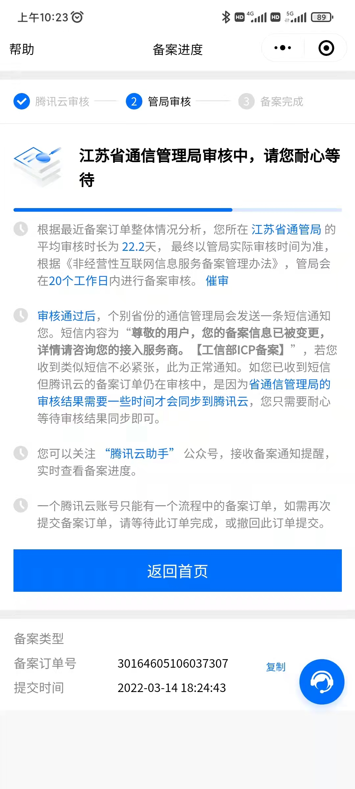
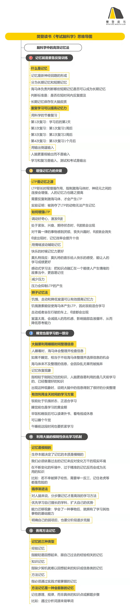
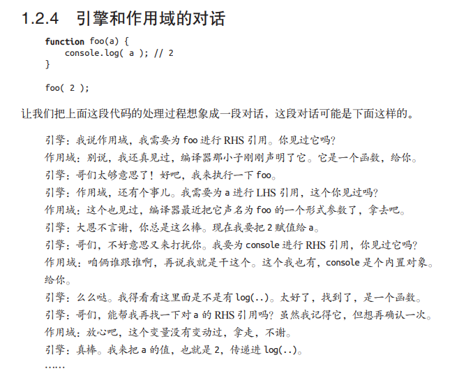

# 三月份嘚吧的

## 02-27

今天开发`realize-utils`中的random、regexp、string、support、time、url模块中常用函数的封装。并V1.1.4发到`NPM`中。

整理博客的相关链接中的资料，首页按钮，博客的侧边栏页面和大体结构。

之后就准备开始把之前零散的知识点，都整理在这个上面了。

## 03-01

昨天和今天都在搞腾讯云的轻量应用服务器，研究怎么部署这个博客系统。昨天晚上做了域名的备案。提示说要购买服务器3天之后才能备案。到03.03号上午才能继续备案。

域名98元5年，服务器200元3年。一年100，哈哈。现阶段的需要就是部署自己的博客系统和存一些自己的学习资料。后期可以学习一下操作系统之类的东西，再继续玩起来吧。

今天发动群友和两个同事给自己的函数库`realize-utils`点star，加上我现在有11个了😅。后面把之前项目中比较公用的函数或比较独立的功能给抽离到这个库中吧。这个库后面要好好维护好这个函数库，从结构到每行代码都要仔细在过几遍，不断的精简和丰富吧。

## 03-02

看B站上的鱼皮视频，才知道用宝塔配置域名，如果设置了购买的域名且没有备案，打开网站后会显示“待该网站备案后继续访问”。这个时候我们可以用公网IP追加域名，然后就可以用先通过公网IP进行访问了。

[俺滴博客](http://124.222.234.238/)

## 03-03

开始网站备案才知道，还需要暂住证。。。完成备案的日子又遥遥无期了 :sob:。

今天把个人网站的引导页开发了下，博客的文件夹也放到了服务器上。

从新配置了vuepress中的base（网站用来部署的基准 URL。如果你打算在子路径下部署你的站点，例如 GitHub 页面，则需要设置此项。如果你打算将你的网站部署到https://foo.github.io/bar/，则应将 base 设置为 "/bar/"。它应该始终以斜杠开始和结束。），我对应的设置了base: '/blog/'。

## 03-05

1. 暂住证办理完毕，10-15个自然日去取，然后再继续备案。

2. 网站引导页引入字体文件大，加载慢的优化。font-spider 字体压缩器，让网页自由引入中文字体成为可能。

```shell
npm install font-spider -g
```

运行 font-spider 命令

```shell
font-spider  *.html
```

命令执行完后，字体文件下多出来以下文件（.font-spider文件夹下是原始的ttf文件）
[链接](https://www.jianshu.com/p/3a2c7272269d)

3. 我的笔记本 git 提交报错处理：Logon failed, use ctrl+c to cancel basic credential prompt. 错误。[连接](https://shliang.blog.csdn.net/article/details/101040291?spm=1001.2101.3001.6661.1&utm_medium=distribute.pc_relevant_t0.none-task-blog-2%7Edefault%7ECTRLIST%7ERate-1.pc_relevant_default&depth_1-utm_source=distribute.pc_relevant_t0.none-task-blog-2%7Edefault%7ECTRLIST%7ERate-1.pc_relevant_default&utm_relevant_index=1)

4. 博客目录变更

## 03-08

:mag_right: 发现一位大佬，之后一段时间都跟着学习一哈。
[山月](https://q.shanyue.tech/)

## 03-15

暂住证下来了，备案进度已到 "江苏省通信管理局"。静待佳音了。:grinning:



## 03-17

最近两次跑步，在听樊登读书的 《考试脑科学》 这本书。讲了很多对我来说很受用的方法。下面附上一张思维导图。


## 03-18

前端工程化的知识点总结到语雀和复习了一遍

下次 03-25 号再复习一遍。[TODO]

开始把 [《JavaScript 高级程序设计第四版》](http://124.222.234.238/utils/PDF/JavaScript%E9%AB%98%E7%BA%A7%E7%A8%8B%E5%BA%8F%E8%AE%BE%E8%AE%A1(%E7%AC%AC4%E7%89%88)%20.pdf) 的知识点给整理到这个项目当中。因为之前读的时候，带着总结了下，所以这次算是复习和整理。

## 03-23

红宝书整理到了DOM一章，就结束了，因为剩余的内容觉得一般。

开始看[《你不知道的 JavaScript 上》](http://124.222.234.238/utils/PDF/%E4%BD%A0%E4%B8%8D%E7%9F%A5%E9%81%93%E7%9A%84JavaScript_%E4%B8%8A.pdf)，+ 写博客做笔记。

这本书看起来比较生动、有趣。



## 03-24

红宝石中的 网络请求与远程资源 整理了一下。因为觉得确实重要。Web Worker 也写到了我的文章模块中了。这两个模块重要的原因，所以还是又加上了。

今天跑步听书，听到了一句很有意义的一段话：

> 叔本华说天才和普通人的区别是什么？就是天才跟普通人都学习，但是天才跟普通人的区别是什么呢？普通人把学习当作一种手段，当作自己谋生的过程，当作自己能够解决衣、食、住、行问题的必然的过程。而天才把学习本身就当做是一种乐趣，他就在学习当中已经完善了自己的人生。这就是天才和普通人最根本的区别。

真正教育和学习的本质是：我们自己成为一个更完美的我，而不是趋同于某一个目标，然后达成一个物质上的追求，这时候你才会发现，学习本身带来的动力是足够强大的。
