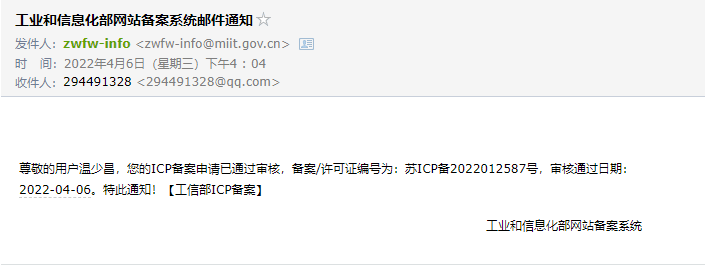
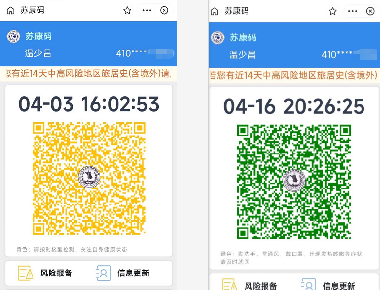
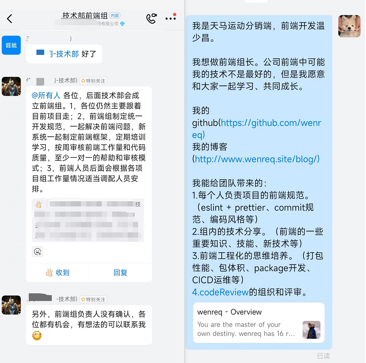
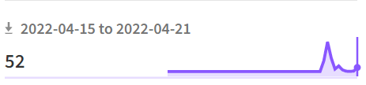

# 四月份嘚吧的

- 这个月网站备案完成。
- 总结《你不知道的JavaScript 上》到语雀。按4个时间节点复习。
- 计划看完《ECMAScript 6 入门教程》。写道到博客中。总结到语雀。排期复习。
- 找房、跑步、做饭、学习。

## 04-01

学习已暂停。开发公司项目预售模块的开发，要求节前就要提测，最近的几天都在忙着开发和联调接口。

## 04-04

04.03 一上午在家远程**免费加班**完成了公司项目开发，已提交测试。

因疫情小区被封加上节假日，每天将学习的 JS 整理到博客中。

## 04-06

终于来了，网站备案审核通过了。🌈

[俺的网站引导页](http://www.wenreq.site/)

[俺的博客](http://www.wenreq.site/blog/)

## 04-17

- 疫情小区被封期间（04.03-04.17），主要在做公司的项目，没有时间去学习和写博客。

- 今天解封了。健康码也转绿码了。

- 报名了前端的小组长。应要求，自己用 vuePress 编写了一份[前端规范](../../standardDoc/index.md)。

## 04-22

在 [Opensource](http://Opensource.com)，我们想说我们对于开源价值和原则应用到软件之外领域的方式很有兴趣。我们更愿意不仅将开源视为一种计算机软件开发和许可的方式，也把它视作一种**态度**。

实现“开源方式”的生活的各个方面，意味着表达一种分享的意愿，通过透明的方式和他人协作（这样其他人也可以关注和加入），拥抱失败，将它作为一种改进的手段，以及期待（甚至鼓励）所有人都可以这么做。

这也意味着在让世界变得更好的过程中扮演一个积极的角色，这只有在每个人都可以接触到对世界进行规划的途径时才有可能。

这个世界充满了“源代码”——蓝图、食谱、规则——它们引导和塑造我们思考和行动的方式。我们相信这些深层代码（无论是什么形式）应该是开放、可接触、分享的——这样人们可以参与其中并让它变得更好。

在这里，我们诉说开源价值对生活所有领域的影响的故事——科学、教育、政府、工业、健康、法律，以及组织动态。我们是一个社区，告诉他人开源的方式如何成为最好的方式，**因为对开源的爱和其它一样：当它被分享的时候它会变得更好。**

