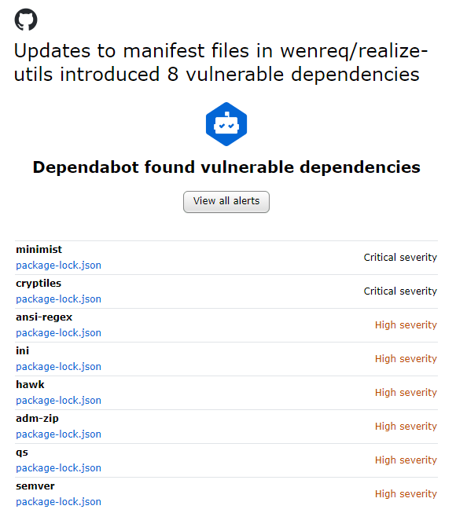
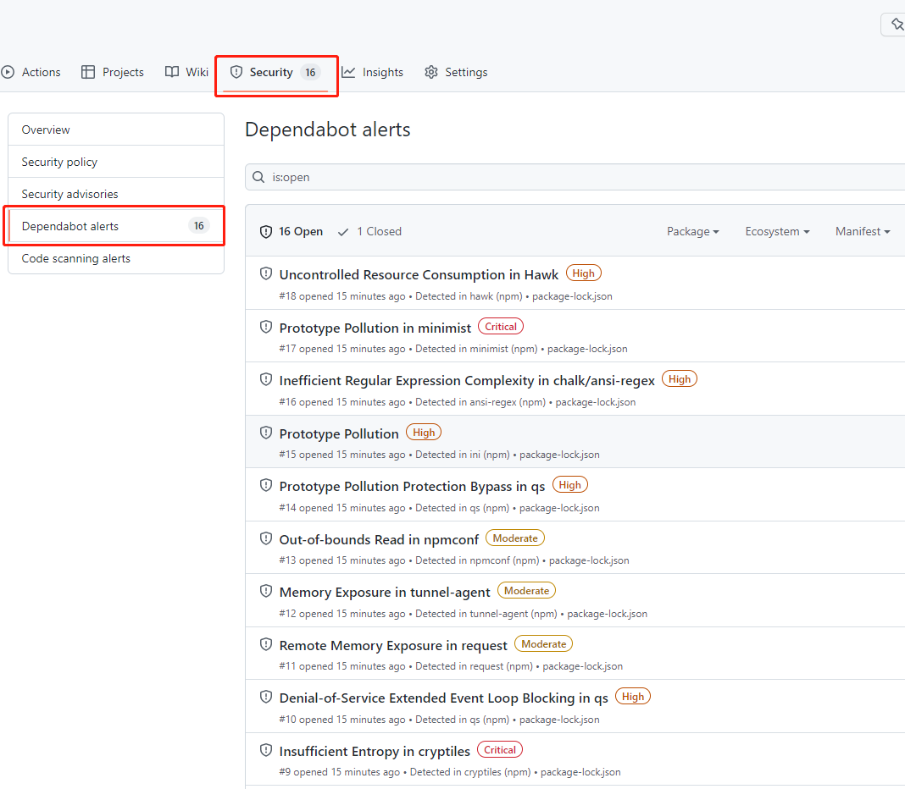
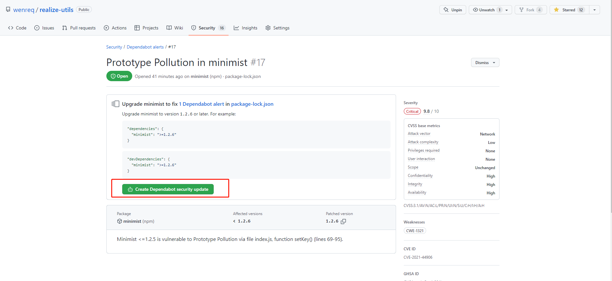

## 1. 前情

我把自己的 realize-utils 工业务工具包发到 npm 后。相关代码也提交到了 GitHub。接下来我收到了一份邮件，标题为：**[wenreq/realize-utils] Your repository has dependencies with security vulnerabilities**，内容如下：



然后去 GitHub 的项目仓库看下了，安全（Security）的 Dependabot alerts 选项，内容如下：



结合邮件标题和 Dependabot alerts 中的翻译，大致的意思就是：**依赖的第三方库有安全的漏洞**。

- Uncontrolled Resource Consumption in Hawk（在 Hawk 中不受控制的资源消耗）
- Inefficient Regular Expression Complexity in chalk/ansi-regex（在 chalk/ansi-regex 中，正则表达式的复杂度很低）
- Prototype Pollution High （原型污染）
- Memory Exposure in tunnel-agent （内存暴露在隧道代理）
- etc...

## 2. 在 Dependabot alerts 中进行依赖的安全升级

### 2.1 逐个的处理

点开 `Prototype Pollution in minimist` 的这个链接，内容如下：



点击这个按钮（Create Dependabot security update）后，等待一会后，成功升级至安全的依赖。它会向你的项目仓库提交一个 PR 的请求，之后需要你的手动合并。


全部的手动安装完毕后，进入 PR 进行合并至你的项目中。

### 2.2 思考

如果之后又有新的依赖更新，或又有新的修复，我总不能再按个的一一手动的进行更新吧。

这时 Git dependabot 机器就派上了用场。

## 3. CI 机器人

可通过 CI/gitlab/github 中配置机器人，使他们每天轮询一次检查仓库的依赖中是否有风险。


在 Github 中，可单独设置 `dependabot` 机器人，在仓库设置中开启小机器人，当它检测到有问题时，会自动向仓库提交 PR。


而它的解决方案也是升级版本号。


## 4. 配置 Dependabot

### 4.1 关于 dependabot.yml 文件

Dependabot 配置文件 `dependabot.yml` 使用 YAML 语法。必须将此文件存储在仓库的 `.github` 目录中。 添加或更新 `dependabot.yml` 文件时，这将触发对版本更新的立即检查。

### 4.2 配置文件

```yml
# dependabot.yml
version: 2
updates:
  # 启用npm的版本更新
  - package-ecosystem: "npm"
    # 在根目录下寻找 `package.json` 和 `lock` 文件
    directory: "/"
    # 每天(工作日)检查 npm 注册表的更新
    schedule:
      interval: "daily"
```

我项目里面的配置。


更详细的配置信息，请移步 [配置 dependabot.yml](https://docs.github.com/cn/code-security/dependabot/dependabot-version-updates/configuration-options-for-the-dependabot.yml-file)

配置完毕之后，将代码提交至仓库后，就会自动的检测依赖项了，如下所示：


接下来就手动合并 PR 就可以了。
