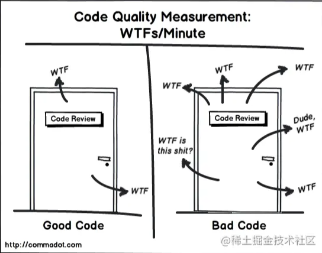

上述的 Lint 工具和类型检查器, 可以约束代码风格、避免低级的语法错误。但是即使通过上面的Lint和类型检查，代码也可能未必是 “好代码”。

很多代码设计的 '最佳实践' 是无法通过具象化的自动化工具或文档覆盖的, 这时候，'经验' 或者 '群体智慧' 就派上用场了。 比如 Code Review 阶段会检查这些东西:

- 编程原则、设计思想。 例如符合 SOLID 原则？ 是否足够 DRY ？接口设计是否简洁易扩展？
- 模块耦合程度、代码重复
- 代码健壮性。是否存在内存泄露、是否线程安全、是否有潜在性能问题和异常、错误是否被处理？
- 代码的性能和效率。
- 是否有没有考虑到的场景？

如果是第一次推行Code Review, 可以建立一个检查列表，对照着进行检查。熟练后，心中自然无码。

Code Review 有很多好处，比如：

- **Code Review 可以让其他成员都熟悉代码**。这样保证其他人都可以较快地接手你的工作，或者帮你解决某些问题。
- **提高代码质量**。毫无疑问. 一方面是*主动性*的代码质量提升，比如你的代码需要被人 Review，会自觉尽量的提高代码质量；另一方面，其他成员可以检查提交方的代码质量。
- **检查或提高新成员的编程水平**。培养新人时，由于不信任它们提交的代码，我们会做一次Review检查代码是否过关。另一方面这是一次真实的案例讲解, 可以较快提高他们的能力。

Code Review有两种方式: 一个```提交时```、一个是```定时```:

- **提交时**。大部分开源项目采用这种方式。通俗讲就是`Pull Request`。只有代码通过测试、和其他成员的 Review 才可以合进正式版本库。这种方式也称为 "阻塞式" 代码检查，一般配合 GitFlow 使用。
- **定时**。在项目完结后、项目的某个里程碑、或者固定的时间(每天、每个星期..). 团队成员聚在一起，回顾自己写的代码, 让其他成员进行审查。

Code Review 是比较难以推行的，不过这个也要看你们团队的情况，向我们钱少活多的团队，很少的时间去立马去兼顾其他成员的代码。这时候定时 Review 会更有用，因为看起来更 "节省时间"。

而提交时 Review 则可以针对新人，比如你不信任他们的代码或者希望帮助他们提高编码能力。

相关资源：

- [Code Review最佳实践](https://mp.weixin.qq.com/s?__biz=MzIwMTQwNTA3Nw==&mid=400946871&idx=1&sn=5a125337833768d705f9d87ba8cd9fff&scene=1&srcid=0104FLyeXIS6N0EShgDseIfI&key=41ecb04b051110031290b34976240e650f0169d239c89f125162a89c8d3412f2087198612e71fd7685cae9eebe08e295&ascene=0&uin=MTYyMDMzMTAwMA==&devicetype=iMac+MacBookPro11,5+OSX+OSX+10.10.5+build(14F1509)&version=11020201&pass_ticket=dc5bBckt1XSthRKTIsukYHIcAvKfv0jninbMlYQ5TWnE6XS/rRkdHKlJjNTI2Wsg)
- [是否要做Code Review？与BAT资深架构师争论之后的思考](https://juejin.cn/post/6844903805767647245)
- [一些Code Review工具](https://richardcao.me/2016/09/30/Talk-About-Codereview/)
