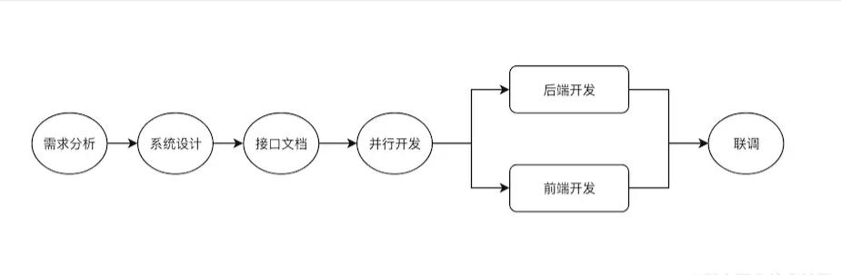

前后端团队经过长期的合作，一般可以总结出一条对于双方开发效率最优的协作流程. 将这个落实为规范，后面的团队成员都遵循这个步调进行协作。

一个典型的前后端协作流程如下:

1. 需求分析。参与者一般有前后端、测试、以及产品。由产品主持，对需求进行宣贯，接受开发和测试的反馈，确保大家对需求有一致的认知。
2. 前后端开发讨论。讨论应用的一些开发设计，沟通技术点、难点、以及分工问题。
3. 设计接口文档。可以由前后端一起设计；或者由后端设计、前端确认是否符合要求。
4. 并行开发。前后端并行开发，在这个阶段，前端可以先实现静态页面; 或者根据接口文档对接口进行Mock, 来模拟对接后端接口。
5. 在联调之前，要求后端做好接口测试。
6. 真实环境联调。前端将接口请求代理到后端服务，进行真实环境联调。
