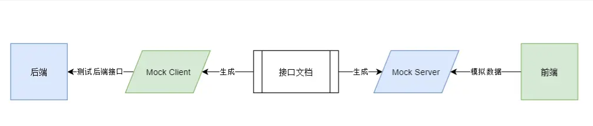

为了做到高效率的前后端并行开发，接口的测试与模拟是必要的。

- 前端要求后端在联调之前，需要测试验证好自己的接口是否可以正常工作。而不是在联调期间，把前端当“接口测试员”，阻塞接口联调进度。
- 另外前端需要在后端接口未准备好之前，通过接口模拟的方式，来编写业务逻辑代码。

针对接口测试与模拟，存在下图这样一个理想的模型:

一切从定义良好的接口文档出发，生成 Mock Server 和 Mock Client, Mock Server 给前端提供模拟数据，而 Mock Client 则辅助后端对它们的接口进行测试。

资源:

- RESTful

  - [Swagger](<https://swagger.io/>) 这是最为接近上面理想模型的一个解决方案
  - [JSON Server](https://github.com/nuysoft/Mock) 快速生成JSON mock服务器
  - [Easy Mock](https://easy-mock.com) 可视化的、在线的接口mock服务

- GraphQl

  - [GraphQL Faker](https://github.com/APIs-guru/graphql-faker)
  - [graphql-tools](https://www.apollographql.com/docs/graphql-tools/mocking/)

- 模拟数据生成

  - [faker.js](https://github.com/Marak/faker.js) 🔥强大的模拟数据生成工具，支持Node和浏览器
  - [Mock.js](https://github.com/nuysoft/Mock) 数据生成和模拟工具
