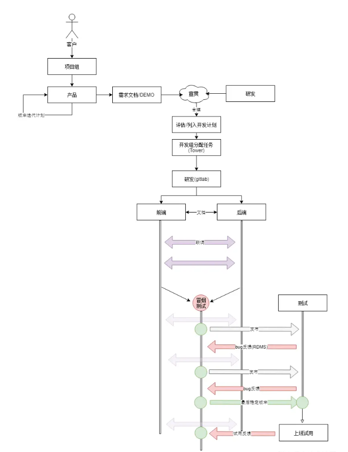

如果团队有规范的新成员培训手册，可以节省很多培训的时间，避免每次重复口述一样的内容。培训手册包含以下内容:

- **产品架构与组织架构**。介绍公司背景和产品，一般组织的团队结构和产品的架构是相关联的。
- **产品研发流程**: 介绍产品开发和迭代会涉及到的流程、以及团队之间的协作衔接，例如:
  
- **工作范围**: 团队成员的职责范围。
- **建立资源索引**: 开发需要设计到的资源，比如各种文档地址、研发系统入口(例如gitlab、bug跟踪系统、文件共享、发布平台、开发/测试环境、监控系统)、协作规范等等。将这些资源整理好可以减少不必要的沟通成本。
- **规范**: 即本文的主体'前端协作规范'。有规范可循，可以让成员以较快的速度入手开发、同时也减少培训成本投入。

培训手册将可以文档具象化的内容整理为文档，和上文说到的 Code Review 一样，一些东西无法通过文档来说明，所以我们一般会搭配一个“培训导师”，在试用期间，一对一辅导。
