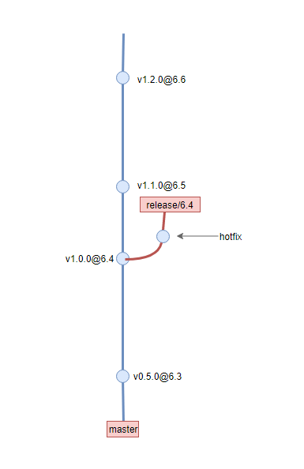
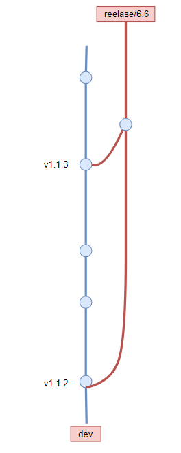

## 1.1.1 版本规范

项目的版本号应该根据某些规则进行迭代, 这里推荐使用[语义化版本](https://semver.org/lang/zh-CN/)规范, **通过这个规范，用户可以了解版本变更的影响范围**。 规则如下:

- 主版本号：当你做了不兼容的 API 修改，
- 次版本号：当你做了向下兼容的功能性新增，
- 修订号：当你做了向下兼容的问题修正。

## 1.1.2 版本控制系统规范

大部分团队都使用git作为版本库，管理好代码也是一种学问。尤其是涉及多人并发协作、需要管理多个软件版本的情况下，定义良好的版本库管理规范，可以让大型项目更有组织性，也可以提高成员协作效率.

## 1.1.3 Git 分支模型

### master分支

master分支表示一个**稳定的发布版本**. 对应GZB的大版本.  

- 场景: 前端应用会跟随需求池中版本迭代, 在dev分支测试稳定后, 会合并到master分支, 并使用tag标记应用版本和对应的需求池中版本
- tag规范: `v{APP_version}@{GZB_version}`, 例如v0.1.0@GZB_6.6
- 人员: 由项目负责人进行审核合并, 普通开发者没有权限

### dev分支

开发者主要工作的分支, **最新的特性或bug修复**都会提交到这个分支. 开发者如果在该分支进行了提交，在push到远程之前应该先pull一下， 并尽量使用rebase模式，保证分支的简洁

- 命名规范: dev
- tag规范: 在dev分支中也可能会经历发布过程, 例如bug修复版本. 这里同样使用tag来标记这些发布. 例如v0.1.1
- 提交规范：如果实在开发分支上进行开发，在推送到远程之前，应该使用`git rebase`形式更新本地分支。

### feature分支

涉及**多人协作或者大功能**的开发, 应该从dev分支checkout出独立的feature分支, 避免干扰dev分支

- 场景:
  - 涉及多人协作: 团队多个成员在同一个项目下负责开发不同的功能, 这时候每个成员在自己的feature分支独立开发
  - 大功能开发: 大功能开发跨越周期比较长, 需要多次迭代才会稳定. 这时候应该在独立的分支上开发. 方便跟踪历史记录, 也免于干扰dev分支的迭代和发布

- 命名规范
  - feature/name: name是功能名称
  - feature/GZB_version:  这也是团队常见的模式, 当无法使用一个功能名称来描述时, 可以使用GZB版本号作为’功能’
- 合并时机
  1. 当feature分支迭代稳定, 并通过测试后, 合并到dev分支. 合并到dev后, **feature分支的生命周期就结束了**. 后续bug修复和功能优化直接在dev开发
  2. 当多个feature分支需要合并对外发布临时版本时. 合并到preview分支 . ⚠️这种情况不应该合并到dev分支, 因为feature分支可能还不稳定或未完成. 比如为了联调某些功能.
- 合并方式
  - 不要使用fast-forward. 这样可以在分支图上查看到分支历史
  
### preview分支

临时的预览分支, preview分支用于临时合并feature分支, 这其中可能会修复某些bug或者冲突. 可以选择性地将这些提交cherrypick回feature分支. 当预览结束后就可以销毁preview分支

### release分支

release分支有两种使用策略，第一种遵循`gitFlow`流程, 第二种是目前后端团队使用的策略，为了配合后端工作，我们主要使用第二种

### git flow 风格的release分支

当前前端应用的稳定版本和GZB版本绑定. release分支不一定存在, 一般情况下, 只会在前端版本稳定后, 将其合并到master, 并创建tag标记. 而只有需要为指定的正式版本修复bug时才会创建release分支

- 场景: 需要为某个正式版本修复bug(hotFix)时, 从master的对应tag中checkout release分支
- 命名规范: `release/{GZB_version}` 外部人员只会关注GZB版本
- 如何修复
  - 如果对应bug可以在dev分支直接被修复, 可以先提交到dev分支(或者已经修复了), 然后再cherrypick到release分支
  - 如果bug在新版本无法复现. 比如新版本升级了依赖. 那么在release分支直接修复即可

### 自定义风格release分支

当要发布一个分销商对应的版本时（或者一开始开发时）从dev分支checkout出一个开发分支，后续需要对外发布时，将dev分支合并到release分支, 并打上版本tag. 后面会介绍到后端开发和自动交付机制这种分支模式。

这一种使用策略. gzb后端在使用, 为了配合后端工作, 我们也推荐使用这种方式

- 何时创建:
  - 开启GZB新版本开发任务时(推荐)
  - 向外发布第一个版本时
- 何时合并：后面dev有版本发布都要合并到release分支，直到开启另一条release分支
- 好处
  - 对发布内容进行筛选
  - 专门用于发布, 开发者容易过滤变更的内容

## 1.1.4 提交信息规范

组织好的提交信息, 可以提高项目的整体质量. 至少具有下面这些优点:

- 格式统一的提交信息有助于自动化生成CHANGELOG
- 版本库不只是存放代码的仓库, 它记录项目的开发日志, 它应该要清晰表达这次提交的做了什么. 这些记录应该可以帮助后来者快速地学习和回顾代码, 也应该方便其他协作者review你的代码
- 规范化提交信息可以促进提交者提交有意义的、粒度合适的'提交'. 提交者要想好要怎么描述这个提交，这样被动促进了他们去把控提交的粒度

`<type>(<scope>): <subject>` 描述主要修改类型和内容

- `✨feat:msg` 新功能、新特性
- `🐛fix(issue No):msg` 修改 bug
- `📝docs:msg` 文档修改
- `dx:msg` 分隔
- `🎨style:msg` 代码格式修改, 注意不是 css 修改（例如分号修改）
- `♻️refactor:msg` 重构
- `⏪revert` revert之前的commit
- `⚡️perf` 更改代码，以提高性能（在不影响代码内部行为的前提下，对程序性能进行优化）
- `✅test` 测试用例新增、修改
- `workflow:msg` 工作流相关文件修改
- `🎉build` 影响项目构建或依赖项修改
- `🎉release:msg` 发布新版本
- `ci:msg` 持续集成相关文件修改
- `⏫chore:msg` 构建过程, 辅助工具升级. 如升级依赖, 升级构建工具
- `types` 类型
- `wip:msg` 半成品的
- 🔒 safe: 修复安全问题
