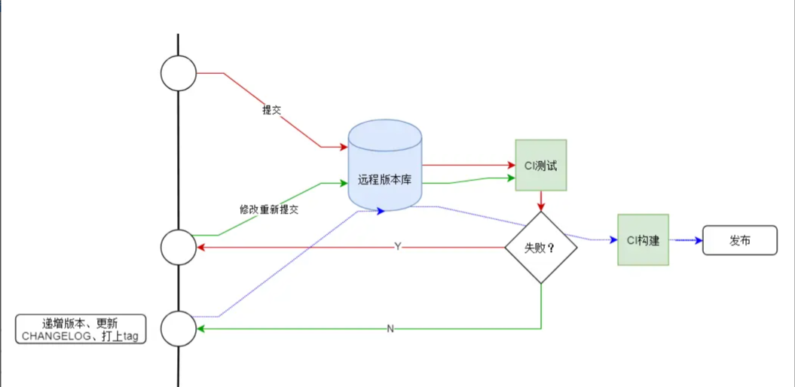

发布工作流指的是将‘软件成品’对外发布(如测试或生产)的一套流程, 将这套流程规范化后，可以实现自动化。

举个例子, 一个典型的发布工作流如下：

- 代码变更
- 提交代码变更到远程版本库
- 程序通过CI测试(例如Travis变绿)
- 提升package.json中的版本
- 生成CHANGELOG
- 提交package.json和CHANGELOG.md文件
- 打上Tag
- 推送

如果你遵循上面的规范，那么就可以利用社区上现有的工具来自动化这个流程. 这些工具有:

- [conventional-changelog-cli](https://github.com/conventional-changelog/conventional-changelog/tree/master/packages/conventional-changelog-cli)
- [conventional-github-releaser](https://github.com/conventional-changelog/conventional-github-releaser)
