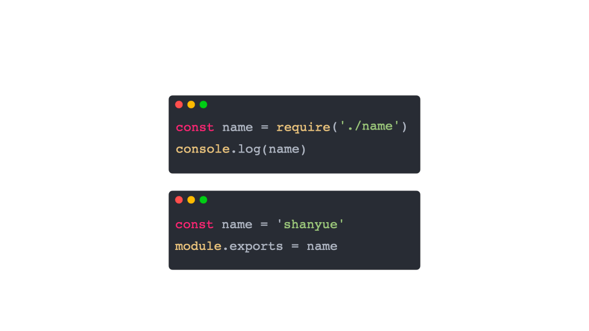
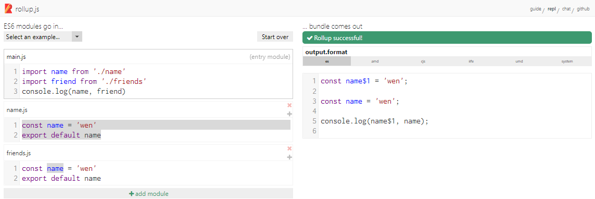
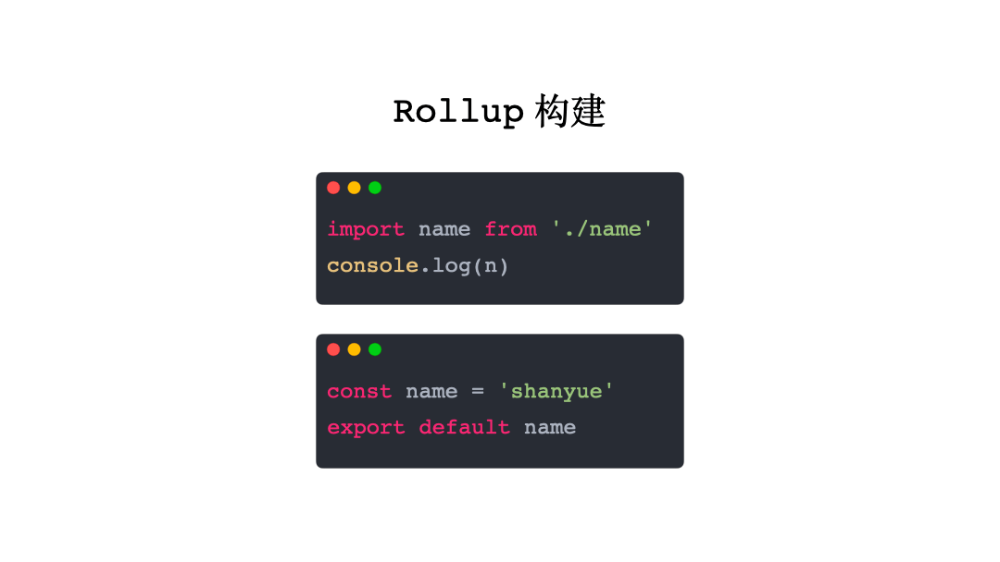

# webpack 的 runtime 做了什么事情

## Webpack Runtime

`webpack` 的 runtime，也就是 webpack 最后生成的代码，做了三件事：

1. `__webpack_modules__` : 维护了一个所有模块的数组。将入口模块解析为 AST，根据 AST 深度优化先搜索所有的模块，并构建出这个模块数组。每个模块都由一个包裹函数(module, module.exports, __webpack_require__) 对模块进行包裹构成。
2. `__webpack_require__(moduleId)` : 手动实现加载一个模块。对已经加载过的模块进行缓存，对未加载过的模块，执行 id 定位到 `__webpack_modules__` 中的包裹函数，执行并返回 `module.exports`，并缓存。
3. `__webpack_require__(0)` : 运行第一个模块， 即运行入口模块。

另外，当涉及到多个 chunk 的打包方式中，比如 `code spliting`，webpack 中会有 `jsonp` 加载 chunk 的运行时代码。

以下是 `webpack runtime` 的最简代码，配置实例可见

```js
/******/ var __webpack_modules__ = ([
/* 0 */,
/* 1 */
/*!****************!*\
  !*** ./sum.js ***!
  \****************/
/*! unknown exports (runtime-defined) */
/*! runtime requirements: module */
/*! CommonJS bailout: module.exports is used directly at 1:0-14 */
/***/ ((module) => {

module.exports = (...args) => args.reduce((x, y) => x + y, 0)

/***/ })
/******/ ]);
/************************************************************************/
/******/ // The module cache
/******/ var __webpack_module_cache__ = {};
/******/ 
/******/ // The require function
/******/ function __webpack_require__(moduleId) {
/******/ 	// Check if module is in cache
/******/ 	var cachedModule = __webpack_module_cache__[moduleId];
/******/ 	if (cachedModule !== undefined) {
/******/ 		return cachedModule.exports;
/******/ 	}
/******/ 	// Create a new module (and put it into the cache)
/******/ 	var module = __webpack_module_cache__[moduleId] = {
/******/ 		// no module.id needed
/******/ 		// no module.loaded needed
/******/ 		exports: {}
/******/ 	};
/******/ 
/******/ 	// Execute the module function
/******/ 	__webpack_modules__[moduleId](module, module.exports, __webpack_require__);
/******/ 
/******/ 	// Return the exports of the module
/******/ 	return module.exports;
/******/ }
/******/ 
/************************************************************************/
var __webpack_exports__ = {};
// This entry need to be wrapped in an IIFE because it need to be isolated against other modules in the chunk.
(() => {
/*!******************!*\
  !*** ./index.js ***!
  \******************/
/*! unknown exports (runtime-defined) */
/*! runtime requirements: __webpack_require__ */
const sum = __webpack_require__(/*! ./sum */ 1)

sum(3, 8)

})();
```

对 `webpack runtime` 做进一步的精简，代码如下

```js
const __webpack_modules_ = [() => {}];
const __webpack_require__ = (id) => {
  const module = { exports: {} };
  const m = __webpack_modules__[id](module, __webpack_require__);
  return module.exports;
}

__webpack_require__(0);
```

使用动画表示 Webpack 的输入输出：


## Rollup

在 Rollup 中，并不会将所有模块至于 `modules` 中使用 Module Wrapper 进行维护，**它们仅仅将所有模块铺平展开**。

试举一例：
```js
// index.js
import name from "./name"
console.log(name);
```

```js
const name = "wen"
export default name;
```

在打包后，直接把所有模块平铺展开即可。可见[实时示例](https://rollupjs.org/repl/?version=2.62.0&shareable=JTdCJTIybW9kdWxlcyUyMiUzQSU1QiU3QiUyMm5hbWUlMjIlM0ElMjJtYWluLmpzJTIyJTJDJTIyY29kZSUyMiUzQSUyMmltcG9ydCUyMG5hbWUlMjBmcm9tJTIwJy4lMkZuYW1lJyU1Q25jb25zb2xlLmxvZyhuYW1lKSUyMiUyQyUyMmlzRW50cnklMjIlM0F0cnVlJTdEJTJDJTdCJTIybmFtZSUyMiUzQSUyMm5hbWUuanMlMjIlMkMlMjJjb2RlJTIyJTNBJTIyY29uc3QlMjBuYW1lJTIwJTNEJTIwJ3dlbiclNUNuZXhwb3J0JTIwZGVmYXVsdCUyMG5hbWUlMjIlMkMlMjJpc0VudHJ5JTIyJTNBZmFsc2UlN0QlNUQlMkMlMjJvcHRpb25zJTIyJTNBJTdCJTIyZm9ybWF0JTIyJTNBJTIyZXMlMjIlMkMlMjJuYW1lJTIyJTNBJTIybXlCdW5kbGUlMjIlMkMlMjJhbWQlMjIlM0ElN0IlMjJpZCUyMiUzQSUyMiUyMiU3RCUyQyUyMmdsb2JhbHMlMjIlM0ElN0IlN0QlN0QlMkMlMjJleGFtcGxlJTIyJTNBbnVsbCU3RA==)

```js
// output.js
const name = "wen";
console.log(name);
```

对于 Rollup 这种方案，当两个模块发生变量冲突如何解决？很简单，直接重新命名，看示例：


使用动画表示 Rollup 的输入输出：


