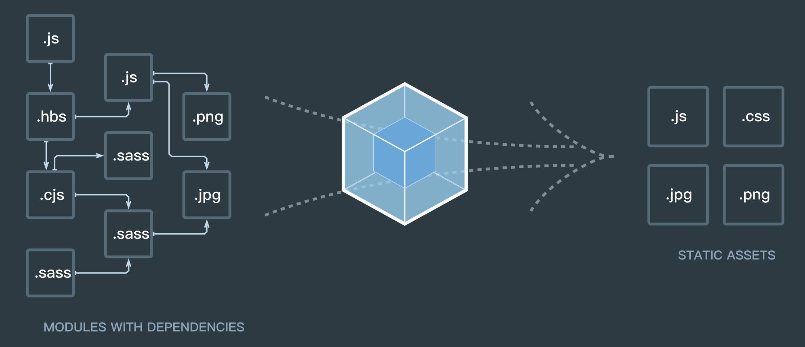

# 打包器(webpack/rollup)如何加载json、image等非 Javascript 资源

在前端中，网页只能加载 `JavaScript` 脚本资源，即便在 node，也只能加载 `JavaScript` 与 `Json` 资源。那类似 `webpack` `rollup` 及 `vite` 这类工具是如何加载图片、JSON 资源的呢？

在 `webpack` 等打包工具中，号称**一切皆是模块**。



当 `webpack` 在这类打包器中，需要加载 JSON 等非 JavaScript 资源时，则通过**模块加载器**（`loader`）将它们转化为模块的形式。

以 JSON 为例：

```js
// user.json 中的内容
{
  "id": 10086,
  "name": "wen",
  "github": "https://github.com/wenreq"
}
```

在现代前端中，我们把它视为 `module` 时，使用 `import` 引入资源。

```js
import user from "./user.json";
```

而我们的打包器，如 `webpack` 与 `rollup` ，将通过以下方式来加载 JSON 资源。

这样它将被视为普通的一份 JavaScript

```js
// 实际上的 user.json 被编译为以下内容
export default {
  id: 10086,
  name: "wen",
  github: "https://github.com/wenreq"
};
```

在 webpack 中通过 loader 处理此类非 JS 资源，以下为一个 `json-loader` 的示例：

```js
module.exports = function (source) {
  const json = typeof source === "string" ? source : JSON.stringify(source);
  return `module.exports = ${json}`;
}
```

那图片是如何处理的呢？

```js
import mainImage from "main.png";


```

更简单，它将替换为它自身的路径。示例如下：

```js
export default `$PUBLIC_URL/assets/image/main.png`;
```

那么如何加载一个 CSS 脚本呢？此处涉及到各种 DOM API，以及如何将它抽成一个 `.css` 文件，复杂很多，下一篇介绍。
