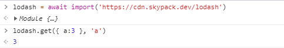

# 浏览器中如何使用原生的 ESM

## Native Import: Import x from URL

通过 `script[type=module]`，可以直接在浏览器中使用原生 `ESM`。这也使得前端不打包(`Bundless`) 成为可能。

```js
<script type="module">
  import lodash from "https://cdn.skypack.dev/lodash";
</script>
```

由于前端跑在浏览器中，**因此它也只能从 URL 中引入 `Package`**

1. 绝对路径: `https://cdn.skypack.dev/lodash`
2. 相对路径: `./lib.js`

现在打开浏览器控制台，把以下代码粘贴栈控制台中。由于 `http import` 的引入，你发现调式 `lodash` 此类工具更加方便了。

```js
> lodash = await import('https://cdn.skypack.dev/lodash')

> lodash.get({ a: 3 }, 'a')
```



## ImportMap

但 `Http Import` 每次都需要输入完全的 URL，相对以前的的裸导(`bare import specifiers`)，很不方便，如下例：

```js
import lodash from "lodash";
```

它不同于 `Node.JS` 可以依赖文件系统，层层寻找 `node_modules`

```sh
/home/app/packages/project-a/node_modules/lodash/index.js
/home/app/packages/node_modules/lodash/index.js
/home/app/node_modules/lodash/index.js
/home/node_modules/lodash/index.js
```

在 ESM 中，可通过 `importmap` 使得裸导入可正常工作：

```html
<script type="importmap">
  {
    "imports": {
      "lodash": "https://cdn.skypack.dev/lodash",
      "ms": "https://cdn.skypack.dev/ms"
    }
  }
</script>
```

此时可与以前同样的方式进行模块导入

```js
import lodash from "lodash"

import("lodash").then(_ => ...)
```

那么通过裸导入如何导入子路径呢？

```html
<script type="importmap">
  {
    "imports": {
      "lodash": "https://cdn.skypack.dev/lodash",
      "lodash/": "https://cdn.skypack.dev/lodash/"
    }
  }
</script>
<script type="module">
  import get from "lodash/get.js"
</script>
```

## Import Assertion

通过 `script[type=module]`，不仅可引入 JavaScript 资源，甚至可以引入 JSON/CSS，示例如下

```html
<script type="module">
  import data from "./data.json" assert { type: "json" };

  console.log(data);
</script>
```
