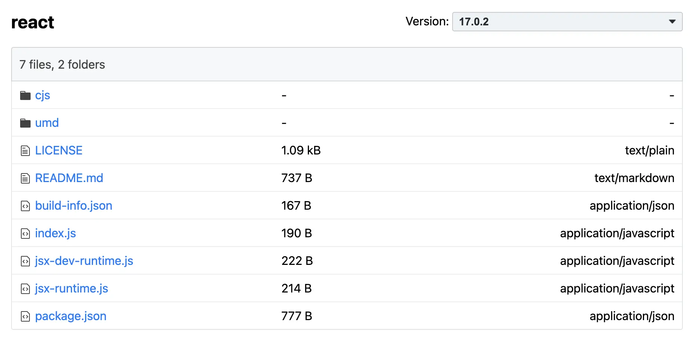
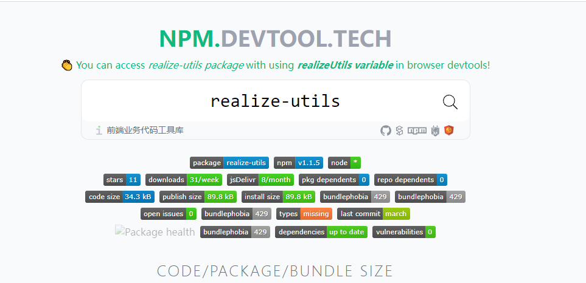

# 如何对 npm package 进行发包

## 准备工作：一个账号

在发布公告 package 之前，需要在 [npm 官网](https://www.npmjs.com/) 进行注册一个账号。

随后，在本地（需要发包的地方）执行命令 `npm login`，进行交互式操作并且登陆。

```sh
npm login
```

## 发布

发布一个 npm 包之前，填写 `package.json` 中一下三项最重要的字段。假设此时包的名称为 `@wen/realize`

```js
{
  name: "@wen/realize",
  version: "1.0.0",
  main: "./index.js",
}
```

之后执行 `npm publish` 发包即可。

```sh
npm publish
```

一旦发布完成，在任意地方通过 `npm i` 均可依赖该包。

```js
const x = require("@wen/realize");

console.log(x);
```

如若该包进行更新后，需要再次发布，可 `npm version` 控制该版本进行升级，记住需要遵守 [Semver] 规范

```sh
# 增加一个修复版本号: 1.0.1 -> 1.0.2 (自动更改 package,json 中的 version 字段)
npm version patch

# 增加一个小的版本号: 1.0.1 -> 1.1.0 (自动更改 package,json 中的 version 字段)
npm version minor

# 将更新后的包发布到 npm 中
npm publish
```

## 实际发包的内容

在 npm 发包时，实际发包内容为 `package.json` 中 `files` 字段，一般只需要将构建后的资源（如果需要构建）进行发包，源文件可发可不发。

```js
{
  files: ["dist"];
}
```

若需要查看一个 package 的发包内容，可直接在 `node_modules/${package}` 进行查看，将会发现它和源码有很大不同。也可以在 CND 中进行查看，以 React 为例

1. jsdelivr: [https://cdn.jsdelivr.net/npm/react/](https://cdn.jsdelivr.net/npm/react/)
2. unpkg: [https://unpkg.com/browse/react/](https://unpkg.com/browse/react/)



## 发包的实际流程

`npm publish` 将自动走过一下生命周期

- prepublishOnly: 如果发包前需要构建，可以放在这里
- prepack
- prepare: 如果发包之前需要构建，可以放在这里（该周期也会在 npm i 后自动执行）
- postpack
- publish
- postpublish

发包实际上是将本地 package 中的所有资源进行打包，并上传到 npm 的一个过程，你可以通过 `npm pack` 命名查看详情

```sh
$ npm pack
npm notice
npm notice package: realize-utils@1.1.5
npm notice === Tarball Contents ===
npm notice 72.3kB dist/realize-utils.js
npm notice 1.1kB  package.json
npm notice 7.8kB  README.md
npm notice === Tarball Details ===
npm notice name:          realize-utils
npm notice version:       1.1.5
npm notice filename:      realize-utils-1.1.5.tgz
npm notice package size:  30.0 kB
npm notice unpacked size: 81.2 kB
npm notice shasum:        de124cb6725bb3eb93be5f9b54ba21ac692de744
npm notice integrity:     sha512-lCi+87xhfcygJ[...]E+fG73Xuii1dA==
npm notice total files:   3
npm notice
realize-utils-1.1.5.tgz
```

当你发包成功后，也可以前往 [npm devtool](https://npm.devtool.tech/react)


