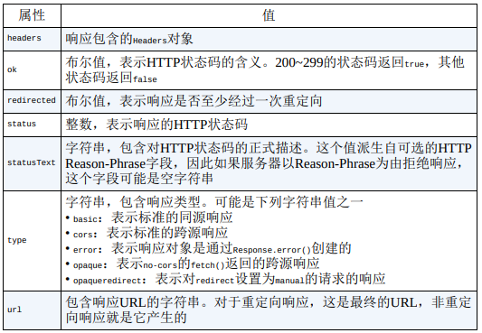

把 `Ajax` 推到历史舞台上的关键技术是 `XMLHttpRequest` (`XHR`)对象。这个技术主要是可以实现在不刷新页面的情况下从服务器获取数据。

## XMLHttpRequest 对象

所有现代浏览器都通过 `XMLHttpRequest` 构造函数原生支持 `XHR` 对象：`let xhr = new XMLHttpRequest();`

### 使用XHR

#### open()

使用 `XHR` 对象首先要调用 `open(type, URL, isAsync)` 方法，这个方法接收 3 个参数：**请求类型**（"get"、"post"等）、**请求URL**，以及表示**请求是否异步**的布尔值。

```js
let xhr = new XMLHttpRequest();
xhr.open("get", "example.php", false);
```

用 `open()` 不会实际发送请求，只是为发送请求**做好准备**。

注意：只能访问**同源URL**，也就是**域名、端口、协议相同**。如果请求的URL域发送请求的页面在任何方面有不同，则会抛出安全错误。

#### send()

发送定义好的请求，调用 `send()` 方法：

```js
let xhr = new XMLHttpRequest();
xhr.open("get", "example.txt", false);
xhr.send(null);
```

`send()` 方法接受一个参数，是作为**请求体发送的数据**。如果不需要发送请求体，则必须传 `null`，因为这个参数在某些浏览器中是**必需的**。调用 `send()` 之后，请求就会发送到服务器。

因为这个请求是同步的，所以 `JavaScript` 代码会等待服务器响应之后再继续执行。收到响应后，`XHR` 对象的以下属性会被填充上数据。

- `responseText`  作为响应体返回的文本。
- `responseXML`   如果响应的内容类型是 `text/xml` 或 `application/xml`，那就是包含响应数据的 `XML DOM` 文档。
- `status`  响应的 `HTTP` 状态
- `statusText` 响应的 `HTTP` 状态描述

收到响应后，第一步要检查 `status` 属性以确保响应成功返回。一般来说，`HTTP` 状态码为 `2xx` 表示成功。此时，`responseText` 或 `responseXML`（如果内容类型正确）属性中会有内容。如果 `HTTP` 状态码是 `304`，则表示资源未修改过，是从**浏览器缓存**中直接拿取的。当然这也意味着响应有效。

```js
let xhr = new XMLHttpRequest();
xhr.open("get", "example.txt", false);
xhr.send(null);

if ((xhr.status >= 200 && xhr.status < 300) || xhr.status == 304) {
   alert(xhr.responseText);
} else {
   alert("Request was unsuccessful: " + xhr.status);
}
```

最好检查 `status` 而不是 `statusText` 属性，因为后者已经被证明在*跨浏览器的情况下不可靠*。无论是什么响应内容类型，`responseText` 属性始终会保存响应体，而 `responseXML` 则对于非 `XML` 数据是 `null`。

#### readyState 属性 和 readystatechange 事件

虽然可以像前面的例子一样发送同步请求，但多数情况下最好使用异步请求，这样可以不阻塞 `JavaScript` 代码继续执行。`XHR` 对象有一个 **`readyState`** 属性，表示**当前处在请求/响应过程的哪个阶段**。这个属性有如下可能的值。

- 0: 未初始化（Uninitialized）。尚未调用 `open()` 方法。
- 1: 已打开（Open）。已调用 `open()` 方法，尚未调用 `send()` 方法。
- 2: 已发送（Sent）。已调用 `send()` 方法，尚未接受到响应。
- 3: 接收中（Receiving）。已经收到部分响应。
- 4: 完成（Complete）。已经收到所有响应，可以使用了。

每次 `readyState` 从一个值变成另一个值，都会触发 `readystatechange` 事件。可以借此机会检查 `readyState` 的值。一般来说，我们唯一关心的 `readyState` 值是**4**，表示数据已就绪。为保证跨浏览器兼容，**`onreadystatechange` 事件处理程序应该在调用 `open()` 之前赋值**。来看下面的例子：

```js
let xhr = new XMLHttpRequest();
xhr.onreadystatechange = function() {
   if(xhr.readyState == 4) {
      if((xhr.status >= 200 && xhr.status < 300) || xhr.status == 304) {
         alert(xhr.responseText);
      } else {
         alert("Request was unsuccessful: " + xhr.status);
      }
   }
}
xhr.open("get", "example.txt", true);
xhr.send(null);
```

`onreadystatechange` 事件处理程序不会收到 `event` 对象。在事件处理程序中，必须使用 `XHR` 对象本身来确定接下来该做什么。

#### abort()

在收到响应之前如果想取消异步请求，可以调用 `abort()` 方法：

`xhr.abort();`

调用这个方法后，`XHR` 对象会停止触发事件，并阻止访问这个对象上任何与响应相关的属性。中断请求后，应该取消对 `XHR` 对象的引用。由于内存问题，不推荐重用XHR对象。

### http头部

每个 `HTTP` 请求和响应都会携带一些头部字段，这些字段可能对开发者有用。`XHR` 对象会通过一些方法暴露与请求和响应相关的头部字段。

默认情况下，`XHR` 请求会发送以下头部字段。

- Accept: 浏览器可以处理的**内容类型**。
- Accept-Charset: 浏览器可以**显示的字符集**。
- Accept-Encoding: 浏览器可以处理的**压缩编码类型**。
- Accept-Language: 浏览器使用的**语言**。
- Connection: 浏览器与服务器的**连接类型**。
- Cookie: 页面中设置的 **Cookie**。
- Host: 发送请求的页面**所在的域**。
- Referer: 发送请求页面的**URI**。注意，这个字段在 HTTP 规范中就拼错了，所以考虑到兼容性也必须将错就错。（正确的拼写应该是 Referrer。）
- User-Agent: 浏览器的**用户代理字符串**。

#### setRequestHeader()

如果需要发送额外的请求头部，可以使用 `setRequestHeader()` 方法。这个方法接收两个参数：头部字段的名称和值。为保证请求头部被发送，**必须在 `open()` 之后、`send()` 之前调用 `setRequestHeader()`**。

#### getResponseHeader() 和 getAllResponseHeaders()

可以使用 `getResponseHeader()` 方法从 `XHR` 对象获取响应头部，只要传入要获取头部的名称即可。如果想取得所有响应头部，可以使用 `getAllResponseHeaders()` 方法，这个方法会返回包含所有响应头部的字符串。

```js
let xhr = new XMLHttpRequest();
xhr.onreadystatechange = function() {
   if(xhr.readyState == 4) { // 完成
      if((xhr.status >= 200 && xhr.status < 300) || xhr.status == 304) {
         alert(xhr.responseText);
      } else {
         alert("Request was unsuccessful: " + xhr.status);
      }
   }
}
console.log(xhr.readySate); // 0 未初始化
xhr.open("get", "example.txt", true);
console.log(xhr.readySate); // 1 已打开
xhr.setRequestHeader("MyHeader", "MyValue"); // 发送额外的请求头部
xhr.send(null);
console.log(xhr.readySate); // 2 已发送

let myHeader = xhr.getResponseHeader("MyHeader"); // 获取指定响应头部
let allHeaders = xhr.getAllResponseHeaders(); // 获取所有响应头部
```

### get请求

用于向服务器查询某些信息。必要时，需要在 `GET` 请求的 `URL` 后面添加查询字符串参数。

发送 `GET` 请求最常见的一个错误是查询字符串格式不对。查询字符串中的每个名和值都必须使用 `encodeURIComponent()` 编码，所有名/值对必须以和号（`&`）分隔。

可以使用以下函数将查询字符串参数添加到现有的 `URL` 末尾：

```js
function addURLParam(url, name, value) {
   url += (url.indexOf("?") == -1 ? "?" : "&");
   url += encodeURIComponent(name) + "=" + encodeURIComponent(value); // 进行编码，添加到URL末尾。
   return url;
}
```

### post请求

用于向服务器发送应该保存的数据。每个 `POST` 请求都应该在请求体中携带提交的数据。`POST` 请求的请求体可以包含非常多的数据，而且数据可以是任意格式。

可以使用 `XHR` 模拟表单提交。为此，第一步需要把 `ContentType` 头部设置为 `application/x-www-form-urlencoded`，这是提交表单时使用的内容类型。

注意 `POST` 请求相比 `GET` 请求要占用更多资源。从性能方面说，发送相同数量的数据，**`GET` 请求比 `POST` 请求要快两倍。**

### XMLHttpRequest Level2

#### FormData类型

`FormData` 类型**便于表单序列化**，也便于创建与表单类似格式的数据然后通过 `XHR` 发送。

```js
let data = new FormData();
data.append("name", "wen");
```

`append()` 方法接收两个参数：键和值。相当于表单字段名称和字段的值。可以像这样添加任意多个键/值对数据。

此外，通过直接给 `FormData` 构造函数传入一个表单元素，也可以将表单中的数据作为键/值对填充进去：`let data = new FormData(document.forms[0]);`

使用 `FormData` 的另一个方便之处是不再需要给 `XHR` 对象显式设置任何请求头部了。`XHR` 对象能够识别作为 `FormData` 实例传入的数据类型并**自动配置相应的头部**。  

#### 超时

在给 `timeout` 属性设置了一个时间且在该时间过后没有收到响应时，`XHR` 对象就会触发 `timeout` 事件，调用   `ontimeout` 事件处理程序。

```js
let xhr = new XMLHttpRequest();
xhr.onreadystatechange = function() {
   if (xhr.readyState == 4) {
      try {
         if ((xhr.status >= 200 && xhr.status < 300) || xhr.status == 304) {
            alert(xhr.responseText);
         } else {
            alert("Request was unsuccessful: " + xhr.status);
         }
      } catch (ex) {
         // 假设由ontimeout处理
      }
   }
};

xhr.open("get", "timeout.php", true);
xhr.timeout = 1000; // 设置1秒超时
xhr.ontimeout = function() {
 alert("Request did not return in a second.");
};
xhr.send(null);
```

这个例子演示了使用 `timeout` 设置超时。给 `timeout` 设置 1000 毫秒意味着，如果请求没有在 1 秒钟内返回则会中断。此时则会触发 `ontimeout` 事件处理程序，**`readyState` 仍然会变成4**，因此也会调用 `onreadystatechange` 事件处理程序。不过，如果在超时之后访问 `status` 属性则会发生错误。**为做好防护，可以把检查 `status` 属性的代码封装在`try/catch` 语句中。**

#### overrideMimeType() 方法

Firefox 首先引入了 `overrideMimeType()` 方法用于重写 `XHR` 响应的 `MIME` 类型。因为响应返回的 `MIME` 类型决定了 `XHR` 对象如何处理响应，所以如果有办法覆盖服务器返回的类型，那么是有帮助的。

假设服务器实际发送了 `XML` 数据，但响应头设置的 `MIME` 类型是 `text/plain`。结果就会导致虽然数据是 `XML`，但 `responseXML` 属性值是 `null`。此时调用 `overrideMimeType()` 可以保证将响应当成 `XML` 而不是纯文本来处理：

```js
let xhr = new XMLHttpRequest();
xhr.open("get","text.php", true);
xhr.overrideMimeType("text/xml");
xhr.send(null);
```

这个例子强制让 `XHR` 把响应当成 `XML` 而不是纯文本来处理。为了正确覆盖响应的 `MIME` 类型，必须在调用 `send()` 之前调用 `overrideMimeType()`。

## 进度事件

有以下6个进度相关的事件。

- loadsatrt：在接受到响应的第一个字节时触发。
- progress：在接受响应期间反复触发。
- error：在请求出错时触发。
- abort：在调用 `abort()` 终止连接时触发。
- load：在成功接受完响应式触发。
- loadend：在通信完成时，且在error、abort或load之后触发。

每次请求都会首先触发 `loadstart` 事件，之后是一个或多个 `progress` 事件，接着是 `error`、`abort` 或 `load` 中的一个，最后以 `loadedn` 事件结束。

### load事件

**用于替代readystatechange事件。`load` 事件在响应接收完成后立即触发** ，这样就不用检查 `readyState` `属性了。onload` 事件处理程序会接受一个 `event` 对象，其 `target` 属性设置为 `XHR` 实例。这个实例可以访问所有 `XHR` 对象属性和方法。只要是从服务器收到了响应，无论状态码是什么，都会触发 `load` 事件。这意味着还需要检查 `status` 属性才能确定数据是否有效。

```js
let xhr = new XMLHttpRequest();
xhr.onload = function() {
   if(xhr.status >= 200 && xhr.status < 300 || xhr.status == 304) {
      alert(xhr.responseText);
   } else {
      alert("Request was unsuccessful：" + xhr.status);
   }
}
xhr.open("get", "altEvents.php", true);
xhr.send(null);
```

### progress事件

在浏览器接受数据期间，`progress` 这个事件会反复触发。每次触发时，`progress` 事件处理程序都会收到 `event` 对象。

- `target` 属性是 `XHR` 对象；
- `lengthComputable` 是一个布尔值，表示进度信息是否可用；
- `position` 是接受到的字节数；
- `totalSize` 是响应的 `ContentLength` 头部定义的总字节数。

有了这些信息就可以给用户提供进度条了。为了保证正确执行，必须在调用 `open()` 前添加 `onprogress` 事件处理程序。

```js
let xhr = new XMLHttpRequest();
xhr.onload = function(event) {
   if(xhr.status >= 200 && xhr.status < 300 || xhr.status == 304) {
      alert(xhr.responseText);
   } else {
      alert("Request was unsuccessful：" + xhr.status);
   }
}
xhr.onprogress = function() {
   let divStatus = document.getElementById("status");
   if(event.lengthComputable) {
      divStatus.innerHTML = "Received" + event.position + "of" + event.totalSize + "bytes";
   }
}
xhr.open("get", "altEvents.php", true);
xhr.send(null);
```

## 跨资源共享

跨源资源共享（CORS，Cross-Origin Resource Sharing）定义了浏览器与服务器如何实现跨源通信。CORS背后的基本思路就是**使用自定义的 `HTTP` 头部**允许浏览器和服务器相互了解，以确实请求或响应应该成功还是失败。

`Origin` 头部包含发送请求的页面的源（协议、域名和端口），以便服务器确定是否为其提供响应。`Origin: http://www.nczonline.net`

如果资源是公开的，那么就包含"*"。`Access-Control-Allow-Origin: '*'` 如果没有这个头部，或者有但源不匹配，则表明不会响应浏览器的请求。** 注意，无论请求还是响应都不会包含 `cookie` 信息。**

出于安全考虑，跨域 `XHR` 对象也施加了一些额外限制。  

- 不能使用 `setRequestHeader()` 设置请求头。
- 不能发送和接受 `cookie`。
- `getAllResponseHeaders()`  方法始终返回空字符

### 预检请求

`CORS` 通过一种叫预检请求（preflighted request）的服务器验证机制，允许使用自定义头部、除 `GET` 和 `POST` 之外的方法，以及不同请求体内容类型。**在要发送涉及上述某种高级选项的请求时，会先向服务器发送一个“预检”请求。**这个请求使用 `OPTIONS` 方法发送并包含以下头部。

- Origin: 与简单请求相同。
- Access-Control-Request-Method: 请求希望使用的方法。
- Access-Control-Request-Headers: （可选）要使用的逗号分隔的自定义头部列表。

下面是一个假设的 `POST` 请求，包含自定义的 `NCZ` 头部。

```txt
Origin: http://www.nczonline.net
Access-Control-Request-Method: POST
Access-Control-Request-Header: NCZ
```

在这个请求发送后，服务器可以确定是否允许这种类型的请求。服务器会通过在响应中发送如下头部与浏览器沟通这些信息。

- Access-Control-Allow-Origin：与简单请求相同。
- Access-Control-Allow-Methods：允许的方法（逗号分隔的列表）。
- Access-Control-Allow-Headers：服务器允许的头部（逗号分隔的列表）。
- Access-Control-Max-Age：缓存预检请求的秒数。

```txt
Access-Control-Allow-Origin: http://www.nczonline.net
Access-Control-Allow-Methods: POST, GET
Access-Control-Allow-Headers: NCZ
Access-Control-Max-Age: 1728000
```

预检请求返回后，结果会按响应指定的时间缓存一段时间。换句话说，只有第一次发送这种类型的请求时才会多发送一次额外的 `HTTP` 请求。

### 凭据请求

默认情况下，跨源请求不提供凭据（cookie、HTTP认证和客户端SSL证书）。可以通过将 `withCredentials` 属性设置为 `true` 来表明请求会发送凭据。如果服务器允许带凭据的请求，那么可以在**响应中包含**如下 HTTP 头部：

```txt
Access-Control-Allow-Credentials: true
```

如果发送了凭据请求而服务器返回的响应中没有这个头部，则浏览器不会把响应交给 `JavaScript` （`responseText` 是空字符串，`status`是`0`，`onerror()`被调用）。注意，服务器也可以在预检请求的响应中发送这个 `HTTP` 头部，以表明这个源允许发送凭据请求。

## 替代性跨源技术

`CORS` 出现之前，实现跨源 `Ajax` 通信是有点麻烦的。开发者需要依赖**能够执行跨源请求的 `DOM` 特性**，在不使用 `XHR` 对象情况下发送某种类型的请求。虽然 `CORS` 目前已经得到广泛支持，但这些技术仍然没有过时，因为它们**不需要修改服务器**。

### 图片探测

利用 `` 标签实现跨域通信的最早的一种技术。以动态创建图片，然后通过它们的 `onload` 和 `onerror` 事件处理程序得知何时收到响应。

图片探测是与服务器之间简单、跨域、单向的通信。

```js
let img = new Image();
img.onload = img.onerror = function() {
   alert("Done!");
};
img.src = "http://www.example.com/test?name=Nicholas";
```

这个例子创建了一个新的 `Image` 实例，然后为它的 `onload` 和 `onerror` 事件处理程序添加了同一个函数。这样可以确保请求完成时无论什么响应都会收到通知。设置完 `src` 属性之后请求就开始了，这个例子向服务器发送了一个 `name` 值。

图片探测的缺点是只能发送 `GET` 请求和无法获取服务器响应的内容。这也是只能利用图片探测实现浏览器与服务器**单向通信**的原因。

### JSONP

JSONP 看起来跟JSON一样，只是会被包在一个函数调用里，比如：`callbcak({"name": "Nicholas"});`

JSONP 格式包含两个部分：回调和数据。回调是在页面接收到响应之后应该调用的函数，通常回调函数的名称是通过请求来动态指定的。而数据就是作为参数传给回调函数的JSON数据。下面是一个典型的JSONP 请求：`http://freegeoip.net/json/?callback=handleResponse`

JSONP调用是通过动态创建 `<script>` 元素并为 `src` 属性指定跨域 `URL` 实现的。 因为 `JSONP` 是有效的 `JavaScript`，所以 `JSONP` 响应在被加载完成之后会立即执行。

```js
function handleResponse(response) {
   console.log(`
      You're at IP address ${response.ip}, which is in
      ${response.city}, ${response.region_name}`);
}
let script = document.createElement("script");
script.src = "http://freegeoip.net/json/?callback=handleResponse";
document.body.insertBefore(script, document.body.firstChild);
```

使用 `JSONP` 可以直接访问响应，实现浏览器与服务器的双向通信。不过 `JSONP` 也有一些缺点。

- `JSONP` 是从不同的域拉取可执行代码。如果这个域并不可信，则可能在响应中加入恶意内容。此时除了完全删除 `JSONP` 没有其他办法。 在使用不受控的 Web 服务时，一定要保证是可信任的。
- 不好确定 `JSONP` 请求是否失败。

## Fetch API

`Fetch API`本身是使用`JavaScript`请求资源的优秀工具，同时这个`API`也能够应用在服务线程（`service worker`）中，提供拦截、重定向和修改通过`fetch()`生成的请求接口。

### 基本用法

`fetch()`方法是暴露在**全局作用域中**的，包括主页面执行线程、模块和工作线程。调用这个方法，浏览器就会向给定 `URL` 发送请求。

#### 01. 分派请求

`fetch()` 只有一个必需的参数 `input`。多数情况下，这个参数是**要获取资源的 URL**。这个方法**返回一个期约**：

```js
let r = fetch('/bar');
console.log(r); // Promise <pending>
```

请求完成、资源可用时，期约会解决为一个 `Response` 对象。这个对象是 `API` 的封装，可以通过它取得相应资源。获取资源要使用这个对象的属性和方法，掌握响应的情况并将负载转换为有用的形式，如下所示：

```js
fetch('https://api.github.com').then((response) => {
   console.log(response); // Response {type: 'cors', url: 'https://api.github.com/', redirected: false, status: 200, ok: true, …}
});
```

#### 02.读取响应

读取响应内容的最简单方式是取得纯文本格式的内容，这要用到 `text()` 方法。这个方法返回一个期约，会解决为取得资源的完整内容：

```js
fetch('bar.txt')
   .then((response) => {
      response.text().then((data) => {
      console.log(data);
   });
});
// bar.txt的内容
```

内容的结构通常是打平的：

```js
fetch('bar.txt')
   .then((response) => response.text())
   .then((data) => console.log(data));
// bar.txt的内容
```

#### 03.处理状态码和请求失败

``Fetch API`` 支持通过 `Response` 的 `status`（状态码）和 `statusText`（状态文本）属性检查响应状态。成功获取响应的请求通常会产生值为 `200` 的状态码。

请求*不存在的资源*通常会产生值为 `404` 的状态码。

请求的 `URL` 如果*抛出服务器错误*会产生值为 `500` 的状态码。

跟随重定向时，响应对象的 `redirected` 属性会被设置为 `true`，而状态码仍然是 `200`。

```js
fetch('/permanent-redirect')
   .then((response) => {
      // 默认行为是跟随重定向直到最终URL
      // 这个例子会出现至少两轮网络请求
      // <origin url>/permanent-redirect -> <redirect url>
      console.log(response.status); // 200
      console.log(response.statusText); // OK
      console.log(response.redirected); // true
   });
```

通常状态码为 `200` 时就会被认为成功了，其他情况可以被认为未成功。为区分这两种情况，可以在状态码非 `200~299` 时检查 `Response` 对象的 `ok` 属性:

```js
fetch('/bar')
   .then((response) => {
      console.log(response.status); // 200
      console.log(response.ok); // true
   });
fetch('/does-not-exist')
   .then((response) => {
      console.log(response.status); // 404
      console.log(response.ok); // false
   });
```

因为服务器没有响应而导致浏览器超时，这样真正的 `fetch()` 失败会导致期约被拒绝：

```js
fetch('/hangs-forever')
   .then((response) => {
      console.log(response);
   }, (err) => {
      console.log(err);
   });
//（浏览器超时后）
// TypeError: "NetworkError when attempting to fetch resource."
```

违反CORS、无网络连接、HTTPS错配及其他浏览器/网络策略问题都会导致期约被拒绝。

可以通过 `url` 属性检查通过 `fetch()` 发送请求时使用的完整 URL：

```js
// foo.com/bar/baz发送的请求
console.log(window.location.href); // https://foo.com/bar/baz

fetch('qux').then((response) => console.log(response.url));
// https://foo.com/bar/qux

fetch('/qux').then((response) => console.log(response.url));
// https://foo.com/qux

fetch('//qux.com').then((response) => console.log(response.url));
// https://qux.com

fetch('https://qux.com').then((response) => console.log(response.url));
// https://qux.com
```

### 常见 Fetch 请求模式

与 `XMLHttpRequest` 一样，`fetch()` 既可以发送数据也可以接收数据。使用 `init` 对象参数，可以配置 `fetch()` 在请求体中发送各种序列化的数据。

#### 01.发送JSON数据

```js
let payload = JSON.stringify({
   foo: 'bar'
});
let jsonHeaders = new Headers({
   'Content-Type': 'application/json'
});
fetch('/send-me-json', {
   method: 'POST', // 发送请求体时必须使用一种HTTP方法
   body: payload,
   headers: jsonHeaders
});
```

#### 02.在请求体中发送参数

```js
let payload = 'foo=bar&baz=qux';
let paramHeaders = new Headers({
   'Content-Type': 'application/x-www-form-urlencoded; charset=UTF-8'
});
fetch('/send-me-params', {
   method: 'POST', // 发送请求体时必须使用一种HTTP方法
   body: payload,
   headers: paramHeaders
});
```

#### 03.发送文件

因为请求体支持 `FormData` 实现，所以 `fetch()` 也可以序列化并发送文件字段中的文件：

```js
let imageFormData = new FormData();
let imageInput = document.querySelector("input[type='file']");

imageFormData.append('image', imageInput.files[0]);

fetch('/img-upload', {
   method: 'POST',
   body: imageFormData
});
```

这个 `fetch()` 实现可以支持多个文件：

```js
let imageFormData = new FormData();
let imageInput = document.querySelector("input[type='file'][multiple]");

for (let i = 0; i < imageInput.files.length; ++i) {
   imageFormData.append('image', imageInput.files[i]);
}

fetch('/img-upload', {
   method: 'POST',
   body: imageFormData
});
```

#### 04.加载Blob文件

Fetch API也能提供Blob类型的响应，而Blob又可以兼容多种浏览器API。一种常见的做法是明确将图片文件加载到内存，然后将其添加到HTML图片元素。为此，可以使用响应对象上暴露的blob()方法。这个方法返回一个期约，解决为一个Blob的实例。然后，可以将这个实例传给`URL.createObjectUrl()`以生成可以添加给图片元素src属性的值：

```js
const imageElement = document.querySelector('img');
fetch('my-image.png')
   .then((response) => response.blob())
   .then((blob) => {
      imageElement.src = URL.createObjectURL(blob);
   });
```

#### 05.发送跨源请求

从不同的源请求资源，响应要包含 CORS 头部才能保证浏览器收到响应。没有这些头部，跨源请求会失败并抛出错误。

```js
fetch('//cross-origin.com');
// TypeError: Failed to fetch
// No 'Access-Control-Allow-Origin' header is present on the requested resource.
```

如果代码不需要访问响应，也可以发送`no-cors`请求。此时响应的type属性值为`opaque`，因此无法读取响应内容。这种方式适合发送探测请求或者将响应缓存起来供以后使用。

```js
fetch('//cross-origin.com', { method: 'no-cors' })
   .then((response) => console.log(response.type));

// opaque
```

#### 06.中断请求

Fetch API支持通过`AbortController`/`AbortSignal`对中断请求。调用`AbortController.abort()`会中断所有网络传输，特别适合希望停止传输大型负载的情况。中断进行中的`fetch()`请求会导致包含错误的拒绝。

```js
let abortController = new AbortController();

fetch('wikipedia.zip', { signal: abortController.signal })
   .catch(() => console.log('aborted!');

// 10毫秒后中断请求
setTimeout(() => abortController.abort(), 10);

// 已经中断
```

### Headers 对象

Headers对象是所有外发请求和入站响应头部的容器。每个外发的`Request`实例都包含一个空的Headers实例，可以通过`Request.prototype.headers`访问，每个入站`Response`实例也可以通过`Response.prototype.headers`访问包含着响应头部的`Headers`对象。这两个属性都是可修改属性。另外，使用`new Headers()`也可以创建一个新实例。

#### 01.Headers 与 Map 的相似之处

`Headers`对象与`Map`对象极为相似。这是合理的，因为`HTTP`头部本质上是序列化后的键/值对，它们的`JavaScript`表示则是中间接口。`Headers`与`Map`类型都有`get()`、`set()`、`has()`和`delete()`等实例方法，如下面的代码所示：

```js
let h = new Headers();
let m = new Map();

// 设置键
h.set('foo', 'bar');
m.set('foo', 'bar');

// 检查键
console.log(h.has('foo')); // true
console.log(m.has('foo')); // true
console.log(h.has('qux')); // false
console.log(m.has('qux')); // false

// 获取值
console.log(h.get('foo')); // bar
console.log(m.get('foo')); // bar

// 更新值
h.set('foo', 'baz');
m.set('foo', 'baz');

// 取得更新的值
console.log(h.get('foo')); // baz
console.log(m.get('foo')); // baz

// 删除值
h.delete('foo');
m.delete('foo');

// 确定值已经删除
console.log(h.get('foo')); // undefined
console.log(m.get('foo')); // undefined
```

`Headers`和`Map`都可以使用一个可迭代对象来初始化，比如：

```js
let seed = [['foo', 'bar']];

let h = new Headers(seed);
let m = new Map(seed);

console.log(h.get('foo')); // bar
console.log(m.get('foo')); // bar
```

而且，它们也都有相同的`keys()`、`values()`和`entries()`迭代器接口：

```js
let seed = [['foo', 'bar'], ['baz', 'qux']];

let h = new Headers(seed);
let m = new Map(seed);

console.log(...h.keys()); // foo, baz
console.log(...m.keys()); // foo, baz

console.log(...h.values()); // bar, qux
console.log(...m.values()); // bar, qux

console.log(...h.entries()); // ['foo', 'bar'], ['baz', 'qux']
console.log(...m.entries()); // ['foo', 'bar'], ['baz', 'qux']
```

#### 02.Headers 独有的特性

Headers并不是与Map处处都一样。在初始化Headers对象时，也可以使用键/值对形式的对象，而Map则不可以：

```js
let seed = { foo: 'bar' };
let h = new Headers(seed);
console.log(h.get('foo')); // bar

let m = new Map(seed);
// TypeError: object is not iterable
```

一个HTTP头部字段可以有多个值，而Headers对象通过`append()`方法支持添加多个值。在Headers实例中还不存在的头部上调用`append()`方法相当于调用`set()`。*后续调用会以逗号为分隔符拼接多个值*：

```js
let h = new Headers();

h.append('foo', 'bar');
console.log(h.get('foo')); // "bar"

h.append('foo', 'baz');
console.log(h.get('foo')); // "bar, baz"
```

#### 03.头部护卫

某些情况下，并非所有HTTP头部都可以被客户端修改，而Headers对象使用护卫来防止不被允许的修改。不同的护卫设置会改变`set()`、`append()`和`delete()`的行为。违反护卫限制会抛出`TypeError`。

### Request 对象

Request对象是**获取资源请求的接口**。这个接口暴露了请求的相关信息，也暴露了使用请求体的不同方式。

#### 01.创建Request对象

可以通过构造函数初始化Request对象。为此需要传入一个input参数，一般是URL：

```js
let r = new Request('https://foo.com');
console.log(r);
// Request {...}
```

Request构造函数也接收第二个参数——一个init对象。这个init对象与前面介绍的`fetch()`的init对象一样。没有在init对象中涉及的值则会使用默认值：

```js
// 用所有默认值创建Request对象
console.log(new Request(''));
// Request {
// bodyUsed: false
// cache: "default"
// credentials: "same-origin"
// destination: ""
// headers: Headers {}
// integrity: ""
// keepalive: false
// method: "GET"
// mode: "cors"
// redirect: "follow"
// referrer: "about:client"
// referrerPolicy: ""
// signal: AbortSignal {aborted: false, onabort: null}
// url: "<current URL>"
// }

// 用指定的初始值创建Request对象
console.log(new Request('https://foo.com',{ method: 'POST' }));
// Request {
// bodyUsed: false
// cache: "default"
// credentials: "same-origin"
// destination: ""
// headers: Headers {}
// integrity: ""
// keepalive: false
// method: "POST"
// mode: "cors"
// redirect: "follow"
// referrer: "about:client"
// referrerPolicy: ""
// signal: AbortSignal {aborted: false, onabort: null}
// url: "https://foo.com/"
// }
```

#### 02.克隆Request对象

Fetch API提供了两种不太一样的方式用于创建Request对象的副本：使用Request构造函数和使用`clone()`方法。

将Request实例作为input参数传给Request构造函数，会得到该请求的一个副本：

```js
let r1 = new Request('https://foo.com');
let r2 = new Request(r1);

console.log(r2.url); // https://foo.com/
```

如果再传入init对象，则init对象的值会覆盖源对象中同名的值：

```js
let r1 = new Request('https://foo.com');
let r2 = new Request(r1, { method: 'POST' });

console.log(r1.method); // GET
console.log(r2.method); // POST
```

这种克隆方式并不总能得到一模一样的副本。最明显的是，第一个请求的请求体会被标记为“已使用”：

```js
let r1 = new Request('https://foo.com',{ method: 'POST', body: 'foobar' });
let r2 = new Request(r1);

console.log(r1.bodyUsed); // true
console.log(r2.bodyUsed); // false
```

第二种克隆Request对象的方式是使用`clone()`方法，这个方法会创建一模一样的副本，任何值都不会被覆盖。与第一种方式不同，这种方法不会将任何请求的请求体标记为“已使用”：

```js
let r1 = new Request('https://foo.com', { method: 'POST', body: 'foobar' });
let r2 = r1.clone();

console.log(r1.url); // https://foo.com/
console.log(r2.url); // https://foo.com/

console.log(r1.bodyUsed); // false
console.log(r2.bodyUsed); // false
```

如果请求对象的`bodyUsed`属性为true（即请求体已被读取），那么上述任何一种方式都不能用来创建这个对象的副本。在请求体被读取之后再克隆会导致抛出`TypeError`。

```js
let r = new Request('https://foo.com');
r.clone();
new Request(r);

// 没有错误
r.text(); // 设置bodyUsed为true
r.clone();
// TypeError: Failed to execute 'clone' on 'Request': Request body is already used

new Request(r);
// TypeError: Failed to construct 'Request': Cannot construct a Request with a Request object that has already been used.
```

#### 03.在 fetch() 中使用 Request 对象

`fetch()`和`Request`构造函数拥有相同的函数签名并不是巧合。在调用`fetch()`时，可以传入已经创建好的`Request`实例而不是`URL`。与`Request`构造函数一样，传给`fetch()`的`init`对象会覆盖传入请求对象的值：

```js
let r = new Request('https://foo.com');

// 向foo.com发送GET请求
fetch(r);

// 向foo.com发送POST请求
fetch(r, { method: 'POST' });
```

`fetch()`会在内部克隆传入的`Request`对象。与克隆`Request`一样，`fetch()`也不能拿请求体已经用过的`Request`对象来发送请求：

```js
let r = new Request('https://foo.com',{ method: 'POST', body: 'foobar' });

r.text();

fetch(r);
// TypeError: Cannot construct a Request with a Request object that has alreadybeen used.
```

关键在于，通过`fetch`使用`Request`会将请求体标记为已使用。也就是说，有请求体的`Request`只能在一次`fetch`中使用。（不包含请求体的请求不受此限制。）演示如下：

```js
let r = new Request('https://foo.com',{ method: 'POST', body: 'foobar' });

fetch(r);

fetch(r);
// TypeError: Cannot construct a Request with a Request object that has alreadybeen used.
```

要想基于包含请求体的相同`Request`对象多次调用`fetch()`，必须在第一次发送`fetch()`请求前调用`clone()`：

```js
let r = new Request('https://foo.com',{ method: 'POST', body: 'foobar' });

// 3个都会成功
fetch(r.clone());
fetch(r.clone());
fetch(r);
```

### Response 对象

Response对象是**获取资源响应的接口**。这个接口暴露了响应的相关信息，也暴露了使用响应体的不同方式。

#### 01.创建Response对象

可以通过构造函数初始化`Response`对象且不需要参数。此时响应实例的属性均为默认值，因为它并不代表实际的HTTP响应：

```js
let r = new Response();
console.log(r);
// Response {
// body: (...)
// bodyUsed: false
// headers: Headers {}
// ok: true
// redirected: false
// status: 200
// statusText: "OK"
// type: "default"
// url: ""
// }
```

`Response`构造函数接收一个可选的`body`参数。这个`body`可以是`null`，等同于`fetch()`参数`init`中的`body`。还可以接收一个可选的`init`对象，这个对象可以包含下表所列的键和值。

可以像下面这样使用body和init来构建Response对象：

```js
let r = new Response('foobar', {
   status: 418,
   statusText: 'I\'m a teapot'
});
console.log(r);
// Response {
// body: (...)
// bodyUsed: false
// headers: Headers {}
// ok: false
// redirected: false
// status: 418
// statusText: "I'm a teapot"
// type: "default"
// url: ""
// }
```

大多数情况下，产生Response对象的主要方式是调用fetch()，它返回一个最后会解决为Response对象的期约，这个Response对象代表实际的HTTP响应。下面的代码展示了这样得到的Response对象：

```js
fetch('https://foo.com')
   .then((response) => {
      console.log(response);
   });
// Response {
// body: (...)
// bodyUsed: false
// headers: Headers {}
// ok: true
// redirected: false
// status: 200
// statusText: "OK"
// type: "basic"
// url: "https://foo.com/"
// }
```

Response类还有两个用于生成Response对象的静态方法：`Response.redirect()`和`Response.error()`。前者接收一个URL和一个重定向状态码（301、302、303、307或308），返回重定向的Response对象：

```js
console.log(Response.redirect('https://foo.com', 301));
// Response {
// body: (...)// bodyUsed: false
// headers: Headers {}
// ok: false
// redirected: false
// status: 301
// statusText: ""
// type: "default"
// url: ""
// }
```

提供的状态码必须对应重定向，否则会抛出错误：

```js
Response.redirect('https://foo.com', 200);
// RangeError: Failed to execute 'redirect' on 'Response': Invalid status code
```

另一个静态方法`Response.error()`用于产生表示网络错误的Response对象（网络错误会导致`fetch()`期约被拒绝）。

```js
console.log(Response.error());
// Response {
// body: (...)
// bodyUsed: false
// headers: Headers {}
// ok: false
// redirected: false
// status: 0
// statusText: ""
// type: "error"
// url: ""
// }
```

#### 02.读取响应状态信息

Response对象包含一组只读属性，描述了请求完成后的状态，如下表所示。



#### 03.克隆Response对象

克隆Response对象的主要方式是使用`clone()`方法，这个方法会创建一个一模一样的副本，不会覆盖任何值。这样不会将任何请求的请求体标记为已使用：

```js
let r1 = new Response('foobar');
let r2 = r1.clone();

console.log(r1.bodyUsed); // false
console.log(r2.bodyUsed); // false
```

如果响应对象的`bodyUsed`属性为`true`（即响应体已被读取），则不能再创建这个对象的副本。在响应体被读取之后再克隆会导致抛出`TypeError`。

```js
let r = new Response('foobar');
r.clone();
// 没有错误

r.text(); // 设置bodyUsed为true

r.clone();
// TypeError: Failed to execute 'clone' on 'Response': Response body is already used
```

**有响应体的`Response`对象只能读取一次。**

此外，通过创建带有原始响应体的Response实例，可以执行伪克隆操作。关键是这样不会把第一个Response实例标记为已读，而是会在两个响应之间共享：

```js
let r1 = new Response('foobar');
let r2 = new Response(r1.body);

console.log(r1.bodyUsed); // false
console.log(r2.bodyUsed); // false

r2.text().then(console.log); // foobar
r1.text().then(console.log);
// TypeError: Failed to execute 'text' on 'Response': body stream is locked
```

### Request、Response 及 Body 混入

## Beacon API

为了把尽量多的页面信息传到服务器，很多分析工具需要在页面声明周期中尽量晚的时候向服务器发送遥测或分析数据。因此，理想的情况下是通过浏览器的unload事件发送网络请求。这个事件表示用户要离开当前页面，不会再生成别的有用的信息了。因为unload事件对浏览器意味着没有理由再发送任何结果未知的网络请求（因为页面要被销毁了）。

为了解决这个问题，`W3C`引入了补充行的`Beacon API`。这个API给`navigator`对象增加了一个`sendBeacon()`方法。这个简单的方法接收一个`URL`和一个数据有效载荷参数，并会发送一个`POST`请求。可选的数据有效载荷参数有`ArrayBufferView`、`Blob`、`DOMString`、`FormData`实例。如果请求成功进入要发送的任务队列，则这个方法返回`true`，否则返回`false`。

```js
// 发送POST请求
// URL: 'https://example.com/analytics-reporting-url'
// 请求负载：'{foo: "bar"}'
navigator.sendBeacon('https://example.com/analytics-reporting-url', '{foo: "bar"}');
```

这个方法虽然看起来只不过是**`POST`请求的的语法糖**。但它有几个重要的特性。

- `sendBeacon()` *并不是只能在页面生命周期末尾使用*，而是任何时候都可以使用。
- 调用`sendBeacon()`后，浏览器会把请求添加到一个*内部的请求队列*。浏览器会主动地发送队列中的请求。
- 浏览器保证在原始页面已经*关闭的情况下也会发送请求*。
- 状态码、超时和其他网络原因造成的失败完全是不透明的，不能通过编程方式处理。
- 信标（`beacon`）请求会携带调用`sendBeacon()`时所有相关的cookie。

网站通常希望在用户完成页面浏览后向服务器发送分析或诊断数据，最可靠的方法是在 `visibilitychange` (en-US) 事件发生时发送数据：

```js
document.addEventListener('visibilitychange', function logData() {
  if (document.visibilityState === 'hidden') {
    navigator.sendBeacon('/log', analyticsData);
  }
})
```

## WebSocket

`WebSocket`（套接字）的目标是通过一个长时连接实现与服务器全双工、双向的通信。在`JavaScript`中创建`WebSocket`时，一个`HTTP`请求会发送到服务器以初始化连接。服务器响应后，连接使用`HTTP`的`Upgrade`头部从`HTTP`协议切换到`WebSocket`协议。这意味着`WebSocket`不能通过标准`HTTP`服务器实现，而必须使用支持该协议的专有服务器。

因为`WebSocket`使用了自定义协议，所以`URL`方案稍有变化：不能再使用`http://`或`https://`，而要使用`ws://`和`wss://`。`ws://`是不安全的连接，`wss://`是安全的连接。

使用自定义协议而非`HTTP`协议的好处是，客户端与服务器之间可以发送非常少的数据，不会对`HTTP`造成任何负担。使用更小的数据包让`Web Socket`非常适合带宽和延迟问题比较明显的移动应用。使用自定义协议的缺点是，定义协议的时间比定义`JavaScript API`要长。`Web Socket` 得到了所有主流浏览器支持。  

### API

要创建一个新的WebSocket，就要实例化一个WebSocket对象并传入提供要连接的URL:

```js
let socket = new WebSocket('ws://www.example.com/server.php');
```

**同源策略不适用与`WebSocket`**，因此可以打开到任意站点的连接。至于是否来自特定源的页面通信，则完全取决于服务器。

浏览器会在初始化`WebSocket`对象之后立即创建连接。与`XHR`类 似，`WebSocket`也有一个`readyState`属性表示当前状态。不过，这个值与 `XHR`中相应的值不一样。

- WebSocket.OPENING（0）：连接正在建立。
- WebSocket.OPEN（1）：连接已经建立。
- WebSocket.CLOSEING（2）：连接正在关闭。
- WebSocket.CLOSE（3）：连接已经关闭。

`WebSocket`对象没有`readystatechange`事件，而是有与上述不同状态对应的其他事件。`readyState`值从`0`开始。任何时候都可以调用`close()`方法关闭`WebSocket`连接：`socket.close()`;调用`close()`之后，`readyState`立即变成`2`（连接正在关闭），并会在关闭后变成`3`（连接已关闭）。

### 发送和接收数据

打开`Web Socket`之后，可以通过连接发送和接收数据。要向服务器发送数据，使用`send()`方法并传入一个字符串、`ArrayBuffer`或`Blob`，如下所示：

```js
let socket = new WebSocket("ws://www.example/server.php");

let stringData = "Hello world!";
let arrayBufferData = Uint8Array.from(['f', 'o', 'o']);
let blobData = new Blob(['f', 'o', 'o']);

socket.send(stringData);
socket.send(arrayBufferData);
socket.send(blobData);
```

服务器向客户端发送消息时，`WebSocket`对象上会触发`message`事件。这个`message`事件与其他消息协议类似，可以通过`event.data`属性访问到有效载荷：

```js
let socket = new WebSocket("ws://www.example/server.php");
let stringData = "Hello world!";
socket.send(stringData);
socket.onmessage = function(event) {
   // 对数据执行某些操作 
   let data = event.data; 
}
```

与通过`send()`方法发送的数据类似，`event.data`返回的数据也可能是`ArrayBuffer`或`Blob`。这由`WebSocket`对象的`binaryType`属性决定，该属性可能是"blob"或"ArrayBuffer"。

### 其他事件

`WebSocket`对象在连接生命周期中有可能触发 3 个其他事件。

- open：在连接成功建立时触发。
- error：在发生错误时处理。连接无法存续。
- close：在连接关闭时触发。

`WebSocket`对象不支持`DOM Level 2`事件监听器，因此需要使用`DOM Level 0`风格的事件处理程序来监听这些事件：

```js
let socket = new WebSocket("ws://www.example.com/server.php");
socket.onopen = function() {
   alert("Connection established.");
};
socket.onerror = function() {
   alert("Connection error.");
};
socket.onclose = function() {
   alert("Connection closed.");
};
```

在这些事件中，只有`close`事件的`event`对象上有**额外信息**。这个对象上有 3 个额外属性：`wasClean`、`code`和`reason`。

- wasClean 是一个布尔值，表示连接是否干净地关闭
- code 是一个来自服务器的数值状态码
- reason 是一个字符串，包含服务器发来的消息。

可以将这些信息显示给用户或记录到日志：

```js
socket.onclose = function(event) {
   console.log(`as clean? ${event.wasClean} Code=${event.code} Reason=${
event.reason}`);
}
```

## 安全

在未授权系统可以访问某些资源时，可以将其视为**跨站点请求伪造**（CSRF，cross-site request forgery）攻击。未授权系统会按照处理请求的服务器的要求伪装自己。Ajax应用程序，无论大小，都会受到CSRF攻击影响，包括无害的漏洞验证攻击和恶意的数据盗窃或数据破坏攻击。

关于安全防护Ajax相关URL的一般理论认为，需要验证请求发送者拥有对资源的访问权限。可以通过如下实现：

- 要求通过 `SSL` 访问能够被Ajax访问的资源。
- 要求每个请求都发送一个按约定计算好的令牌（`token`）。

主要，以下手段对防护`CSRF`攻击时**无效的**。

- 要求 POST 而非 GET 请求（很容易修改请求方法）。
- 使用来源 URL 验证来源（来源URL很容易伪造）。
- 基于cookie验证（同样很容易伪造）。

## 小结

Ajax是无须刷新当前页面即可从服务器获取数据的一个方法，具体有如下特点：

- 让Ajax迅速流行的中心对象是XMLHttpRequest（XHR）。
- 这个对象最早由微软发明，并在IE5中作为通过JavaScript从服务器获取XML数据的一种手段。
- 之后，Firefox、Safari、Chrome和Opera都复刻了相同的实现。W3C 随后将XHR行为写入Web标准。  
- 虽然不同浏览器的实现是有差异，但XHR对象的基本使用在所有浏览器中相对是规范的，因此可以放心地在Web应用程序中使用。

XHR的一个主要限制是**同源策略**，即通信只能在相同的域名、相同端口和相同协议的前提下完成。访问超出这些限制之外的资源会导致安全错误，除非使用了正式的跨域方案。这个方案叫做跨源资源共享（`CORS`，Cross-Origin Resourse Sharing），XHR对象原生支持`CORS`。图片探测和`JSONP`是另外两种跨域通信技术。但没有CORS可靠。

Fetch API是最为对XHR对象的一种端到端的替代方案而提出的。这个API提供了优秀的基于期约的结构、更直观的接口，以及对`Stream API`的最好支持。

`Web Socket`是与服务器的全双工、双向通信渠道。与其他方案不同，`Web Socket`不使用`HTTP`，而使用了自定义协议，目的是**更快发送小数据块**。这需要专用的服务器，但速度优势明显。
