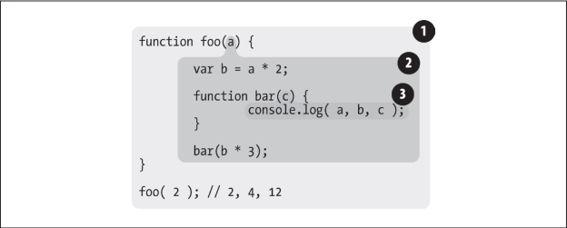

作用域共有两种主要的工作模型。第一种是最为普遍的，被大多数编程语言所采用的**词法作用域**，另外一种叫作**动态作用域**，仍有一些编程语言在使用（比如 `Bash` 脚本、`Perl` 中的一些模式等）。

## 2.1 词法阶段

大部分标准语言编译器的第一个工作阶段叫做词法化（也叫单词化）。回忆一下，词法化的过程会对源代码中的字符进行检查，如果是*有状态的解析过程*，还会赋予单词语义。

简单地说，**词法作用域就是定义在词法阶段的作用域**。换句话说，词法作用域是由你在写代码时将变量和块作用域写在哪里来决定的，因此**当词法分析器处理代码时会保持作用域不变**（大部分情况下是这样的）。

考虑一下代码：

```js
function foo(a) {
  var b = a * 2;
  function bar(c) {
    console.log( a, b, c );
  }
  bar( b * 3 );
}
foo( 2 ); // 2, 4, 12
```



1 包含着整个全局作用域，其中只有一个标识符：foo。

2 包含着 foo 所创建的作用域，其中有三个标识符：a、bar 和 b。

3 包含着 bar 所创建的作用域，其中只有一个标识符：c。

作用域气泡由其对应的作用域块代码写在哪里决定，它们是**逐级包含**的。下一章会讨论不同类型的作用域，但现在只要假设每一个函数都会创建一个新的作用域气泡就好了。没有任何函数可以部分地同时出现在两个父级函数中。

### 查找

作用域气泡的结构和互相之间的位置关系给引擎提供了足够的位置信息，引擎用这些信息来查找标识符的位置。

在上一个代码片段中，引擎执行 `console.log(..)` 声明，并查找 `a`、`b` 和 `c` 三个变量的引用。它首先从最内部的作用域，也就是 `bar(..)` 函数的作用域气泡开始查找。引擎无法在这里找到 `a`，因此会去上一级到所嵌套的 `foo(..)` 的作用域中继续查找。在这里找到了 `a`，因此引擎使用了这个引用。对 `b` 来讲也是一样的。而对 `c` 来说，引擎在 `bar(..)` 中就找到了它。

如果 `a`、`c` 都存在于 `bar(..)` 和 `foo(..)` 的内部，`console.log(..)` 就可以直接使用 `bar(..)`中的变量，而无需到外面的 `foo(..)` 中查找。

**作用域查找会在找到第一个匹配的标识符时停止。**作用域查找始终**从运行时所处的最内部作用域**开始，逐级向外或者说向上进行，直到遇见第一个匹配的标识符为止。

无论函数在**哪里**被调用，也无论它**如何**被调用，它的词法作用域都**只由函数被声明时所处的位置决定**。

词法作用域查找**只会查找一级标识符**，比如 `a`、`b` 和 `c`。如果代码中引用了 f`oo.bar.baz`，词法作用域查找只会试图查找 `foo` 标识符，找到这个变量后，对象属性访问规则会分别接管对 `bar` 和 `baz` 属性的访问。

## 2.2 欺骗词法

**欺骗词法作用域会导致性能下降。**

### 2.2.1 eval

在执行 `eval(..)` 之后的代码时，引擎并不 “知道” 或 “在意” 前面的代码是以动态形式插入进来，并对词法作用域的环境进行修改的。引擎只会如往常地进行词法作用域查找。

```js
function foo(str, a) {
  eval( str ); // 欺骗！
  console.log( a, b );
}
var b = 2;
foo( "var b = 3;", 1 ); // 1, 3
```

在严格模式的程序中，`eval(..)` 在运行时有其自己的词法作用域，意味着其中的声明无法修改所在的作用域。

在程序中动态生成代码的使用场景非常罕见，因为它所带来的好处无法抵消性能上的损失。

```js
function foo(str) {
  "use strict";
  eval( str );
    console.log( a ); // ReferenceError: a is not defined
}
foo( "var a = 2" );
```

### 2.2.2 with

`with` 通常被当作重复引用同一个对象中的多个属性的快捷方式，可以不需要重复引用对象本身。

```js
var obj = {
  a: 1,
  b: 2,
  c: 3
};

// 单调乏味的重复 "obj"
obj.a = 2;
obj.b = 3;
obj.c = 4;

// 简单的快捷方式
with (obj) {
  a = 3;
  b = 4;
  c = 5;
}
```

但实际上这不仅仅是为了方便地访问对象属性。考虑如下代码：

```js
function foo(obj) {
  with (obj) {
    a = 2;
  }
}

var o1 = {
  a: 3
};

var o2 = {
  b: 3
};

foo( o1 );
console.log( o1.a ); // 2

foo( o2 );
console.log( o2.a ); // undefined
console.log( a ); // 2 —— 不好，a 被泄漏到全局作用域上了！
```

一个奇怪的副作用，实际上 `a = 2` 赋值操作创建了一个全局的变量 `a`。这是怎么回事？

`with` 可以将一个没有或有多个属性的对象处理为一个完全隔离的词法作用域，因此这个对象的属性也会被处理为定义在这个作用域中的词法标识符。

`o2` 的作用域、`foo(..)` 的作用域和全局作用域中都没有找到标识符 `a`，因此当 `a＝2` 执行时，**自动创建了一个全局变量**（因为是非严格模式）。

另外一个不推荐使用 `eval(..)` 和 `with` 的原因是会被**严格模式所影响**（限制）。`with` 被完全禁止，而在保留核心功能的前提下，间接或非安全地使用 `eval(..)` 也被禁止了。

### 2.2.3 性能

`eval(..)` 和 `with` 会**在运行时修改或创建新的作用域**，以此来欺骗其他在书写时定义的词法作用域。

JavaScript 引擎会在编译阶段进行数项的性能优化。其中有些依赖于能够**根据代码的词法进行静态分析**，**并预先确定所有变量和函数的定义位置**，才能**在执行过程中快速找到标识符**。

但如果引擎在代码中发现了 `eval(..)` 或 `with`，它只能够简单地假设**关于标识符位置的判断都是无效的**，因为无法在词法分析阶段明确知道 `eval(..)` 会接收到什么代码，这些代码会如何对作用域进行修改，也无法知道传递给 `with` 用来创建新词法作用域的对象的内容到底是什么。

最悲观的情况是如果出现了 `eval(..)` 或 `with`，所有的优化可能都是无意义的，因此最简单的做法就是完全不做任何优化。

如果代码中大量使用 `eval(..)` 或 `with`，那么运行起来一定会变得非常慢。无论引擎多聪明，试图将这些悲观情况的副作用限制在最小范围内，***也无法避免如果没有这些优化，代码会运行得更慢这个事实。***

## 2.3 小结

词法作用域意味着作用域是*由书写代码时函数声明的位置*来决定的。编译的词法分析阶段基本能够知道全部标识符在哪里以及是如何声明的，从而能够预测在执行过程中如何对它们进行查找。

JavaScript 中有两个机制可以 “欺骗” 词法作用域：`eval(..)` 和 `with`。前者可以对一段包含一个或多个声明的 “代码” 字符串进行演算，并借此来 ***修改已经存在的词法作用域*** （在运行时）。后者本质上是通过将一个对象的引用 ***当作*** 作用域来处理，***将对象的属性当作作用域的标识符来处理***，从而创建了一个新的词法作用域（同样是在运行时）。

这两个机制的副作用是***引擎无法在编译时对作用域查找进行优化***，因为引擎只能严谨地认为这样的优化是无效的。使用这其中任何一个机制将导致代码运行变慢。不要使用它们。
