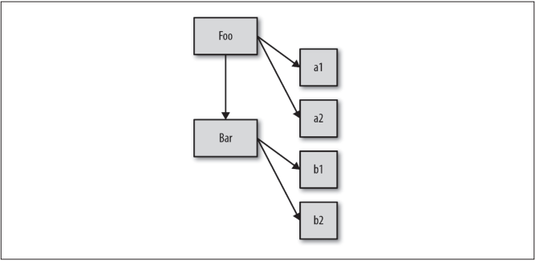

第 4 章中介绍的所有模拟类复制行为的方法，如各种混入，都没有使用 `[[Prototype]]` 链机制。

## 5.1 `[[Prototype]]`

JavaScript 中的对象有一个特殊的 `[[Prototype]]` 内置属性，其实就是对于其他对象的引用。几乎所有的对象在创建时 `[[Prototype]]` 属性都会被赋予一个非空的值。

```js
var myObject = {
  a: 2
};
myObject.a; // 2
```

`[[Prototype]]` 引用有什么用呢？在第 3 章中我们说过，当你试图引用对象的属性时会触发 `[[Get]]` 操作，比如  `myObject.a`。对于默认的 `[[Get]]` 操作来说，第一步是**检查对象本身**是否有这个属性，如果有的话就使用它。

要注意，如果包含 `Proxy` 的话，我们这里对 `[[Get]]` 和 `[[Put]]` 的讨论就不适用。

但是如果 a 不在 myObject 中，就需要使用对象的 `[[Prototype]]` 链了。

**对于默认的 `[[Get]]` 操作来说，如果无法在对象本身找到需要的属性，就会继续访问对象的 `[[Prototype]]` 链**:

```js
var anotherObject = {
  a: 2
};
// 创建一个关联到 anotherObject 的对象
var myObject = Object.create( anotherObject );
myObject.a; // 2
```

`Object.create(..)` 的原理，现在只需要知道它会**创建一个对象并把这个对象的 `[[Prototype]]` 关联到指定的对象**。

现在 myObject 对象的 `[[Prototype]]` 关联到了 anotherObject。显然 myObject.a 并不存在，但是尽管如此，属性访问仍然成功地（在 anotherObject 中）找到了值 2。但是，如果 anotherObject 中也找不到 a 并且 `[[Prototype]]` 链不为空的话，就会继续查找下去。这个过程会持续到找到匹配的属性名或者查找完整条 `[[Prototype]]` 链。如果是后者的话，`[[Get]]` 操作的返回值是 `undefined`。

使用 `for..in` 遍历对象时原理和查找 `[[Prototype]]` 链类似，任何可以通过原型链访问到（并且是 `enumerable`，参见第 3 章）的属性都会被枚举。使用 `in` 操作符来检查属性在对象中是否存在时，同样会查找对象的整条原型链（无论属性是否可枚举）：

```js
var anotherObject = {
  a: 2
};
// 创建一个关联到 anotherObject 的对象
var myObject = Object.create( anotherObject );
for (var k in myObject) {
  console.log("found: " + k);
}
// found: a
("a" in myObject); // true
```

因此，当你通过各种语法进行属性查找时都会查找 `[[Prototype]]` 链，直到找到属性或者查找完整条原型链。

### 5.1.1 `Object.prototype`

但是到哪里是 `[[Prototype]]` 的 “尽头” 呢？

所有普通的 `[[Prototype]]` 链最终都会指向内置的 `Object.prototype`。由于所有的 “普通”（内置，不是特定主机的扩展）对象都 “源于”（或者说把 `[[Prototype]]` 链的顶端设置为）这个 `Object.prototype` 对象，所以它包含 JavaScript 中许多通用的功能。

有些功能你应该已经很熟悉了， 比如说 `.toString()` 和 `.valueOf()`， 第3章还介绍过 `.hasOwnProperty(..)`。稍后我们还会介绍 `.isPrototypeOf(..)`，这个你可能不太熟悉。

### 5.1.2 属性设置和屏蔽

给一个对象设置属性并不仅仅是添加一个新属性或者修改已有的属性值。

```js
myObject.foo = "bar";
```

如果 myObject 对象中包含名为 foo 的普通数据访问属性，这条赋值语句只会修改已有的属性值。

如果 foo 不是直接存在于 myObject 中，`[[Prototype]]` 链就会被遍历，类似 `[[Get]]` 操作。如果原型链上找不到 foo，foo 就会被直接添加到 myObject 上。

然而，如果 foo 存在于原型链上层，赋值语句 `myObject.foo = "bar"` 的行为就会有些不同。

如果属性名 foo 既出现在 myObject 中也出现在 myObject 的 `[[Prototype]]` 链上层，那么就会发生**屏蔽**。myObject 中包含的 foo 属性会屏蔽原型链上层的所有 foo 属性，因为 `myObject.foo` **总是会选择原型链中最底层**的 foo 属性。

屏蔽比我们想象中更加复杂。下面我们分析一下如果 foo 不直接存在于 myObject 中而是存在于原型链上层时 `myObject.foo = "bar"` 会出现的三种情况。

1. 如果在 `[[Prototype]]` 链上层存在名为 foo 的普通数据访问属性并且**没有被标记**为只读（`writable:false`），那就会直接在 myObject 中**添加**一个名为 foo 的新属性，它是**屏蔽属性**。
2. 如果在 `[[Prototype]]` 链上层存在 foo，但是它**被标记**为只读（`writable:false`），那么无法修改已有属性或者在 myObject 上创建屏蔽属性。如果运行在严格模式下，代码会抛出一个错误。否则，这条赋值语句会被忽略。总之，**不会**发生屏蔽。
3. 如果在 `[[Prototype]]` 链上层存在 foo 并且它是一个 setter，那就一定会调用这个 setter。foo 不会被添加到（或者说屏蔽于）myObject，也不会重新定义 foo 这个 setter。

大多数开发者都认为如果向 `[[Prototype]]` 链上层已经存在的属性（`[[Put]]`）赋值，就一定会触发屏蔽，但是如你所见，三种情况中只有一种（第一种）是这样的。

如果你希望在第二种和第三种情况下也屏蔽 foo，那就不能使用 `=` 操作符来赋值，而是使用 `Object.defineProperty(..)`（参见第 3 章）来向 myObject 添加 foo。

如果需要对屏蔽方法进行委托的话就不得不使用丑陋的显式伪多态（参见第 4 章）。通常来说，使用屏蔽得不偿失，所以应当尽量避免使用。第 6 章会介绍另一种不使用屏蔽的更加简洁的设计模式。

有些情况下会**隐式产生屏蔽**，一定要当心。思考下面的代码：

```js
var anotherObject = {
  a: 2
};
var myObject = Object.create( anotherObject );
anotherObject.a; // 2
myObject.a; // 2 
anotherObject.hasOwnProperty( "a" ); // true
myObject.hasOwnProperty( "a" ); // false 

myObject.a++; // 隐式屏蔽！

anotherObject.a; // 2 
myObject.a; // 3 

myObject.hasOwnProperty( "a" ); // true
```

尽管 `myObject.a++` 看起来应该（通过委托）查找并增加 `anotherObject.a` 属性，但是别忘了 `++` 操作相当于 `myObject.a = myObject.a + 1`。因此 `++` 操作首先会通过 `[[Prototype]]`查找属性 a 并从 `anotherObject.a` 获取当前属性值 2，然后给这个值加 1，接着用 `[[Put]]` 将值 3 赋给 `myObject` 中新建的屏蔽属性 a，天呐！

修改委托属性时一定要小心。如果想让 `anotherObject.a` 的值增加，唯一的办法是 `anotherObject.a++`。

## 5.2 “类”

JavaScript 才是真正应该被称为 “面向对象” 的语言，因为它是少有的可以不通过类，直接创建对象的语言。

在 JavaScript 中，类无法描述对象的行为，（因为根本就不存在类！）对象直接定义自己的行为。再说一遍，JavaScript 中只有对象。

### 5.2.1 “类” 函数

```js
function Foo() {
 // ...
}
var a = new Foo();
Object.getPrototypeOf( a ) === Foo.prototype; // true
```

调用 new Foo() 时会创建 a，其中一步就是将 a 内部的 `[[Prototype]]` 链接到 Foo.prototype 所指向的对象。

在面向类的语言中，**类可以被复制（或者说实例化）多次**，就像用模具制作东西一样。之所以会这样是因为实例化（或者继承）一个类就意味着 “把类的行为复制到物理对象中”，对于每一个新实例来说都从重复这个过程。

但是在 JavaScript 中，并没有类似的复制机制。你不能创建一个类的多个实例，只能创建多个对象，它们 `[[Prototype]]` 关联的是同一个对象。但是在默认情况下并不会进行复制，因此这些对象之间并不会完全失去联系，它们是**互相关联**的。

`new Foo()` 会生成一个新对象（我们称之为 a），这个新对象的内部链接 `[[Prototype]]` 关联的是 `Foo.prototype` 对象。

#### 关于名称

继承意味着复制操作，JavaScript 并不会复制对象属性。相反，JavaScript 会在两个对象之间创建一个关联，这样一个对象就可以通过**委托**访问另一个对象的属性和函数。委托这个术语更加准确地描述了 JavaScript 中对象的关联机制。

### 5.2.2 “构造函数”

```js
function Foo() {
 // ...
}
Foo.prototype.constructor === Foo; // true
var a = new Foo();
a.constructor === Foo; // true
```

`Foo.prototype` 默认（在代码中第一行声明时！）有一个公有并且不可枚举的属性 `.constructor`，这个属性引用的是**对象关联的函数**（本例中是 Foo）。此外，我们可以看到通过 “构造函数” 调用 new Foo() 创建的对象也有一个 `.constructor` 属性，指向
“创建这个对象的函数”。

按照 JavaScript 世界的惯例，“类” 名首字母要大写，所以名字写作 Foo 而非 foo 似乎也提示它是一个“类”。显而易见，是吧 ?!

#### 1. 构造函数还是调用

上一段代码很容易让人认为 Foo 是一个构造函数，因为我们使用 `new` 来调用它并且看到 “构造” 了一个对象。

实际上，Foo 和你程序中的其他函数没有任何区别。函数本身并不是构造函数，然而，当你在普通的函数调用前面加上 `new` 关键字之后，就会把这个函数调用变成一个 “构造函数调用”。实际上，`new` 会劫持所有普通函数并**用构造对象的形式来调用它**。

```js
function NothingSpecial() {
 console.log( "Don't mind me!" );
}
var a = new NothingSpecial();
// "Don't mind me!"
a; // {}
```

NothingSpecial 只是一个普通的函数，但是使用 `new` 调用时，它就会构造一个对象并赋值给 a，这看起来像是 `new` 的一个副作用（无论如何都会构造一个对象）。这个调用是一个**构造函数调用**，但是 NothingSpecial 本身并不是一个构造函数。

换句话说，在 JavaScript 中对于 “构造函数” 最准确的解释是，**所有带 `new` 的函数调用**。

***函数不是构造函数，但是当且仅当使用 `new` 时，函数调用会变成 “构造函数调用”。***

### 5.2.3 技术

JavaScript 开发者绞尽脑汁想要模仿类的行为：

```js
function Foo(name) {
  this.name = name;
}
Foo.prototype.myName = function() {
  return this.name;
};
var a = new Foo( "a" );
var b = new Foo( "b" );
a.myName(); // "a"
b.myName(); // "b"
```

这段代码展示了另外两种 “面向类” 的技巧：

1. this.name = name 给每个对象都添加了 .name 属性，有点像类实例封装的数据值。
2. `Foo.prototype.myName = ...` 可能个更有趣的技巧，它会给 Foo.prototype 对象添加一个属性（函数）。现在，a.myName() 可以正常工作。

在这段代码中，看起来似乎创建 a 和 b 时会把 Foo.prototype 对象复制到这两个对象中，然而事实并不是这样。

在本章开头介绍默认 `[[Get]]` 算法时我们介绍过 `[[Prototype]]` 链，以及当属性不直接存在于对象中时如何通过它来进行查找。

因此，在创建的过程中，a 和 b 的内部 [[Prototype]] 都会关联到 Foo.prototype 上。当 a 和 b 中无法找到 myName 时，它会（通过委托，参见第 6 章）在 Foo.prototype 上找到。

#### 回顾 “构造函数”

之前讨论 `.constructor` 属性时我们说过，看起来 `a.constructor === Foo` 为真意味着 `a` 确实有一个指向 `Foo` 的 `.constructor` 属性，但是事实不是这样。

这是一个很不幸的误解。实际上，`.constructor` 引用同样被委托给了 `Foo.prototype`，而 `Foo.prototype.constructor` 默认指向 `Foo`。

`.constructor` 属性指向 Foo 看作是 a 对象由 Foo “构造” 非常容易理解，但这只不过是一种虚假的安全感。`a.constructor` 只是通过默认的 `[[Prototype]]` 委托指向 Foo，这和 “构造”毫无关系。相反，对于 .constructor 的错误理解很容易对你自己产生误导。

`Foo.prototype` 的 `.constructor` 属性只是 `Foo` 函数在声明时的默认属性。如果你创建了一个新对象并替换了函数默认的 `.prototype` 对象引用，那么新对象并**不会**自动获得 `.constructor` 属性。

```js
function Foo() { /* .. */ }
Foo.prototype = { /* .. */ }; // 创建一个新原型对象
var a1 = new Foo();
a1.constructor === Foo; // false!
a1.constructor === Object; // true!
```

`Object(..)` 并没有 “构造” `a1`，对吧？看起来应该是 `Foo()` “构造” 了它。大部分开发者都认为是 `Foo()` 执行了构造工作，但是问题在于，如果你认为 “constructor” 表示“由……构造” 的话，`a1.constructor` 应该是 `Foo`，但是它并不是 `Foo` ！

到底怎么回事？ a1 并没有 .constructor 属性，所以它会委托 [[Prototype]] 链上的 Foo.prototype。但是这个对象也没有 .constructor 属性（不过默认的 Foo.prototype 对象有这个属性！），所以它会继续委托，这次会委托给委托链顶端的 Object.prototype。这个对象有 .constructor 属性，指向内置的 Object(..) 函数。

错误观点已被摧毁。

当然，你可以给 Foo.prototype 添加一个 .constructor 属性，不过这需要手动添加一个符
合正常行为的不可枚举（参见第 3 章）属性。

```js
function Foo() { /* .. */ }
Foo.prototype = { /* .. */ }; // 创建一个新原型对象
// 需要在 Foo.prototype 上“修复”丢失的 .constructor 属性
// 新对象属性起到 Foo.prototype 的作用
// 关于 defineProperty(..)，参见第 3 章
Object.defineProperty( Foo.prototype, "constructor" , {
  enumerable: false,
  writable: true,
  configurable: true,
  value: Foo // 让 .constructor 指向 Foo
} );
```

修复 .constructor 需要很多手动操作。所有这些工作都是源于把 “constructor” 错误地理解为“由……构造”，这个误解的代价实在太高了。

实际上，对象的 `.constructor` 会默认指向一个函数，这个函数可以通过对象的 `.prototype` 引用。 “constructor” 和 “prototype” 这两个词本身的含义可能适用也可能不适用。最好的办法是记住这一点 **“constructor 并不表示被构造”**。

`.constructor` 并不是一个不可变属性。它是**不可枚举**（参见上面的代码）的，但是它的值是**可写的**（可以被修改）。此外，你可以给任意 `[[Prototype]]` 链中的任意对象添加一个名为 `constructor` 的属性或者对其进行修改，你可以任意对其赋值。

和 `[[Get]]` 算法查找 `[[Prototype]]` 链的机制一样，`.constructor` 属性引用的目标可能和你想的完全不同。

`a1.constructor` 是一个非常不可靠并且不安全的引用。通常来说要尽量避免使用这些引用。

## 5.3 （原型）继承

之前我们只把继承看作是类和类之间的关系，并没有把它看作是类和实例之间的关系：



图中由下到上的箭头表明这是委托关联，不是复制操作。

下面这段代码使用的就是典型的 “原型风格”：

```js
function Foo(name) {
  this.name = name;
}
Foo.prototype.myName = function () {
  return this.name;
}
function Bar(name, label) {
  Foo.call(this, name);
  this.label = label;
} 
// 我们创建了一个新的 Bar.prototype 对象关联到 Foo.prototype
Bar.prototype = Object.create(Foo.prototype);

// 注意！现在没有 Bar.prototype.constructor 了
// 如果你需要这个属性的话可能需要手动修复一下它
Bar.prototype.myLabel = function() {
  return this.label;
}

var a = new Bar("a", "obj a")
a.myName(); // "a"
a.myLabel(); // "obj a"
```

这段代码的核心部分就是语句 `Bar.prototype = Object.create(Foo.prototype)`。 **调用 `Object.create(..)` 会凭空创建一个 “新” 对象并把新对象内部的 `[[Prototype]]` 关联到你指定的对象**（本例中是 Foo.prototype）。

换句话说，这条语句的意思是：“创建一个新的 Bar.prototype 对象并把它关联到 Foo.prototype”。

注意，下面这两种方式是常见的错误做法，实际上它们都存在一些问题：

```js
// 和你想要的机制不一样！
Bar.prototype = Foo.prototype;

// 基本上满足你的需求，但是可能会产生一些副作用 :(
Bar.prototype = new Foo();
```

Bar.prototype = Foo.prototype 并不会创建一个关联到 Bar.prototype 的新对象，它只是让 Bar.prototype 直接**引用** Foo.prototype 对象。因此当你执行类似 Bar.prototype.myLabel = ... 的赋值语句时会**直接修改** Foo.prototype 对象本身。显然这不是你想要的结果，否则你根本不需要 Bar 对象，直接使用 Foo 就可以了，这样代码也会更简单一些。

Bar.prototype = new Foo() 的确会创建一个关联到 Bar.prototype 的新对象。但是它使用了 Foo(..) 的 “构造函数调用”，如果函数 Foo 有一些**副作用**（比如写日志、修改状态、注册到其他对象、给 this 添加数据属性，等等）的话，就会**影响**到 Bar() 的“后代”，后果不堪设想。

因此，要创建一个合适的关联对象，我们必须使用 Object.create(..) 而不是使用具有副作用的 Foo(..)。这样做唯一的缺点就是需要创建一个新对象然后把旧对象**抛弃掉**，不能直接修改已有的默认对象。

如果能有一个**标准并且可靠的方法来修改对象的 `[[Prototype]]` 关联**就好了。在 `ES6` 之前，我们只能通过设置 `.__proto__` 属性来实现，但是这个方法并**不是标准并且无法兼容所有浏览器**。`ES6` 添加了辅助函数 `Object.setPrototypeOf(..)`，可以用标准并且可靠的方法来修改关联。

我们来对比一下两种把 Bar.prototype **关联到** Foo.prototype 的方法：

```js
// ES6 之前需要抛弃默认的 Bar.prototype
Bar.prototype = Object.create( Foo.prototype );

// ES6 开始可以直接修改现有的 Bar.prototype
Object.setPrototypeOf(Bar.prototype, Foo.prototype);
```

如果忽略掉 `Object.create(..)` 方法带来的轻微性能损失（抛弃的对象需要进行垃圾回收），它实际上比 `ES6` 及其之后的方法更短而且可读性更高。不过无论如何，这是两种完全不同的语法。

### 检查“类”关系

假设有对象 a，如何寻找对象 a 委托的对象（如果存在的话）呢？在传统的面向类环境中，检查一个实例（JavaScript 中的对象）的继承祖先（JavaScript 中的委托关联）通常被称为**内省**（或者**反射**）。

```js
function foo() {
  // ...
}
Foo.prototype.blah = ...;
var a = new Foo();
```

我们如何通过内省找出 a 的“祖先”（委托关联）呢？第一种方法是站在 ***“类”*** 的角度来判断：

`a instanceof Foo; // true`

`instanceof` 操作符的左操作数是一个普通的对象，右操作数是一个函数。`instanceof` 回答的问题是：在 `a` 的整条 `[[Prototype]]` 链中**是否有指向** `Foo.prototype` 的对象？

可惜，这个方法只能处理**对象**（a）和**函数**（带 .prototype 引用的 Foo）之间的关系。如果你想判断两个对象（比如 a 和 b）之间是否通过 `[[Prototype]]` 链关联，只用 `instanceof` 无法实现。

下面是第二种判断 `[[Prototype]]` ***反射***的方法，它更加简洁：

`Foo.prototype.isPrototypeOf(a); // true`

注意，在本例中，我们实际上并不关心（甚至不需要）Foo，我们只需要一个可以用来判断的对象（本例中是 Foo.prototype）就行。`isPrototypeOf(..)` 回答的问题是：在 a 的整条 `[[Prototype]]` 链中**是否出现过** Foo.prototype ？

我们只需要**两个对象**就可以判断它们之间的关系。举例来说：

```js
// 非常简单：b 是否出现在 c 的 [[Prototype]] 链中？
b.isPrototypeOf( c );
```

我们也可以直接获取一个对象的 `[[Prototype]]` 链。在 `ES5` 中，标准的方法是：

`Object.getPrototypeOf( a )`

可以验证一下，这个对象引用是否和我们想的一样：

`Object.getPrototypeOf( a ) === Foo.prototype; // true`

绝大多数（不是所有！）浏览器也支持一种**非标准**的方法来访问内部 `[[Prototype]]` 属性：

`a.__proto__ === Foo.prototype; // true`

这个奇怪的 `.__proto__`（在 ES6 之前并不是标准！）属性 “神奇地” 引用了内部的 `[[Prototype]]` 对象，如果你想直接查找（甚至可以通过 `.__proto__.__ptoto__...` 来遍历）原型链的话，这个方法非常有用。

和我们之前说过的 `.constructor` 一样，`.__proto__` 实际上并不存在于你正在使用的对象中（本例中是 a）。实际上，它和其他的常用函数（`.toString()`、`.isPrototypeOf(..)`，等等）一样，存在于内置的 `Object.prototype` 中。（它们是**不可枚举**的，参见第 2 章。）

此外，`.__proto__` 看起来很像一个属性，但是实际上它更像一个 `getter/setter`（参见第 3 章）。

`.__proto__` 的实现大致上是这样的（对象属性的定义参见第 3 章）：

```js
Object.defineProperty(Object.prototype, "__proto__", {
  get: function() {
    return Object.getPrototypeOf(this);
  },
  set: function(o) {
    // ES6 中的 setPrototypeOf(..)
    Object.setPrototype(this, o)
    return o;
  }
})
```

因此，访问（获取值）`a.__proto__` 时，实际上是调用了 `a.__proto__()`（调用 `getter` 函数）。虽然 `getter` 函数存在于 `Object.prototype` 对象中，但是它的 `this` 指向对象 `a`（this的绑定规则参见第 2 章），所以和 `Object.getPrototypeOf( a )` 结果相同。

`.__proto__` 是**可设置属性**，之前的代码中使用 `ES6` 的 `Object.setPrototypeOf(..)` 进行设置。然而，通常来说你**不需要修改**已有对象的 `[[Prototype]]`。

## 5.4 对象关联

现在我们知道了，`[[Prototype]]` 机制就是存在于对象中的一个内部链接，它会引用其他对象。

通常来说，这个链接的作用是：如果在对象上没有找到需要的属性或者方法引用，引擎就会继续在 `[[Prototype]]` 关联的对象上进行查找。同理，如果在后者中也没有找到需要的引用就会继续查找它的 `[[Prototype]]`，以此类推。这一系列对象的链接被称为 “原型链”。

### 5.4.1 创建关联

```js
var foo = {
  something: function() {
    console.log( "Tell me something good..." );
  }
};
var bar = Object.create( foo );
bar.something(); // Tell me something good...
```

**`Object.create(..)` 会创建一个新对象并把它关联到我们指定的对象**，这样我们就可以充分发挥 `[[Prototype]]` 机制的威力（委托）并且避免不必要的麻烦（比如使用 `new` 的构造函数调用会生成 `.prototype` 和 `.constructor` 引用）。

`Object.create(null)` 会创建一个拥有空（或者说 null）`[[Prototype]]` 链接的对象，这个对象**无法**进行委托。由于这个对象没有原型链，所以 `instanceof` 操作符（之前解释过）无法进行判断，因此总是会返回 `false`。这些特殊的空 `[[Prototype]]` 对象通常被称作 **“字典”**，它们**完全不会受**到原型链的干扰，因此**非常适合用来存储数据**。

我们并**不需要**类来创建两个对象之间的关系，只需要通过**委托**来关联对象就足够了。而 `Object.create(..)` 不包含任何 “类的诡计”，所以它可以完美地创建我们想要的关联关系。

`Object.create()` 的 `polyfill` 代码

```js
if(!Object.create) {
  Object.create = function(o) {
    function F() {}
    F.prototype = o;
    return new F();
  }
}
```

这段 `polyfill` 代码使用了一个一次性函数 `F`，我们通过改写它的 `.prototype` 属性使其**指向想要关联的对象**，然后再使用 `new F()` 来构造一个新对象进行关联。

### 5.4.2 关联关系是备用

看起来对象之间的关联关系是处理 “缺失” 属性或者方法时的一种备用选项。这个说法有点道理，但是我认为这并不是 `[[Prototype]]` 的本质。

```js
var anotherObject = {
  cool: function() {
    console.log( "cool!" );
  }
};
var myObject = Object.create( anotherObject );
myObject.cool(); // "cool!"
```

由于存在 `[[Prototype]]` 机制，这段代码可以正常工作。但是如果你这样写只是为了让 myObject 在无法处理属性或者方法时可以使用备用的 anotherObject，那么你的软件就会变得有点“神奇”，而且很难理解和维护。

这并不是说任何情况下都不应该选择备用这种设计模式，但是这在 JavaScript 中并不是很常见。所以如果你使用的是这种模式，那或许应当退后一步并重新思考一下这种模式是否合适。

在 `ES6` 中有一个被称为 “代理”（`Proxy`）的高端功能，它实现的就是 “方法无法找到” 时的行为。

```js
var anotherObject = {
  cool: function() {
    console.log( "cool!" );
  }
};
var myObject = Object.create( anotherObject );
myObject.doCool = function() {
  this.cool(); // 内部委托！
};
myObject.doCool(); // "cool!"
```

这里我们调用的 myObject.doCool() 是实际存在于 myObject 中的，这可以让我们的 API 设计更加清晰（不那么“神奇”）。从内部来说，我们的实现遵循的是**委托设计模式**（参见第6 章），通过 `[[Prototype]]` 委托到 `anotherObject.cool()`。

换句话说，**内部委托**比起直接委托可以让 API 接口设计更加清晰。

## 5.5 小结

如果要访问对象中并不存在的一个属性，`[[Get]]` 操作（参见第 3 章）就会查找对象内部 `[[Prototype]]` 关联的对象。这个关联关系实际上定义了一条 “原型链”（有点像嵌套的作用域链），在查找属性时会对它进行遍历。

所有普通对象都有内置的 `Object.prototype`，指向原型链的顶端（比如说全局作用域），如果在原型链中找不到指定的属性就会停止。`toString()`、`valueOf()` 和其他一些通用的功能都存在于 `Object.prototype` 对象上，因此语言中所有的对象都可以使用它们。

关联两个对象最常用的方法是使用 `new` 关键词进行函数调用，在调用的 4 个步骤（第 2 章）中会**创建一个关联其他对象的新对象**。

使用 `new` 调用函数时会把新对象的 `.prototype` 属性关联到 “其他对象”。带 `new` 的函数调用通常被称为 “构造函数调用”，尽管它们实际上和传统面向类语言中的类构造函数不一样。

虽然这些 `JavaScript` 机制和传统面向类语言中的 “类初始化” 和 “类继承” 很相似，但是 `JavaScript` 中的机制有一个核心区别，那就是**不会进行复制**，**对象之间是通过内部的`[[Prototype]]` 链关联的**。

出于各种原因，以“继承”结尾的术语（包括“原型继承”）和其他面向对象的术语都无法帮助你理解 JavaScript 的真实机制（不仅仅是限制我们的思维模式）。

相比之下，“委托” 是一个更合适的术语，因为对象之间的关系不是复制而是**委托**。
