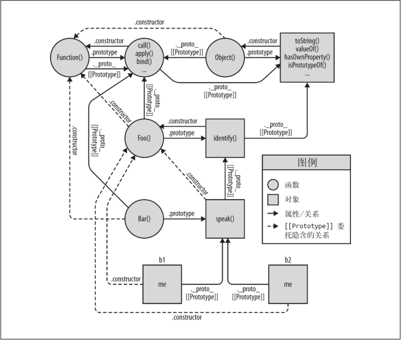
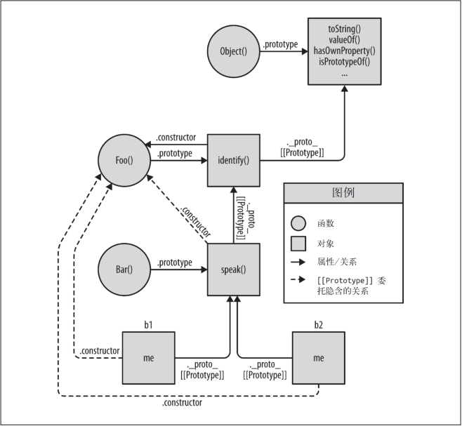

我们用一种**更加简单直接**的方法来深入发掘一下 JavaScript 中对象的 `[[Prototype]]` 机制到底是什么。

JavaScript 中这个机制的本质就是**对象之间的关联关系**。

## 6.1 面向委托的设计

面向类的设计中**有些**原则依然有效，因此不要把所有知识都抛掉。举例来说，**封装**是非常有用的，它同样可以应用在委托中（虽然不太常见）。

### 6.1.1 类理论

现许多行为可以先 “抽象” 到父类然后再用子类进行特殊化（重写）。

```js
class Task {
  id;
  // 构造函数 Task()
  Task(ID) { id = ID; }
  outputTask() { output(id); }
}

class XYZ inherits Task {
  label;
  // 构造函数 XYZ()
  XYZ(ID, Label) { super(ID); label = Label; }
  outputTask() { super(); output(label); }
}

class ABC inherits Task {
  // ...
}
```

现在你可以实例化子类 XYZ 的一些副本然后使用这些实例来执行任务“XYZ”。这些实例会复制 Task 定义的通用行为以及 XYZ 定义的特殊行为。同理，ABC 类的实例也会复制 Task的行为和 ABC 的行为。在构造完成后，你通常只需要操作这些实例（而不是类），因为每个实例都有你需要完成任务的所有行为。

### 6.1.2 委托理论

但是现在我们试着来使用**委托行为**而不是类来思考同样的问题。

```js
Task = {
  setID: function(ID) { this.id = ID; },
  outputID: function() { console.log( this.id ); }
};
// 让 XYZ 委托 Task
XYZ = Object.create( Task );
XYZ.prepareTask = function(ID,Label) {
  this.setID( ID );
  this.label = Label;
};
XYZ.outputTaskDetails = function() {
  this.outputID();
  console.log( this.label );
};
// ABC = Object.create( Task );
// ABC ... = ...
```

在这段代码中，Task 和 XYZ 并不是类（或者函数），它们是**对象**。XYZ 通过 `Object.create(..)` 创建，它的 `[[Prototype]]` 委托了 Task 对象。

相比于面向类（或者说面向对象），我会把这种编码风格称为 “对象关联”（`OLOO`，objects linked to other objects）。我们真正关心的只是 XYZ 对象（和 ABC 对象）委托了 Task 对象。

JavaScript 中，`[[Prototype]]` 机制**会把对象关联到其他对象**。

对象关联风格的代码还有一些不同之处。

1. 在上面的代码中，id 和 label 数据成员都是直接存储在 XYZ 上（而不是 Task）。通常来说，在 `[[Prototype]]` 委托中**最好把状态保存在委托者**（XYZ、ABC）**而不是委托目标**（Task）上。
2. 在类设计模式中，我们故意让父类（Task）和子类（XYZ）中都有 outputTask 方法，这样就可以利用**重写**（多态）的优势。在委托行为中则恰好相反：我们会尽量**避免**在 `[[Prototype]]` 链的不同级别中使用相同的命名，否则就需要使用笨拙并且脆弱的语法来消除引用歧义。
3. 我们和 XYZ 进行交互时可以使用 Task 中的通用方法，因为 XYZ 委托了 Task。

委托行为意味着某些对象（XYZ）在找不到属性或者方法引用时会把这个请求委托给另一个对象（Task）。

这是一种**极其强大**的设计模式，和父类、子类、继承、多态等概念完全不同。在你的脑海中对象并不是按照父类到子类的关系垂直组织的，而是通过任意方向的委托关联并排组织的。

在 API 接口的设计中，**委托最好在内部实现，不要直接暴露出去**。

#### 1. 互相委托（禁止）

你无法在两个或两个以上互相（双向）委托的对象之间创建**循环**委托。如果你把 B 关联到 A 然后试着把 A 关联到 B，就会出错。

很遗憾（并不是非常出乎意料，但是有点烦人）这种方法是**被禁止**的。如果你引用了一个两边都不存在的属性或者方法，那就会在 `[[Prototype]]` 链上产生一个**无限递归的循环**。

#### 2. 调式

以用 JavaScript 的机制来解释 Chrome 的跟踪原理：

```js
function Foo() {}
var a1 = new Foo();

a1.constructor; // Foo(){}
a1.constructor.name; // "Foo"
```

Chrome 是不是直接输出了对象的 `.constructor.name` 呢？令人迷惑的是，答案是 “既是又不是”。

```js
function Foo() {}
var a1 = new Foo();
Foo.prototype.constructor = function Gotcha(){};
a1.constructor; // Gotcha(){}
a1.constructor.name; // "Gotcha"
a1; // Foo {}
```

即使我们把 `a1.constructor.name` 修改为另一个合理的值（Gotcha），Chrome 控制台仍然会输出 Foo。

Chrome 在内部肯定是通过另一种方式进行跟踪。

```js
var Foo = {};
var a1 = Object.create( Foo );
a1; // Object {}
Object.defineProperty( Foo, "constructor", {
  enumerable: false,
  value: function Gotcha(){}
});
a1; // Gotcha {}
```

### 6.1.3 比较思维模型

我们会通过一些示例（Foo、Bar）代码来比较一下两种设计模式（面向对象和对象关联）具体的实现方法。下面是典型的（“原型”）**面向对象**风格：

```js
function Foo(who) {
  this.me = who;
}
Foo.prototype.identify = function() {
  return "I am " + this.me;
};
function Bar(who) {
  Foo.call( this, who );
}
Bar.prototype = Object.create( Foo.prototype );
Bar.prototype.speak = function() {
  alert( "Hello, " + this.identify() + "." );
};
var b1 = new Bar( "b1" );
var b2 = new Bar( "b2" );
b1.speak(); // Hello, I am b1.
b2.speak(); // Hello, I am b2.
```

子类 Bar 继承了父类 Foo，然后生成了 b1 和 b2 两个实例。b1 委托了 Bar.prototype，Bar.prototype 委托了 Foo.prototype。这种风格很常见，你应该很熟悉了。

下面我们看看如何使用**对象关联**风格来编写功能完全相同的代码：

```js
Foo = {
  init: function(who) {
    this.me = who;
  },
  identify: function() {
    return "I am " + this.me;
  }
};
Bar = Object.create( Foo );
Bar.speak = function() {
  alert( "Hello, " + this.identify() + "." );
};
var b1 = Object.create( Bar );
b1.init( "b1" );
var b2 = Object.create( Bar );
b2.init( "b2" );
b1.speak(); // Hello, I am b1.
b2.speak(); // Hello, I am b2.
```

这段代码中我们同样利用 `[[Prototype]]` 把 b1 委托给 Bar 并把 Bar 委托给 Foo，和上一段代码一模一样。我们**仍然实现了三个对象之间的关联**。

但是非常重要的一点是，这段代码**简洁**了许多，我们只是把对象关联起来，并不需要那些既复杂又令人困惑的模仿类的行为（构造函数、原型以及 new）。

问问你自己：如果对象关联风格的代码能够实现类风格代码的所有功能并且更加简洁易懂，那它是不是比类风格更好？

下面我们看看两段代码对应的思维模型。

首先，类风格代码的思维模型强调**实体以及实体间的关系**：



从图中可以看出这是一张十分复杂的关系网。此外，如果你跟着图中的箭头走就会发现，JavaScript 机制有很强的**内部连贯性**。

举例来说，JavaScript 中的函数之所以可以访问 `call(..)`、`apply(..)` 和 `bind(..)`（参见第 2 章），就是因为函数本身是对象。而函数对象同样有 `[[Prototype]]` 属性并且关联到 `Function.prototype` 对象，因此所有函数对象都可以通过**委托**调用这些默认方法。JavaScript 能做到这一点，你也可以！

好，下面我们来看一张简化版的图，它更 “清晰” 一些——只展示了**必要的**对象和关系：



仍然很复杂，是吧？虚线表示的是 Bar.prototype 继承 Foo.prototype 之后丢失的 `.constructor` 属性引用（参见 5.2.3 节的“回顾‘构造函数’”部分），它们还没有被修复。即使移除这些虚线，这个思维模型在你处理对象关联时仍然非常复杂。

现在我们看看**对象关联**风格代码的思维模型：


通过比较可以看出，对象关联风格的代码显然更加简洁，因为这种代码只关注一件事：**对象之间的关联关系**。

其他的 “类”技巧都是非常复杂并且令人困惑的。去掉它们之后，事情会变得简单许多（同时保留所有功能）。

## 6.2 类与对象

首先看看 Web 开发中非常典型的一种前端场景：创建 UI 控件（按钮、下拉列表，等等）。

### 6.2.1 控制“类”

你可能已经习惯了面向对象设计模式，所以很快会想到一个包含所有通用控件行为的父类（可能叫作 Widget）和继承父类的特殊控件子类（比如 Button）。

#### ES6的class语法糖

附录 A 会详细介绍 ES6 的 `class` 语法糖，不过这里可以简单介绍一下如何使用 `class` 来实现相同的功能：

```js
class Widget {
  constructor(width,height) {
    this.width = width || 50;
    this.height = height || 50;
    this.$elem = null;
  }
  render($where){
    if (this.$elem) {
      this.$elem.css( {
        width: this.width + "px",
        height: this.height + "px"
      }).appendTo( $where );
    }
  }
}

class Button extends Widget {
  constructor(width,height,label) {
    super( width, height );
    this.label = label || "Default";
    this.$elem = $( "<button>" ).text( this.label );
  }
  render($where) {
    super.render( $where );
    this.$elem.click( this.onClick.bind( this ) );
  }
  onClick(evt) {
    console.log( "Button '" + this.label + "' clicked!" );
  }
}

$( document ).ready( function(){
  var $body = $( document.body );
  var btn1 = new Button( 125, 30, "Hello" );
  var btn2 = new Button( 150, 40, "World" );
  btn1.render( $body );
  btn2.render( $body );
});
```

毫无疑问，使用 `ES6` 的 `class` 之后，上一段代码中许多丑陋的语法都不见了，`super(..)` 函数棒极了。

实际上这里并没有真正的类，`class` 仍然是通过 `[[Prototype]]` 机制实现的，因此我们仍然面临第 4 章至第 6 章提到的思维模式不匹配问题。附录 A 会详细介绍 `ES6` 的 `class` 语法及其实现细节，我们会看到为什么解决语法上的问题无法真正解除对于 JavaScript 中类的误解，尽管它看起来非常像一种解决办法！

### 6.2.2 委托控件对象

下面的例子使用对象关联风格委托来更简单地实现 Widget/Button：

```js
var Widget = {
  init: function(width,height){
    this.width = width || 50;
    this.height = height || 50;
    this.$elem = null;
  },
  insert: function($where){
    if (this.$elem) {
      this.$elem.css( {
        width: this.width + "px",
        height: this.height + "px"
      }).appendTo( $where );
    }
  }
};
var Button = Object.create( Widget );
Button.setup = function(width,height,label){
  // 委托调用
  this.init( width, height );
  this.label = label || "Default";
  this.$elem = $( "<button>" ).text( this.label );
};
Button.build = function($where) {
  // 委托调用
  this.insert( $where );
  this.$elem.click( this.onClick.bind( this ) );
};
Button.onClick = function(evt) {
  console.log( "Button '" + this.label + "' clicked!" );
};
$( document ).ready( function(){
  var $body = $( document.body );
  var btn1 = Object.create( Button );
  btn1.setup( 125, 30, "Hello" );
  var btn2 = Object.create( Button );
  btn2.setup( 150, 40, "World" );
  btn1.build( $body );
  btn2.build( $body );
} );
```

使用对象关联风格来编写代码时不需要把 Widget 和 Button **当作父类和子类**。相反，Widget 只是一个对象，包含一组通用的函数，任何类型的控件都可以委托，Button 同样只是一个对象。（当然，它会**通过委托关联**到 Widget ！）

在委托设计模式中，除了建议**使用不相同**并且更具描述性的方法名之外，还要通过对象关联避免丑陋的显式伪多态调用（Widget.call 和 Widget.prototype.render.call），代之以简单的相对委托调用 this.init(..) 和 this.insert(..)。

如果你仔细观察就会发现，之前的一次调用（var btn1 = new Button(..)）现在变成了两次（var btn1 = Object.create(Button) 和 btn1.setup(..)）。乍一看这似乎是一个缺点（需要更多代码）。

**对象关联可以更好地支持关注分离（separation of concerns）原则**，创建和初始化并不需要合并为一个步骤。

## 6.3 更简洁的设计

在这个场景中我们有两个控制器对象，一个用来操作网页中的登录表单，另一个用来与服务器进行验证（通信）。

在传统的类设计模式中，我们会把基础的函数定义在名为 Controller 的类中，然后**派生**两个子类 LoginController 和 AuthController，它们都继承自 Controller 并且**重写**了一些基础行为：

```js
// 父类
function Controller() {
  this.errors = [];
}
Controller.prototype.showDialog = function(title,msg) {
  // 给用户显示标题和消息
};
Controller.prototype.success = function(msg) {
  this.showDialog( "Success", msg );
};
Controller.prototype.failure = function(err) {
  this.errors.push( err );
  this.showDialog( "Error", err );
};
// 子类
function LoginController() {
  Controller.call( this );
}
// 把子类关联到父类
LoginController.prototype = Object.create( Controller.prototype );
LoginController.prototype.getUser = function() {
  return document.getElementById( "login_username" ).value;
};
LoginController.prototype.getPassword = function() {
  return document.getElementById( "login_password" ).value;
};
LoginController.prototype.validateEntry = function(user, pw) {
  user = user || this.getUser();
  pw = pw || this.getPassword();
  if (!(user && pw)) {
    return this.failure("Please enter a username & password!");
  } else if (pw.length < 5) {
    return this.failure("Password must be 5+ characters!");
  }
  // 如果执行到这里说明通过验证
  return true;
};
// 重写基础的 failure()
LoginController.prototype.failure = function(err) {
  // “super”调用
 Controller.prototype.failure.call(this, "Login invalid: " + err);
};
// 子类
function AuthController(login) {
  Controller.call( this );
  // 合成
  this.login = login;
}
// 把子类关联到父类
AuthController.prototype = Object.create( Controller.prototype );
AuthController.prototype.server = function(url,data) {
  return $.ajax( { url: url,data: data } );
};
AuthController.prototype.checkAuth = function() {
  var user = this.login.getUser();
  var pw = this.login.getPassword();
  if (this.login.validateEntry( user, pw )) {
    this.server( "/check-auth",{
      user: user,
      pw: pw
    })
      .then( this.success.bind( this ) )
      .fail( this.failure.bind( this ) );
  }
};
// 重写基础的 success()
AuthController.prototype.success = function() {
  // “super”调用
  Controller.prototype.success.call( this, "Authenticated!" );
};
// 重写基础的 failure()
AuthController.prototype.failure = function(err) {
  // “super”调用
  Controller.prototype.failure.call(this, "Auth Failed: " + err);
};
var auth = new AuthController(
  // 除了继承，我们还需要合成
  new LoginController()
);
auth.checkAuth();
```

### 反类

但是，我们真的需要用一个 Controller 父类、两个子类加上合成来对这个问题进行建模吗？能不能使用**对象关联风格的行为委托来实现**更简单的设计呢？当然可以！

```js
var LoginController = {
  errors: [],
  getUser: function() {
    return document.getElementById("login_username").value;
  },
  getPassword: function() {
    return document.getElementById("login_password").value;
  },
  validateEntry: function(user, pw) {
    user = user || this.getUser();
    pw = pw || this.getPassword();
    if (!(user && pw)) {
      return this.failure("Please enter a username & password!");
    } else if (pw.length < 5) {
      return this.failure("Password must be 5+ characters!");
    }
    // 如果执行到这里说明通过验证
    return true;
  },
  showDialog: function(title, msg) {
    // 给用户显示标题和消息
  },
  failure: function(err) {
    this.errors.push( err );
    this.showDialog( "Error", "Login invalid: " + err );
  }
};
// 让 AuthController 委托 LoginController
var AuthController = Object.create( LoginController );
AuthController.errors = [];
AuthController.checkAuth = function() {
  var user = this.getUser();
  var pw = this.getPassword();
  if (this.validateEntry( user, pw )) {
    this.server( "/check-auth",{
      user: user,
      pw: pw
    })
    .then( this.accepted.bind( this ) )
    .fail( this.rejected.bind( this ) );
  }
};
AuthController.server = function(url,data) {
  return $.ajax( { url: url, data: data } );
};
AuthController.accepted = function() {
  this.showDialog( "Success", "Authenticated!" )
};
AuthController.rejected = function(err) {
  this.failure( "Auth Failed: " + err );
};
```

由于 AuthController 只是一个对象（LoginController 也一样），因此我们不需要实例化
（比如 new AuthController()），只需要一行代码就行：`AuthController.checkAuth();`

借助对象关联，你可以简单地向委托链上添加一个或多个对象，而且同样不需要实例化：

```js
var controller1 = Object.create( AuthController );
var controller2 = Object.create( AuthController );
```

在行为委托模式中，AuthController 和 LoginController 只是对象，它们之间是**兄弟关系**，并不是父类和子类的关系。代码中 AuthController 委托了 LoginController，反向委托也完全没问题。

这种模式的重点在于**只需要两个实体**（LoginController 和 AuthController），而之前的模式需要三个。

我们不需要 Controller 基类来 “共享” 两个实体之间的行为，因为委托足以满足我们需要的功能。同样，前面提到过，我们也不需要实例化类，因为它们根本就不是类，它们只是对象。此外，我们也不需要合成，因为**两个对象可以通过委托进行合作**。

总结：我们用一种（极其）简单的设计实现了同样的功能，这就是**对象关联**风格代码和**行为委托**设计模式的力量。

## 6.4 更好的语法

在 ES6 中我们可以在任意**对象的字面**形式中使用简洁方法声明（concise method declaration），所以对象关联风格的对象可以这样声明（和 class 的语法糖一样）：

```js
var LoginController = {
  errors: [],
  getUser() { // 妈妈再也不用担心代码里有 function 了！
    // ...
  },
  getPassword() {
    // ...
  }
  // ...
};
```

唯一的**区别**是对象的字面形式仍然需要使用 “,” 来分隔元素，而 `class` 语法不需要。这个区别对于整体的设计来说无关紧要。

此外，在 ES6 中，你可以使用对象的字面形式（这样就可以使用简洁方法定义）来改写之前繁琐的属性赋值语法（ 比 如 AuthController 的 定 义 ）， 然后用 `Object.setPrototypeOf(..)` 来修改它的 `[[Prototype]]`：

```js
// 使用更好的对象字面形式语法和简洁方法
var AuthController = {
  errors: [],
  checkAuth() {
    // ...
  },
  server(url,data) {
    // ...
  }
  // ...
};
// 现在把 AuthController 关联到 LoginController
Object.setPrototypeOf( AuthController, LoginController );
```

使用 ES6 的简洁方法可以让对象关联风格更加人性化（并且仍然比典型的原型风格代码更加简洁和优秀）。你完全不需要使用类就能享受整洁的对象语法！

### 反词法

简洁方法有一个非常小但是非常重要的缺点。思考下面的代码：

```js
var Foo = {
  bar() { /*..*/ },
  baz: function baz() { /*..*/ }
};
```

去掉语法糖之后的代码如下所示：

```js
var Foo = {
  bar: function() { /*..*/ },
  baz: function baz() { /*..*/ }
};
```

看到区别了吗？由于函数对象本身没有名称标识符，所以 bar() 的缩写形式（function()..）实际上会变成一个匿名函数表达式并赋值给 bar 属性。相比之下，具名函数表达式（function baz()..）会额外给 .baz 属性附加一个词法名称标识符 baz。

然后呢？在本书第一部分 “作用域和闭包” 中我们分析了匿名函数表达式的三大主要缺点，下面我们会简单介绍一下这三个缺点，然后和简洁方法定义进行对比。

匿名函数没有 name 标识符，这会导致：

1. 调试栈更难追踪；
2. 自我引用（递归、事件（解除）绑定，等等）更难；
3. 代码（稍微）更难理解。

简洁方法没有第 1 和第 3 个缺点。

去掉语法糖的版本使用的是匿名函数表达式，通常来说并不会在追踪栈中添加 `name`，但是简洁方法很特殊，会给对应的函数对象设置一个内部的 `name` 属性，这样理论上可以用在追踪栈中。（但是追踪的具体实现是不同的，因此无法保证可以使用。）

很不幸，简洁方法无法避免第 2 个缺点，它们不具备可以自我引用的词法标识符。思考下面的代码：

```js
var Foo = {
  bar: function(x) {
    if(x < 10) {
      return Foo.bar( x * 2 );
    }
    return x;
  },
  baz: function baz(x) {
    if(x < 10) {
      return baz( x * 2 );
    }
    return x;
  }
};
```

使用简洁方法时一定要小心这一点。如果你**需要自我引用**的话，那最好使用传统的**具名函数**表达式来定义对应的函数（ · baz: function baz(){..}· ），不要使用简洁方法。

## 6.5 内省

内省就是**检查实例的类型**。类实例的内省主要目的是通过创建方式来判断对象的结构和功能。

下面的代码使用 instanceof 来推测对象 a1 的功能：

```js
function Foo() {
  // ...
}
Foo.prototype.something = function(){
  // ...
}
var a1 = new Foo();
// 之后
if (a1 instanceof Foo) {
  a1.something();
}
```

因为 Foo.prototype 在 a1 的 `[[Prototype]]` 链上， 所以 instanceof 操作告诉我们 a1 是 Foo “类” 的一个实例。知道了这点后我们就可以认为 a1 有 Foo “类” 描述的功能。

自己对 `instanceof` 总结：***判断构造函数的原型对象是否存在实例的原型链上***。

`instanceof` 语法会产生语义困惑而且非常不直观。如果你想检查对象 a1 和某个对象的关系，那必须使用另一个引用该对象的函数才行——你不能直接判断两个对象是否关联。

（使用类时）你最直观的想法可能是使用 `Bar instanceof Foo`（因为很容易把 “实例” 理解成“继承”），但是在 JavaScript 中这是行不通的，你必须使用 `Bar.prototype instanceof Foo`。

还有一种常见但是可能更加脆弱的内省模式，许多开发者认为它比 `instanceof` 更好。这种模式被称为 “鸭子类型”。这个术语源自这句格言“如果看起来像鸭子，叫起来像鸭子，那就一定是鸭子。”

```js
if(a1.something) {
  a1.something();
}
```

我们并没有检查 a1 和委托 something() 函数的对象之间的关系，而是假设如果 a1 通过了测试 a1.something 的话，那 a1 就一定能调用 .something()（无论这个方法存在于 a1 自身还是委托到其他对象）。这个假设的风险其实并不算很高。

但是 “鸭子类型” 通常会在测试之外做出**许多关于对象功能的假设**，这当然会带来许多风险（或者说脆弱的设计）。

ES6 的 `Promise` 就是典型的 “鸭子类型”。

出于各种各样的原因，我们需要判断一个对象引用是否是 `Promise`，但是判断的方法是检
查对象是否有 `then()` 方法。换句话说，如果对象有 `then()` 方法，`ES6` 的 `Promise` 就会认为这个对象是 “可持续”（thenable）的，因此会期望它具有 `Promise` 的所有标准行为。

如果有一个不是 `Promise` 但是具有 `then()` 方法的对象，那你千万不要把它用在 ES6 的
`Promise` 机制中，否则会出错。

这个例子清楚地解释了 “鸭子类型” 的危害。你应该尽量避免使用这个方法，即使使用也要保证条件是**可控**的。

现在回到本章想说的对象关联风格代码，其内省更加简洁。我们先来回顾一下之前的 Foo/Bar/b1 对象关联例子（只包含关键代码）：

```js
var Foo = { /* .. */ };
var Bar = Object.create( Foo );
Bar...
var b1 = Object.create( Bar );
```

使用对象关联时，所有的对象都是通过 `[[Prototype]]` 委托互相关联，下面是内省的方法，非常简单：

> mdn `isPrototypeOf()` 方法允许你检查一个对象是否存在于另一个对象的原型链上。

> prototypeObj.isPrototypeOf(object) 检查一个prototypeObj是否存在于object的原型链上。object 在该对象的原型链上搜寻

```js
// 让 Foo 和 Bar 互相关联
Foo.isPrototypeOf( Bar ); // true
Object.getPrototypeOf( Bar ) === Foo; // true

// 让 b1 关联到 Foo 和 Bar
Foo.isPrototypeOf( b1 ); // true
Bar.isPrototypeOf( b1 ); // true
Object.getPrototypeOf( b1 ) === Bar; // true
```

这种方法显然更加简洁并且清晰。再说一次，我们认为 JavaScript 中**对象关联**比类风格的代码更加简洁（而且功能相同）。

## 6.6 小结

在软件架构中你可以选择是否使用类和继承设计模式。大多数开发者理所当然地认为类是唯一（合适）的代码组织方式，但是本章中我们看到了另一种更少见但是更强大的设计模式：**行为委托**。

行为委托认为对象之间是兄弟关系，互相委托，而不是父类和子类的关系。JavaScript 的 `[[Prototype]]` 机制本质上就是行为委托机制。也就是说，我们可以选择在 JavaScript 中努力实现类机制（参见第 4 和第 5 章），也可以拥抱更自然的 `[[Prototype]]` 委托机制。

当你只用对象来设计代码时，不仅可以让语法更加简洁，而且可以让代码结构更加清晰。

对象关联（对象之前互相关联）是一种编码风格，它倡导的是**直接创建和关联对象**，不把它们抽象成类。对象关联可以用基于 `[[Prototype]]` 的行为委托非常自然地实现。
