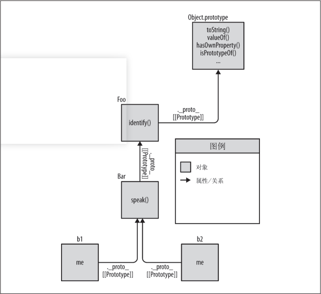

我们用一种**更加简单直接**的方法来深入发掘一下 JavaScript 中对象的 `[[Prototype]]` 机制到底是什么。

JavaScript 中这个机制的本质就是**对象之间的关联关系**。

## 6.1 面向委托的设计

面向类的设计中**有些**原则依然有效，因此不要把所有知识都抛掉。举例来说，**封装**是非常有用的，它同样可以应用在委托中（虽然不太常见）。

### 6.1.1 类理论

现许多行为可以先 “抽象” 到父类然后再用子类进行特殊化（重写）。

```js
class Task {
  id;
  // 构造函数 Task()
  Task(ID) { id = ID; }
  outputTask() { output(id); }
}

class XYZ inherits Task {
  label;
  // 构造函数 XYZ()
  XYZ(ID, Label) { super(ID); label = Label; }
  outputTask() { super(); output(label); }
}

class ABC inherits Task {
  // ...
}
```

现在你可以实例化子类 XYZ 的一些副本然后使用这些实例来执行任务“XYZ”。这些实例会复制 Task 定义的通用行为以及 XYZ 定义的特殊行为。同理，ABC 类的实例也会复制 Task的行为和 ABC 的行为。在构造完成后，你通常只需要操作这些实例（而不是类），因为每个实例都有你需要完成任务的所有行为。

### 6.1.2 委托理论

但是现在我们试着来使用**委托行为**而不是类来思考同样的问题。

```js
Task = {
  setID: function(ID) { this.id = ID; },
  outputID: function() { console.log( this.id ); }
};
// 让 XYZ 委托 Task
XYZ = Object.create( Task );
XYZ.prepareTask = function(ID,Label) {
  this.setID( ID );
  this.label = Label;
};
XYZ.outputTaskDetails = function() {
  this.outputID();
  console.log( this.label );
};
// ABC = Object.create( Task );
// ABC ... = ...
```

在这段代码中，Task 和 XYZ 并不是类（或者函数），它们是**对象**。XYZ 通过 `Object.create(..)` 创建，它的 `[[Prototype]]` 委托了 Task 对象。

相比于面向类（或者说面向对象），我会把这种编码风格称为 “对象关联”（`OLOO`，objects linked to other objects）。我们真正关心的只是 XYZ 对象（和 ABC 对象）委托了 Task 对象。

JavaScript 中，`[[Prototype]]` 机制**会把对象关联到其他对象**。

对象关联风格的代码还有一些不同之处。

1. 在上面的代码中，id 和 label 数据成员都是直接存储在 XYZ 上（而不是 Task）。通常来说，在 `[[Prototype]]` 委托中**最好把状态保存在委托者**（XYZ、ABC）**而不是委托目标**（Task）上。
2. 在类设计模式中，我们故意让父类（Task）和子类（XYZ）中都有 outputTask 方法，这样就可以利用**重写**（多态）的优势。在委托行为中则恰好相反：我们会尽量**避免**在 `[[Prototype]]` 链的不同级别中使用相同的命名，否则就需要使用笨拙并且脆弱的语法来消除引用歧义。
3. 我们和 XYZ 进行交互时可以使用 Task 中的通用方法，因为 XYZ 委托了 Task。

委托行为意味着某些对象（XYZ）在找不到属性或者方法引用时会把这个请求委托给另一个对象（Task）。

这是一种**极其强大**的设计模式，和父类、子类、继承、多态等概念完全不同。在你的脑海中对象并不是按照父类到子类的关系垂直组织的，而是通过任意方向的委托关联并排组织的。

在 API 接口的设计中，**委托最好在内部实现，不要直接暴露出去**。

#### 1. 互相委托（禁止）

你无法在两个或两个以上互相（双向）委托的对象之间创建**循环**委托。如果你把 B 关联到 A 然后试着把 A 关联到 B，就会出错。

很遗憾（并不是非常出乎意料，但是有点烦人）这种方法是**被禁止**的。如果你引用了一个两边都不存在的属性或者方法，那就会在 `[[Prototype]]` 链上产生一个**无限递归的循环**。

#### 2. 调式

以用 JavaScript 的机制来解释 Chrome 的跟踪原理：

```js
function Foo() {}
var a1 = new Foo();

a1.constructor; // Foo(){}
a1.constructor.name; // "Foo"
```

Chrome 是不是直接输出了对象的 `.constructor.name` 呢？令人迷惑的是，答案是 “既是又不是”。

```js
function Foo() {}
var a1 = new Foo();
Foo.prototype.constructor = function Gotcha(){};
a1.constructor; // Gotcha(){}
a1.constructor.name; // "Gotcha"
a1; // Foo {}
```

即使我们把 `a1.constructor.name` 修改为另一个合理的值（Gotcha），Chrome 控制台仍然会输出 Foo。

Chrome 在内部肯定是通过另一种方式进行跟踪。

```js
var Foo = {};
var a1 = Object.create( Foo );
a1; // Object {}
Object.defineProperty( Foo, "constructor", {
  enumerable: false,
  value: function Gotcha(){}
});
a1; // Gotcha {}
```

### 6.1.3 比较思维模型

我们会通过一些示例（Foo、Bar）代码来比较一下两种设计模式（面向对象和对象关联）具体的实现方法。下面是典型的（“原型”）**面向对象**风格：

```js
function Foo(who) {
  this.me = who;
}
Foo.prototype.identify = function() {
  return "I am " + this.me;
};
function Bar(who) {
  Foo.call( this, who );
}
Bar.prototype = Object.create( Foo.prototype );
Bar.prototype.speak = function() {
  alert( "Hello, " + this.identify() + "." );
};
var b1 = new Bar( "b1" );
var b2 = new Bar( "b2" );
b1.speak(); // Hello, I am b1.
b2.speak(); // Hello, I am b2.
```

子类 Bar 继承了父类 Foo，然后生成了 b1 和 b2 两个实例。b1 委托了 Bar.prototype，Bar.prototype 委托了 Foo.prototype。这种风格很常见，你应该很熟悉了。

下面我们看看如何使用**对象关联**风格来编写功能完全相同的代码：

```js
Foo = {
  init: function(who) {
    this.me = who;
  },
  identify: function() {
    return "I am " + this.me;
  }
};
Bar = Object.create( Foo );
Bar.speak = function() {
  alert( "Hello, " + this.identify() + "." );
};
var b1 = Object.create( Bar );
b1.init( "b1" );
var b2 = Object.create( Bar );
b2.init( "b2" );
b1.speak(); // Hello, I am b1.
b2.speak(); // Hello, I am b2.
```

这段代码中我们同样利用 `[[Prototype]]` 把 b1 委托给 Bar 并把 Bar 委托给 Foo，和上一段代码一模一样。我们**仍然实现了三个对象之间的关联**。

但是非常重要的一点是，这段代码**简洁**了许多，我们只是把对象关联起来，并不需要那些既复杂又令人困惑的模仿类的行为（构造函数、原型以及 new）。

问问你自己：如果对象关联风格的代码能够实现类风格代码的所有功能并且更加简洁易懂，那它是不是比类风格更好？

下面我们看看两段代码对应的思维模型。

首先，类风格代码的思维模型强调**实体以及实体间的关系**：


从图中可以看出这是一张十分复杂的关系网。此外，如果你跟着图中的箭头走就会发现，JavaScript 机制有很强的**内部连贯性**。

举例来说，JavaScript 中的函数之所以可以访问 `call(..)`、`apply(..)` 和 `bind(..)`（参见第 2 章），就是因为函数本身是对象。而函数对象同样有 `[[Prototype]]` 属性并且关联到 `Function.prototype` 对象，因此所有函数对象都可以通过**委托**调用这些默认方法。JavaScript 能做到这一点，你也可以！

好，下面我们来看一张简化版的图，它更 “清晰” 一些——只展示了**必要的**对象和关系：


仍然很复杂，是吧？虚线表示的是 Bar.prototype 继承 Foo.prototype 之后丢失的 `.constructor` 属性引用（参见 5.2.3 节的“回顾‘构造函数’”部分），它们还没有被修复。即使移除这些虚线，这个思维模型在你处理对象关联时仍然非常复杂。

现在我们看看**对象关联**风格代码的思维模型：



通过比较可以看出，对象关联风格的代码显然更加简洁，因为这种代码只关注一件事：**对象之间的关联关系**。

其他的 “类”技巧都是非常复杂并且令人困惑的。去掉它们之后，事情会变得简单许多（同时保留所有功能）。

## 6.2 类与对象

### 6.2.1 控制“类”

### 6.2.2 委托控件对象

## 6.3 更简洁的设计

### 反类

## 6.4 更好的语法

### 反词法

## 6.5 内省

## 6.6 小结
