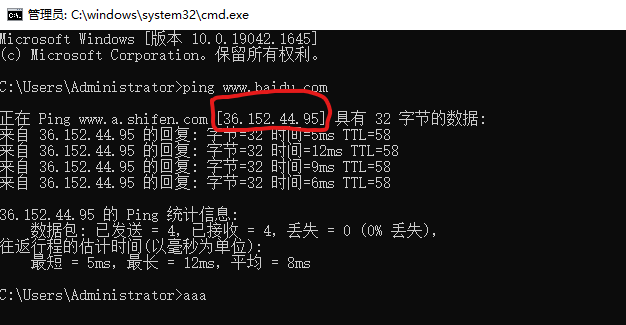
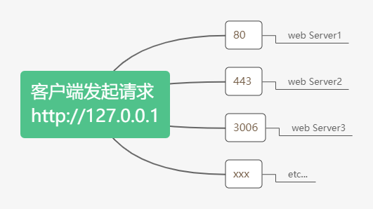

## 4.1 什么是 http 模块

回顾：什么是**客户端**、什么是**服务器**？

在网络节点中，负责消费资源的电脑，叫做客户端；**负责对外提供网络资源**的电脑，叫做服务器。

**http 模块**是 Node.js 官方提供的、用来**创建 web 服务器**的模块。通过 http 模块提供 `http.createServer()` 方法，就能方便的把一台普通的电脑，变成一台 Web 服务器，从而对外提供 Web 资源服务。

使用 http 模块创建 Web 服务器，则需要先导入它。

```js
const http = require('http')
```

## 4.2 进一步理解 http 模块的作用

服务器和普通电脑的**区别**在于，服务器上安装了 **web 服务器软件**，例如：IIS、`Apache` 等。通过安装这些服务器软件，就能把一台普通的电脑变成一台 web 服务器。

在 Node.js 中，我们不需要使用 IIS、Apache 等这些第三方 web 服务器软件。因为我们可以基于 Node.js 提供的 http 模块，**通过几行简单的代码，就能轻松的手写一个服务器软件**，从而对外提供服务。

## 4.3 服务器相关的概念

### 4.3.1 IP 地址

**IP 地址**就是互联网上**每台计算机的唯一地址**，因此 IP 地址具有唯一性。如果把“个人电脑”比作“一台电话”，那么“IP地址”就相当于“电话号码”，只有在知道对方 IP 地址的前提下，才能与对应的电脑之间进行数据通信。

IP 地址的格式：通常用“点分十进制”表示为(`a.b.c.d`)的形式，其中，`a,b,c,d` 都是 0~255 之间的十进制整数。例如：用点分十进制表示的 IP 地址(192.168.1.1)



注意：

- **互联网中每台 Web 服务器，都有自己的 IP 地址**，例如：大家可以在 Windows 的终端运行 `ping www.baidu.com` 命令，即可查看到百度服务器的 IP 地址(36.152.44.95)。
- 在开发期间，自己的电脑既是一台服务器，也是一个客户端，为了方便测试，可以在自己的浏览器中输入 `127.0.0.1` 这个 IP 地址，就能把自己电脑当作一台服务器访问了。

### 4.3.2 域名和域名服务器

尽管 IP 地址能够唯一地标记网络上的计算机，但 IP 地址是一长串数字，*不直观*，而且*不便于记忆*，于是人们发明了另一套字符型的地址方案，即所谓的**域名(Domain Name)地址**。

IP 地址和域名是**一一对应的关系**，这份对应关系放在一种叫做**域名服务器**（DNS,Domain name server）的电脑中。使用者只需通过好记的域名访问对应的服务器即可，对应的转换工作由域名服务器实现。因此，**域名服务器就是提供 IP 地址和域名之间的转换服务的服务器**。

注意：

- 单纯使用 IP 地址，互联网中的电脑也能够正常工作。但是有了域名的加持，能够让互联网的世界变得更加方便。
- 在开发测试期间，127.0.0.1 对应的域名是 localhost，它们都代表我们自己的这台电脑，在使用效果上没有任何区别。

### 4.3.3 端口号

计算机中的端口号，就好像是生活中的门牌号一样。通过门牌号，外卖小哥可以在整栋大楼众多的房间，准确送到你的手中。

同样的道理，在一台电脑中，可以运行成百上千个 web 服务、每个 web 服务都对应一个唯一的端口号。客户端发送过来的网络请求，通过端口号，可以被准确地交给**对应的 web 服务**进行处理。

注意：

- 1. 每个端口号不能同时被多个 web 服务占用。
- 2. 在实际应用中，URL 中的 **80 端口可以被省略**。



## 4.4 创建最基本的 Web 服务器

1. 导入 http 模块
2. 创建 web 服务器实例
3. 为服务器实例绑定 request 事件，监听客户端的请求
4. 启动服务器

### 4.4.1 完整步骤

```js
// 1. 导入 http 模块
// 如果希望在自己的电脑上创建一个 web 服务器，从而对外提供 web 服务，则需要导入 http 模块：
const http = require('http')

// 2. 创建 web 服务器实例
// 调用 `http.createServer()` 方法，即可快速创建一个 web 服务器实例：
const server = http.createServer()

// 3. 为服务器实例绑定 request 事件，监听客户端的请求
// 使用服务器实例的 `.on()` 方法，为服务器实例绑定 `request` 事件，即可监听客户端发送过来的网络请求：
server.on('request', (req, res) => {
  // 只要由客户端来请求我们自己的服务器，就会触发 request 事件，从而调用这个事件处理函数
  console.log('Someone visit outr web serve.')
})

// 4. 启动服务器
// 调用 server.listen(port, callback) 方法，即可启动 web 服务器
server.listen(80, () => {
  console.log('Http server running at http://127.0.0.1')
})
```

### 4.4.2 req 请求对象

只要服务器接收到客户端的请求，就会调用通过 `server.on()` 为服务器绑定的 `request` 事件处理函数。

如果想在事件处理函数中，访问与客户端相关的数据或属性，可以使用如下的方式：

```js
server.on('request', (req, res) => {
  // req 是请求对象，它包含了与客户端相关的数据和属性，例如：
  // req.url 是客户端请求的 URL 地址
  // req.method 是客户端的 method 请求类型
  const str = `你请求的url是${req.url}，请求的方法是${req.method}`
  console.log(str)
})
```

### 4.4.3 res 响应对象

在服务器的 `requset` 事件处理函数中，如果想访问与服务器相关的数据或属性，可以使用如下的方式：

```js
server.on('request', (req, res) => {
  // res 是响应对象，它包含了与服务器相关的数据和属性，例如：
  // 要发送到客户端的字符串
  const str = const str = `你请求的url是${req.url}，请求的方法是${req.method}`
  
  // res.send() 方法的作用：
  // 向客户端发送指定的内容，并结束这次请求的处理过程
  res.end(str)
})
```

### 4.4.4 解决中文乱码

当调用 `res.end()` 方法，向客户端发送中文内容的时候，会出现乱码问题，此时，需要**手动设置内容的编码格式**：`res.setHeader('Content-Type', 'text/html: charset=utf-8')`

```js
server.on('request', (req, res) => {
  const str = const str = `你请求的url是${req.url}，请求的方法是${req.method}`
  // 为了防止中文显示乱码的问题，需要设置响应头 Content-Type 的值为 text/html; charset=utf-8
  res.setHeader('Content-Type', 'text/html: charset=utf-8')
  res.end(str)
})
```

## 4.5 根据不同的 url 响应不同的 html 内容

- 1. 获取请求的 `url` 地址
- 2. 设置默认的响应内容为 `404 Not found`
- 3. 判断用户请求的是否为 `/` 或 `/index.html` 页面
- 4. 判断用户请求的是否为 `/about` 页面
- 5. 设置 `Content-type` 响应头，防止中文乱码
- 6. 使用 `res.end()` 把内容响应给客户端

```js
server.on('request', (req, res) => {
  // 1. 获取请求的 url 地址
  const url = req.url
  // 2. 设置默认的响应内容为404 Not found
  let content = '<h1>404 Not found!</h1>'
  // 3. 判断用户请求的是否为 / 或 /index.html 页面
  if (url === '/' || url === '/index.html') {
    content = '<h1>首页</h1>'
  } else if(url === '/about.html') { // 4. 判断用户请求的是否为 /about 页面
    content = '<h1>关于页面</h1>'
  }
  // 5. 设置 Content-type 响应头，防止中文乱码
  res.setHeader('Content-Type', 'text/html; charset=utf-8')
  // 6. 使用 `res.end()` 把内容响应给客户端
  res.end(content)
})
```

## 4.6 案例 - 实现页面的 web 服务器

### 4.6.1 核心思路

**把文件的实际存放路径，作为每个资源的请求 url 地址**。

### 4.6.2 实现步骤

- 导入需要的模块
- 创建基本的 web 服务器
- 将资源的请求 url 地址映射为文件的存放路径
- 读取文件内容并响应给客户端
- 优化资源的请求路径

### 4.6.3 Code

```js
// 1.1 导入 http 模块
const http = require('http')
// 1.2 导入 fs 文件系统模块
const fs = require('fs')
// 1.3 导入 path 路径处理模块
const path = require('path')

// 2.1 创建 web 服务器
const server = http.createServer()
// 2.2 监听 web 服务器的 request 事件
server.on('request', (req, res) => { 
  // 3.1 获取到客户端请求的 url 地址
  const url = req.url
  // 3.2 把请求的 url 地址，映射为文件的存放路径
  // const fpath = path.join(__dirname, url)

  // *** 将 3.2 的实现方式，改为如下代码... ***
  // 5.1 预定义空白的文件存放路径
  let fpath = ''
  if (url === '/') {
    // 5.2 如果请求的路径是 / ，则手动指定文件的存放路径
    fpath = path.join(__dirname, './split/index.html')
  } else {
    // 5.3 如果请求的路径不为 /，则动态拼接文件的存放路径
    fpath = path.join(__dirname, './split', url)
  }

  // 4.1 根据“映射”过来的文件路径读取文件
  fs.readFile(fpath, 'utf8', (err, dataStr) => {
    // 4.2 读取文件失败后，向客户端响应固定的“错误信息”
    if (err) return res.end('404 Not fount.')
    // 4.3 读取文件成功后，将“读取成功的内容”响应给客户端
    res.end(dataStr)
  })
})
// 2.3 启动 web 服务器
server.listen(80, () => {
  console.log('Server listen at http://127.0.0.1')
})
```
