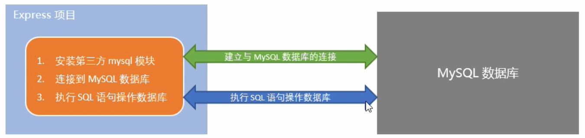
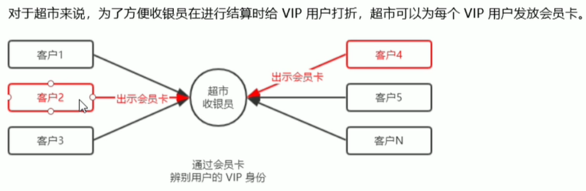
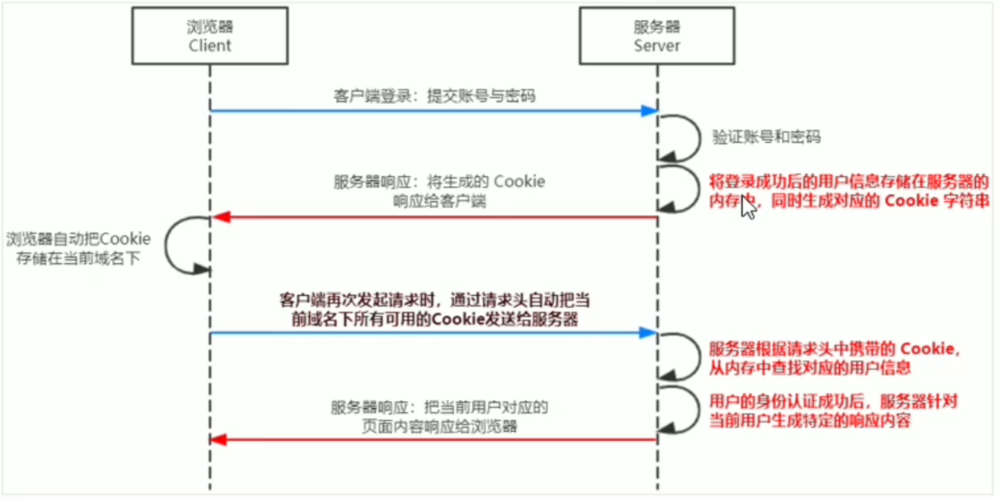
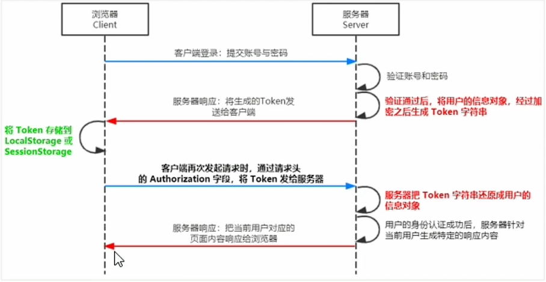

## 目标

- 知道如何配置 MySql 数据库环境
- 认识并使用常见的 SQL 语句操作数据库
- 在 Express 中操作 MySql 数据库
- 了解 Session 的实现原理
- 了解 JWT 的实现原理

## 目录

- 数据库的基本概念
- 安装并配置 MySQL
- MySQL 的基本使用
- 在 Express 中操作 MySQL
- 前后端的身份认证

## 1. 数据库的基本概念

### 1.1 什么是数据库

数据库（database）是用来**组织**、**存储**和**管理**数据的仓库。

当今世界是一个充满着数据的互联网，充斥着大量的数据。**数据的来源**有很多，比如出行记录、消费记录、浏览的网页、发送的消息等等。除了文本类型的数据，图像、音乐、声音都是数据。

为了方便管理互联网世界中的数据，就有了**数据库管理系统**的概念（简称：数据库）。用户可以对数据库中的数据进行**新增**、**查询**、**更新**、**删除**等操作。

### 1.2 常见的数据库及分类

市面上的数据库有很多种，最常见的数据库有如下几个：

- MySQL 数据库（目前**使用最广泛**、**流行度最高**的开源免费数据库；Community + Enterprise）
- Oracle 数据库（收费）
- SQL Server 数据库（收费）
- Mongodb 数据库（Community + Enterprise）

其中，MySQL、Oracle、SQL Server 属于**传统型数据库**（又叫做：**关系型数据库** 或 **SQL 数据库**），这三者的设计理念相同，用法比较类似。

而 Mongodb 属于新型数据库（又叫做：非关系型数据库 或 NoSQL 数据库），它在一定程度上弥补了传统型数据库的缺陷。

### 1.3 传统型数据库的数据组织结构

数据的组织结构：指的就是数据以什么样的结构进行存储。

传统型数据库的数据组织结构，与 Excel 中数据的组织结构比较类似。因此，我们可以对比着 Excel 来了解和学习传统型数据库的数据组织结构。

#### 1. Excel 的数据组织结构

每个 Excel 中，数据的组织结构分别为**工作簿**、**工作表**、**数据行**、**列**这 4 大部分组成。

- 整个 Excel 叫做工作簿
- users 和 books 是工作表
- users 工作表中有三行数据
- 每行数据由 6 列信息组成
- 每列信息都有对应的数据类型

#### 2. 传统型数据库的数据组织结构

在传统型数据库中，数据的组织结构分为数据库（database）、数据表（table）、数据行（row）、字段（field）这 4 大部分组成。

- 数据库类似于 Excel 的工作簿
- 数据表类似于 Excel 的工作表
- 数据行类似于 Excel 的每一行数据
- 字段类似于 Excel 的列
- 每个字段都有对应的数据类型

#### 3. 实际开发中库、表、行、字段的关系

- 在实际项目开发中，一般情况下，每个项目都对应**独立的数据库**。
- 不同的数据，要存储到数据库的不同表中，例如：用户数据存储到 users 表中，图书数据存储到 books 表中。
- 每个表中具体存储哪些信息，有字段来决定，例如：我们可以为 users 表设计 id、username、password 这 3 个字段。
- 表中的行，代表每一条具体的数据。

## 2. 安装和配置 MySQL

### 2.1 了解需要安装哪些 MySQL 相关的软件

对于开发人员来说，只需要按照 `MySQL Server` 和 `MySQL Workbench` 这两个软件，就能满足开发的需求了。

- MySQL Server：专门用来**提供数据存储**和服务的软件。
- MySQL Workbench：可视化的 MySQL 管理工具，通过它，可以方便的**操作存储**在 MySQL Server 中的数据。

### 2.2 MySQL 在 Windows 环境下的安装

在 Window 环境下安装 MySQL，只需要运行 `mysql-installer-community-8.0.29.0.msi` 这个安装包，就能一次性将 `MySQL Server` 和 `MySQL Workbench` 安装到自己的电脑上。

[MySQL](https://dev.mysql.com/downloads/installer/)

## 3. MySQL 的基本使用

### 3.1 使用 MySQL Workbench 管理数据库

DataType 数据类型：

1. `init` 整数
2. `varchar(len)` 字符串
3. `tinyint(1)` 布尔值

字段的特殊标识：

1. `PK`(Primary Key) 主键、唯一标识
2. `NN`(Not Null) 值不允许为空
3. `UQ`(Unique) 值唯一
4. `AI`(Auto Increment) 值自动增长

### 3.2 使用 SQL 管理数据库

#### 1. 什么是 SQL

SQL (英文全称：Structured Query Language) 是**结构化查询语言**，专门用来**访问和处理数据库**的编程语言。能够让我们**以编程的形式，操作数据库里面的数据**。

三个关键点：

1. SQL 是一门**数据库编程语言**
2. 使用 SQL 语言编写出来的代码，叫做 **SQL 语句**。
3. SQL 语言**只能在关系型数据库中使用**（例如 MySQL、Oracle、SQL Server）。非关系型数据库（例如 Mongodb）不支持 SQL 语言。

#### 2. SQL 能做什么

1. 从数据库中**查询**数据
2. 向数据库中**插入**新的数据
3. **更新**数据库中的数据
4. 从数据库删除数据
5. 可以创建新数据库
6. 可在数据库中创建新表
7. 可在数据库中创建存储过程、视图
8. etc...

#### 3 SQL 的学习目标

重点掌握如何使用 SQL 从数据表中：

查询数据（select）、插入数据（insert into）、更新数据（update）、删除数据（delete）

额外需要掌握的 4 种 SQL 语法：`where 条件`、`and 和 or 运算符`、`order by 排序`、`count(*) 函数`

### 3.3 SQL 的 SELECT 语句

#### 1. 语法

SELECT 语句用于从表中**查询**数据。执行的结果被存储在一个结果表中（称为**结果集**）。

```sql
-- 这是注释
-- 从 FROM 指定的【表中】，查询出【所有的】数据。* 表示【所有的列】
SELECT * FROM 表名称

-- 从 FROM 指定的【表中】，查询出指定列名称（字段）的数据
SELECT 列名称 FROM 表名称
```

注意：SQL 语句中的关键字对**大小写不敏感**。SELECT 等效于 select，FROM 等效于 from。

#### 2. `SELECT *` 示例

我们希望从 users 表中选取所有的列，可以使用符号 `*` 取代列的名称。

```sql
SELECT * FROM users
```

#### 3. SELECT 列名称 示例

如需获取名为 "username" 和 "password" 的列的内容（从名为 "users" 的数据表）

```sql
SELECT username, password FROM users
```

### 3.4 SQL 的 INSERT INTO 语句

#### 1. 语句

INSERT INTO 语句用于向数据表中**插入新的**数据行。

```sql
-- 语法解读：向指定的表中，插入如下几列数据，列的值通过 values 一一指定
-- 注意：列和值要一一对应，多个列和多个值之间，使用英文逗号分隔
INSERT INTO table_name (列1, 列2, ...) VALUES (值1, 值2, ...)
```

#### 2. `INSERT INTO` 示例

向 users 表中，插入一条 username 为 tony，password 为 098123 的用户数据。

```sql
INSERT INTO users (username, password) values ('tony', '098123')
```

### 3.5 SQL 的 UPDATE 语句

#### 1. 语句

Update 语句用于修改表中的数据。

```sql
-- 语法解读：
-- 1. 用 UPDATE 指定要更新那个表中的数据
-- 2. 用 SET 指定列对应的新值
-- 3. 用 WHERE 指定更新的条件
UPDATE 表名称 SET 列名称 = 新值 WHERE 列名称 = 某值
```

#### 2. UPDATE 示例 - 更新某一行中的一个列

把 users 表中的 id 为 4 的用户密码，更新为 888888。

```sql
UPDATE users SET password = 88888 WHERE id = 7
```

#### 3 UPDATE 示例 - 更新某一个中的若干列

把 users 表中 id 为 2 的用户密码和用户状态，分别更新为 admin123 和 1。

```sql
UPDATE users SET password='admin123', status=1 WHERE id=2
```

多个被更新的列之间，使用英文的**逗号**进行分隔。WHERE 后面跟着的是更新条件。注意：初学者经常忘记提供更新的 WHERE 条件，这样会导致整张表的数据都被更新，**一定要谨慎**。

### 3.6 SQL 的 DELETE 语句

#### 1. 语句

DELETE 语句用于删除表中的行。

```sql
-- 语法解读
-- 从指定的表中，根据 WHERE 条件，删除对应的数据行
DELETE FROM 表名称 WHERE 列名称 = 值
```

#### 2. DELETE 示例

从 users 表中，删除 id 为 4 的用户。

```sql
DELETE FROM users WHERE id = 4
```

### 3.7 SQL 的 WHERE 子句

#### 1. 语句

WHERE 子句用于**限定选择的标准**。在 `SELECT`、`UPDATE`、`DELETE` 语句中，皆可使用 WHERE 子句来限定选择的标准。

```sql
-- 查询语句中的 WHERE 条件
SELECT 列名称 FROM 表名称 WHERE 列 运算符 值
-- 更新语句中的 WHERE 条件
UPDATE 表名称 SET 列=新值 WHERE 列 运算符 值
-- 删除语句中的 WHERE 条件
DELETE FROM 表名称 WHERE 列 运算符 值
```

#### 2. 可以在 WHERE 子句中使用的运算符

下面的运算符可在 WHERE 子句中使用，用来限定选择的标准：

| 操作符  |     描述     |
| ------- | :----------: |
| =       |     等于     |
| `<>`    |    不等于    |
| >       |     大于     |
| `<`     |     小于     |
| >=      |   大于等于   |
| `<=`    |   小于等于   |
| BETWEEN | 在某个范围内 |
| LIKE    | 搜索某种模式 |

注意：在某些版本的 SQL 中，操作符 `<>` 可以写成 `!=`

#### 3. WHERE 子句示例

可以通过 WHERE 子句来限定 SELECT 查询条件：

```sql
-- 查询 status 为 1 的所有用户
SELECT * FROM users WHERE status=1
-- 查询 id 大于 2 的所有用户
SELECT * FROM users WHERE id>2
-- 查询 username 不等于 admin 的所有用户
SELECT * FROM users WHERE username<>'admin'
```

### 3.8 SQL 的 AND 和 OR 运算符

#### 1. 语法

AND 和 OR 可以在 **WHERE 子语句**中**把两个或多个条件结合起来**。

AND 表示**必须同时满足多个条件**，相当于 JavaScript 中的 && 运算符，例如 if(a !== 10 && a !== 20)

OR 表示**只要满足任意一个条件即可**，相当于 JavaScript 中的 || 运算符，例如 if(a !== 10 || a !== 20)

#### 2. AND 运算符示例

使用 AND 来显式所有 status 为 0，并且 id 小于 3 的用户：

```sql
SELECT * FROM users WHERE status=0 AND id<3
```

#### 3. OR 运算符示例

使用 OR 来显式所有 status 为 1，或者 username 为 zs 的用户：

```sql
SELECT * FROM users WHERE status=1 OR username='zs'
```

### 3.9 SQL 的 ORDER BY 子句

#### 1. 语句

ORDER BY 语句用于**根据指定的列对结果集进行排序**。

ORDER BY 语句**默认**按照**升序**对记录进行排序。

如果您希望按照降序对记录进行排序，可以使用 `DESC` 关键字。

#### 2. ORDER BY 子句 - 升序排序

对 users 表中的数据，按照 status 字段进行升序排序。

```sql
-- 下面两条 SQL 语句是等价的。
-- ASC 关键字代表升序排序
SELECT * FROM users ORDER BY status;
SELECT * FROM users ORDER BY status ASC;
```

#### 3. ORDER BY 子句 - 降序排序

对 users 表中的数据，按照 id 字段进行降序排序。

```sql
-- DESC 关键字代表降序排序
SELECT * FROM users ORDER BY id DESC;
```

#### 4. ORDER BY 子句 - 多重排序

对 users 表中的数据，先按照 status 字段进行降序排序，再按照 username 的字母顺序，进行升序排序。

```sql
SELECT * FROM users ORDER BY status DESC, username ASC
```

### 3.10 SQL 的 COUNT(\*) 函数

#### 1. 语法

COUNT(\*) 函数用于返回查询结果的总数据条数。

```sql
SELECT COUNT(*) FROM 表名称
```

#### 2. 示例

查询 users 表中 status 为 0 的总数据条数。

```sql
SELECT COUNT(*) FROM users WHERE status=0
```

#### 3. 使用 AS 为列设置别名

如果希望给查询出来的列名称设置别名，可以使用 `AS` 关键字。

```sql
-- 将列名从 COUNT(*) 修改为 total
SELECT COUNT(*) AS total FROM users WHERE status=0
```

## 4. 在项目中操作 MySQL

### 4.1 在项目中操作数据库的步骤

1. 安装操作 MySQL 数据库的第三方模块（`mysql`）
2. 通过 mysql 模块**连接到 MySQL 数据库**
3. 通过 mysql 模块**执行 SQL 语句**



### 4.2 安装与配置 mysql 模块

#### 1. 安装 mysql 模块

`npm install mysql`

#### 2. 配置 mysql 模块

在使用 mysql 模块操作 MySQL 数据库之前，必须先对 mysql 模块进行必要的配置，主要的配置步骤如下：

`mysql.createPool` 建立连接。

```js
// 1. 导入 mysql 模块
const mysql = require("mysql");
// 2. 建立与 MySQL 数据库的连接
const db = mysql.createPool({
  host: "127.0.0.1", // 数据库的 IP 地址
  user: "root", // 登陆数据库的账号
  password: "admin123", // 登陆数据库的密码
  database: "wenv2_db", // 指定要操作哪个数据库
});
```

#### 3. 测试 mysql 模块能够正常工作

通过 `db.query()` 函数，指定要执行的 SQL 语句，通过回调函数拿到执行的结果。

```js
// 检测 mysql 模块能否正常工作
db.query("SELECT 1", (err, results) => {
  if (err) {
    return console.log(err.message);
  }
  // 只要能打印出 [ RowDataPacket { '1': 1 } ] 的结果，就证明数据库连接正常
  console.log(results);
});
```

### 4.3 使用 mysql 模块操作 MySQL 数据库

#### 1. 查询数据

```js
db.query("SELECT * FROM users", (err, results) => {
  // 查询失败
  if (err) return console.log(err.message);
  // 查询成功
  // 注意：如果执行的是 select 查询语句，则执行的结果是数组
  console.log(results);
});
```

#### 2. 插入数据

向 users 表中新增数据，其中 username 为 Spider-Mam，password 为 pcc321。

```js
// 1. 定义要插入到 users 表中的对象
const users = { username: 'Spider-Mam', password: 'pcc321' }
// 2. 待执行的 SQL 语句，其中英文的 ? 表示占位符
const sqlStr = 'INSERT INTO users (username, password) VALUES (?, ?)'
// 3. 使用数组的形式，依次为 ? 占位符指定具体的值
db.query(sqlStr, [user.username, user.password],(err, results) => {
  if(err) return console.log(err.message)
  // 注意：如果执行的是 insert into 插入语句，则 results 是一个对象
  // 可以通过 affectedRows 属性，来判断是否插入数据成功
  if(results.affectedRows === 1) { console.log('插入数据成功')  // 成功}
})
```

#### 3. 插入数据的便捷方式

向表中新增数据时，如果**数据对象的每个属性和数据表的字段一一对应**，则可以通过如下快速插入数据：

```js
// 1. 要插到 users 表中的数据对象
const user = { username: "Spider-Mam2", password: "pcc4321" };
// 2.待执行的 SQL 语句，其中英文的 ? 表示占位符
const sqlStr = "INSERT INTO users SET ?";
// 3. 直接将数据对象当做占位符的值
db.query(sqlStr, user, (err, results) => {
  if (err) return console.log(err.message);
  if (results.affectedRows === 1) {
    console.log("插入数据成功"); // 成功
  }
});
```

#### 4. 更新数据

```js
// 1. 要更新的数据对象
const user = { id: 6, username: "aaa", password: "000" };
// 2. 要执行的 SQL 语法
const sqlStr = "update users set username=?, password=? where id=?";
// 3. 调用 db.query() 执行 SQL 语句的同时，使用数组依次为占位符指定具体的值
db.query(sqlStr, [user.username, user.password, user.id], (err, results) => {
  if (err) return console.log(err.message);
  // 注意： 执行了 update 语句后，执行的结果，也是一个对象，可以通过 affectedRows 判断是否更新成功
  if (results.affectedRows === 1) {
    console.log("更新成功"); // 成功
  }
});
```

#### 5. 更新数据的便捷方式

更新表数据时，如果数据对象的每个属性和数据表的字段一一对应，则可以通过如下方式快速更新表数据：

```js
// 1. 要更新的数据对象
const user = { id: 7, username: "aaaa", password: "0000" };
// 2. 要执行的 SQL 语句
const sqlStr = "UPDATE users SET ? WHERE id=?";
// 3. 调用 db.query() 执行 SQL 语句的同时，使用数据一次为占位符指定具体的值
db.query(sqlStr, [user, user.id], (err, results) => {
  if (err) return console.log(err.message); // 失败
  if (results.affectedRows === 1) {
    console.log("更新成功"); // 成功
  }
});
```

#### 6. 删除数据

在删除数据时，推荐根据 id 这样的唯一标识，来删除对应的数据。

```js
// 1. 要执行的 SQL 语句中
const sqlStr = "DELETE FROM users WHERE id=?";
// 2. 调用 db.query() 执行 SQL 语句的同时，为占位符指定具体的值
// 注意：如果 SQL 语句中有多个占位符，则必须使用数据为每个占位符指定具体的值。如果 SQL 语句中只有一个占位符，则可以省略数组。
db.query(sqlStr, 7, (err, results) => {
  if (err) return console.log(err.message); // 失败
  if (results.affectedRows === 1) {
    console.log("删除数据成功"); // 成功
  }
});
```

#### 7. 标记删除

使用 DELETE 语句，会把真正的数据从表中删除掉。为了保险起见，推荐使用标记删除的形式，来模拟删除的动作。

所谓的标记删除，就是在表中设置类似于 status 这样的状态字段，来标记当前这条数据是否被删除。

当用户执行了删除的动作时，我们并没有执行 DELETE 语句把数据删除掉，而是执行 UPDATE 语句，将这条数据对应的 status 字段标记为删除即可。

```js
// 标记删除：使用 UPDATE 语句替代 DELETE 语句；只更新数据的状态，并没有真正的删除
db.query("UPDATE users SET status=? WHERE id=?", [1, 6], (err, results) => {
  if (err) return console.log(err.message); // 失败
  if (results.affectedRows === 1) {
    console.log("删除数据成功");
  } // 成功
});
```

## 5. 前后端的身份认证

### 5.1 Web 开发模式

目前主流的 Web 开发模式有两种，分别是

1. 基于**服务端渲染**的传统 Web 开发模式
2. 基于**前后端分离**的新型 Web 开发模式

#### 1. 服务端渲染的 Web 开发模式

服务端渲染的概念：服务器发送给客户端的 HTML 页面，是在服务器通过字符串的拼接，动态生成的。因此，客户端不需要使用 Ajax 这样的技术额外请求页面。

```js
app.get("/index.html", (req, res) => {
  // 1. 要渲染的数据
  const user = { name: "zs", age: 20 };
  // 2. 服务器端通过字符串的拼接，动态生成 HTML 内容
  const html = `<h1>姓名：${user.name}，年龄：${user.age}</h1>`;
  // 3. 把生成好的页面内容响应给客户端。因此，客户端拿到的是带有真实数据的 HTML 页面
  res.send(html);
});
```

#### 2. 服务端渲染的优缺点

优点：

1. **前端耗时少。** 因为服务器端负责动态生成 HTML 内容，浏览器只需要直接渲染页面即可。尤其是移动端，更省电。
2. **有利于 SEO.** 因为服务器端响应式完整的 HTML 页面内容,所以爬虫更容易爬取获得信息,有利于 SEO.

缺点:

1. **占用服务器资源.** 即服务器端完成 HTML 页面内容的拼接,如果请求较多,会对服务器造成一定的访问压力.
2. **不利于前端端分离,开发效率低.** 使用服器端渲染,则无法进行分工合作,尤其对应前端复杂度高的项目,不利于项目高效开发.

#### 3. 前后端分离的 Web 开发模式

前后端分离的概念: 前后端分离的模式,依赖于 Ajax 技术的广泛应用.简而言之,前后端分离的 Web 开发模式,就是后端只负责提供 API 接口,前端使用 Ajax 调用接口的开发模式.

#### 4. 前后端分离的优缺点

优点:

1. **开发体验好**.前端专注于 UI 页面的开发,后端专注与 api 的开发,且前端有更多的选择性.
2. **用户体验好**. Ajax 技术的广泛应用,极大的提高了用户的体验,可以轻松实现页面的局部刷新.
3. **减轻了服务端的渲染压力**. 因为页面最终在每个用户的浏览器中生成的.

缺点:

1. **不利于 SEO**. 因为完整的 HTML 页面需要在客户端动态拼接完成,所以对无法爬取页面的有效信息.(解决方案: 利用 Vue / React 等前端框架的 **SSR** (server side render) 技术能够很好的解决 SEO 问题!)

#### 5. 如何选择 Web 开发模式

不谈业务场景而盲目选择使用何种开发模式都是耍流氓.

- 比如企业级网站,主要功能是展示而没有复杂的交互,并且需要良好的 SEO,则这时我们需要使用服务端渲染;
- 而类似后台管理项目,交互性比较强,不需要考虑 SEO,那么就可以使用前端后分离的开发模式.

另外,具体使用何种开发模式并不是绝对的,为了同时兼顾了首页的渲染速度和前后端分离的开发效率,一些网站采用了首屏服务器端渲染 + 其他页面前后端分离的开发模式.

### 5.2 身份认证

#### 1. 什么是身份认证

身份认证(Authentication) 又称 "身份验证" / "鉴权" , 是指通过一定的手段,完成对用户身份的确认.

- 日常: 高铁的验票乘车,手机的密码或指纹解锁,支付宝或微信的支付密码等
- Web: 各大网站的手机验证登录,邮箱密码登录,二维码登录等

#### 2. 为什么需要身份认证

确认当前所声称为某中身份的用户,确实是所声称的用户.

#### 3. 不同开发模式下的身份认证

对于服务端渲染和前后端分离这两种开发模式来说,分别有着不同的身份认证方案:

- **服务端渲染**推荐使用 **Session** 认证机制
- **前端端分离**推荐使用 **JWT** 认证机制

### 5.3 Session 认证机制

#### 1. HTTP 协议的无状态性

Http 协议的无状态性，指的是客户端的**每次 HTTP 请求都是独立的**，连续多个请求之间没有直接关系，**服务器不会主动保留每次 HTTP 请求的状态**。

#### 2. 如何突破 HTTP 无状态的限制



现实生活中的会员卡身份认证方式，在 Web 开发中的专业术语叫做 `Cookie`。

#### 3. 如何突破 HTTP 无状态的限制

Cookie 是**存储在用户浏览器中的一段不超过 4 KB 的字符串**。它有一个**名称**、一个**值**和其他几个用于控制 Cookie 有效期、安全性、使用范围的可选属性组成。

不同域名下的 Cookie 各自**独立**，每当客户端发起请求时，会**自动**把当前域名下所有为过期的 Cookie 一同发送到服务器。

Cookie 的几大特性：

1. 自动发送
2. 域名独立
3. 过期时限
4. 4 KB 限制

#### 4. Cookie 在身份认证中的作用

客户端第一次请求服务器的时候，服务器**通过响应头形式**，向客户端发送一个身份认证的 Cookie，客户端会自动将 Cookie 保存在浏览器中。

随后，当客户端浏览器每次请求服务器的时候，浏览器会**自动**将身份认证相关的 Cookie，**通过请求头的形式**发送给服务器，服务器即可验明客户端的身份。

#### 5. Cookie 不具有安全性

由于 Cookie 是存储在浏览器中的，而且**浏览器也提供了读写 Cookie 的 API**，因此 **Cookie 很容易被伪造**，不具有安全性。因此不建议服务器将重要的隐私数据，通过 Cookie 的形式发送给浏览器。

#### 6. 提高身份认证的安全性

会员卡 + 刷卡认证的设计理念，就是 Session 认证机制的精髓。

#### 7. Session 的工作原理



### 5.4 在 Express 中使用 Session 中间件

#### 1. 安装 express-session 中间件

在 Express 项目中，只需要安装 express-session 中间件，即可在项目中使用 session 认证：

```shell
npm install express-session
```

#### 2. 配置 express-session 中间件

express-session 中间件安装成功后，需要通过 app.use() 来注册 session 中间件，示例代码如下：

```js
// 1. 导入 session 中间件
var session = require('express-session')

// 2. 配置 session 中间件
app.use(session({
  secret: 'keyboard cat', // secret 属性的值可以为任意字符串
  resave： false, // 固定写法
  saveUninitialized： true // 固定写法
}))
```

#### 3. 向 session 中存数据

当 express-session 中间件配置成功后，即可通过 `req.session` 来访问和使用 session 对象，从而存储用户的关键信息：

```js
app.post("/api/login", (req, res) => {
  // 判断用户提交的登录信息是否正确
  if (req.body.username !== "admin" || req.body.password !== "000000") {
    return res.send({
      state: 1,
      msg: "登录失败",
    });
  }
  req.session.user = req.body; // 将用户的信息，存储到 session 中
  req.session.isLogin = true; // 将用户的登录状态，存储到 session 中
  res.send({
    state: 0,
    msg: "登录成功",
  });
});
```

#### 4. 从 session 中取数据

可以直接从 req.session 对象上获取之前存储的数据，示例代码如下：

```js
// 获取用户姓名的接口
api.get('/api/username', (req, res) => {
  // 判断用户是否登录
  if(!req.session.isLogin) {
    return res.send({
      status: 1,
      msg: 'fail'
    }
  }
  res.send({
    status: 0,
    msg: 'success',
    username: req.session.user.username
  })
})
```

#### 5. 清空 session

调用 req.session.destroy() 函数，即可清空服务器保存的 session 信息。

```js
// 退出登陆的接口
app.post("/api/logout", (req, res) => {
  // 清空当前客户端对应的 session 信息
  req.session.destroy();
  res.send({
    status: 0,
    msg: "退出登陆成功",
  });
});
```

### 5.5 JWT 认证机制

#### 1. 了解 Session 认证的局限性

Session 认证机制需要配合 Cookie 才能实现。由于 Cookie 默认不支持跨域访问，所以，当涉及到前端跨域请求后端接口的时候，需要做很多额外的配置，才能实现跨域 session 认证。

注意：

- 当前端请求后端接口不存在跨域问题的时候，推荐使用 Session 身份认证机制。
- 当前端需要跨域请求后端接口的时候，不推荐使用 Session 身份认证机制，推荐使用 JWT 认证机制。

#### 2. 什么是 JWT

JWT（英文全称：JSON Web Token）是目前最流行的**跨域认证解决方案**。

#### 3. JWT 的工作原理



总结：用户的信息通过 Token 字符串的形式，保存在客户端浏览器中。服务器通过还原 Token 字符串的形式来认证用户的身份。

#### 4. JWT 的组成部分

JWT 通常由三部分组成，分别是 Header（头部）、Payload（有效荷载）、Signature（签名）。

三者之间使用英文的 "." 分隔，格式如下：

```js
Header.Payload.Signature;
```

#### 5. JWT 的三个部分各自代表的含义

- Payload 部分才是真正的用户信息，它是用户信息经过加密之后生成的字符串。
- Header 和 Signature 是安全性的部分，只是为了保证 Token 的安全性。

#### 6. JWT 的使用方式

客户端收到服务器返回的 JWT 之后，通常会将它存储在 localStorage 和 sessionStorage 中。

此后，客户端每次与服务器通信，都要带上这个 JWT 的字符串，从而进行身份认证。推荐的做法是把 JWT 放在 HTTP 请求头的 `Authorization: Bearer <token>` 字段中，格式如下：

```js
Authorization: Bearer <token>
```

### 5.6 在 Express 中使用 JWT

#### 1. 安装 JWT 相关的包

运行如下命令，安装如下两个 JWT 相关的包：

```sh
npm install jsonwebtoken express-jwt
```

其中：

- `jsonwebtoken` 用于**生成 JWT 字符串**
- `express-jwt` 用于**将 JWT 字符串解析还原成 JSON 对象**

#### 2. 导入 JWT 相关的包

使用 require() 函数，分别导入 JWT 相关的两个包：

```js
// 1. 导入用于生成 JWT 字符串的包
const jwt = require("jsonwebtoken");
// 2. 导入用于将客户端发送过来的 JWT 字符串，解析还原成 JSON 对象的包
const expressJwt = require("express-jwt");
```

#### 3. 定义 secret 秘钥

为了保证 JWT 字符串的安全性，防止 JWT 字符串在网络传输过程中被别人破解，我们需要专门定义一个用于加密和解密的 secret 密钥：

1. 当生成 JWT 字符串的时候，需要使用 secret 秘钥对用户的信息**进行加密**，最终得到加密好的 JWT 字符串。
2. 当把 JWT 字符串解析还原成 JSON 对象的时候，需要使用 secret 密钥**进行解密**。

```js
// 定义 secret 密钥，本质：就是一个字符串
const secretKey = "wen No1";
```

#### 4. 在登陆成功后生成 JWT 字符串

调用 `jsonwebtoken` 包提供的 `sign()` 方法，将用户的信息加密成 JWT 字符串，响应给客户端。

```js
// 登陆接口
app.post('/api/login', (req, res) => {
  status: 200,
  message: '登陆成功！',
  // 调用 jwt.sign() 生成 JWT 字符串，三个参数分别是：用户信息对象、加密秘钥、配置对象
  token: jwt.sign({ username: userinfo.username }, secretKey, { expiresIn: '30s' })
})
```

#### 5. 将 JWT 字符串还原为 JSON 对象

客户端每次在访问那些有权限接口的时候，都需要竹筒主动通过请求头中的 Authorization 字段，将 Token 字符串发送到服务器进行身份验证。

此时，服务器可以通过 express-jwt 这个中间件，自动将客户端发送过来的 Token 解析还原成 JSON 对象。

```js
// 使用 app.use() 来注册中间件
// expressJwt({ secret: secretKey }) 就是用来解析 Token 的中间件
// .unless({ path: [/^\/api\//] }) 用来指定哪些接口不需要访问权限
app.use(expressJwt({ secret: secretKey }).unless({ path: [/^\/api\//] }));
```

#### 6. 使用 req.user 获取用户信息

当 express-jwt 这个中间件配置成功之后，即可在那些有权限的接口中，使用 `req.user` 对象，来访问从 JWT 字符串中解析出来的用户信息了，实例代码如下：

```js
// 这是一个有权限的 api 接口
app.get('/admin/getInfo', (req, res){
  console.log(req.user)
  res.send({
    status: 200,
    message: '获取用户信息成功！',
    data: req.user
  })
})
```

#### 7. 捕获解析 JWT 失败后产生的错误

当使用 express-jwt 解析 Token 字符串时，如果客户端发送过来的 Token 字符串过期或不合法，会产生一个解析失败的错误，影响项目的正常运行。我们可以通过 **Express 的错误中间件**，捕获这个错误并进行相关的处理，示例代码如下：

```js
app.use((err, req, res, next) => {
  // Token 解析失败导致的错误
  if (err.name === "UnauthorizedError") {
    return res.send({ status: 401, message: "无效的token" });
  }
  // 其他原因导致的错误
  res.send({ status: 500, message: "未知错误" });
});
```
