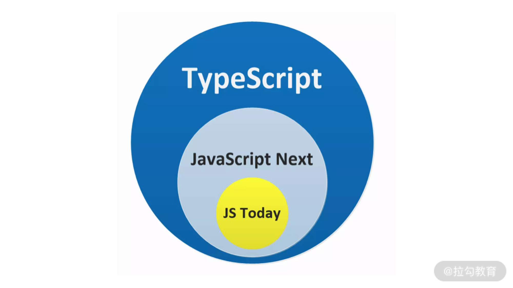
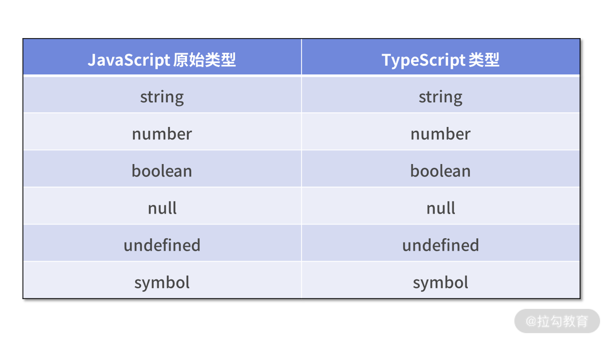

## 2.1 TypeScript 简介

TypeScript 是 JavaScript 的**超集**。

- 轻易复用 JavaScript 的代码、最新特性
- 使用可选的静态类型进行检查报错



## 2.2 基本语法

缺省类型注解的 TypeScript 与 JavaScript 完全一致。

### TypeScript 语法与 JavaScript 语法的区别

可以在 TypeScript 中显示声明变量 num 仅仅是数字类型。只需要在变量 num 后添加 `:number` 类型注解即可。

```ts
let num: number = 1;
```

特殊说明：`number`表示数字类型，`:`用来**分割变量和类型的分隔符**。

`number` 可以是 JavaScript 原始类型：`number`、`string`、`boolean`、`null`、`undefined`、`symbol` 等

### JavaScript 原始类型到 TypeScript 类型的映射关系



## 2.3 原始类型

### string

使用 `string` 表示 JavaScript 中任意的字符

```ts
let firstName: string = "Wen"; // 字符串字面量
let lastName: string = String("shaochang"); // 显示类型转换
let fullName: string = `my name is ${firstName} ${lastName}`; // 模板字符串
```

### number

使用 `number` 类型

```ts
/** 十进制整数 */
let integer: number = 6; // 6
/** 十进制整数 */
let integer2: number = Number(42); // 42
/** 十进制浮点数 */
let decimal: number = 3.14; // 2.14
/** 二进制整数 */
let binary: number = 0b1010; // 10
/** 八进制整数 */
let octal: number = 0o744; // 484
/** 十六进制整数 */
let hex: number = 0xf00d; // 61453
```

### bigint

如果使用较少的**大整数**，可以使用 bigint 类型来表示。number 和 bigint 不兼容。

```ts
let big: bigint = 100n;
```

### boolean

使用 `boolean` 表示 True 或者 False

```ts
/** TypeScript 真香为 真 */
let TypeScriptIsGreat: boolean = true;
/** TypeScript 太糟糕为 假 */
let TypeScriptIsBad: boolean = false;
```

### symbol

> 自 ECMAScript 6 起，TypeScript 开始支持新的 Symbol 原始类型

（可以通过 Symbol 构造一个函数，然后创建一个**独一无二的标记**）

使用 `Symbol` 表示如下代码所示的类型

```ts
let sym1: symbol = Symbol();
let sym2: symbol = Symbol('42');
```

不能将它们和小写格式对应的 number、string、boolean、symbol 进行等价。

```ts
let sym: symbol = Symbol('a');
let sym2: Symbol = Symbol('b');
sym = sym2 // ok or fail?
sym2 = sym // ok or fail?

let str: String = new String('a');
let str2: string = 'a';
str = str2; // ok or fail?
str2 = str; // ok or fail?
```

缺省类型注解的有无似乎没有什么明显的作用。(基于上下文的推导)

```ts
{
  let mustBeNum = 1;
}
{
  let mustBeNum: number = 1;
}
```

## 2.4 静态类型检测

在编译时期，静态类型的编程语言即可准确地发现类型错误，这就是静态类型检测的优势。

TypeScript 编译器将通过对比检测**变量接收值**的类型与我们**显示注解**的类型，从而检测类型是否存在错误。

- 如果两个类型完全一致，显示检测通过。
- 如果两个类型不一致，它就会抛出一个编译期错误，告知我们编码错误。

```ts
const trueNum: number = 42;
const fakeNum: number = '42'; // ts(2322) Type 'string' is not assignable to type 'number'
```

## 2.5 小结

TypeScript 是添加了类型注解的 JavaScript。
