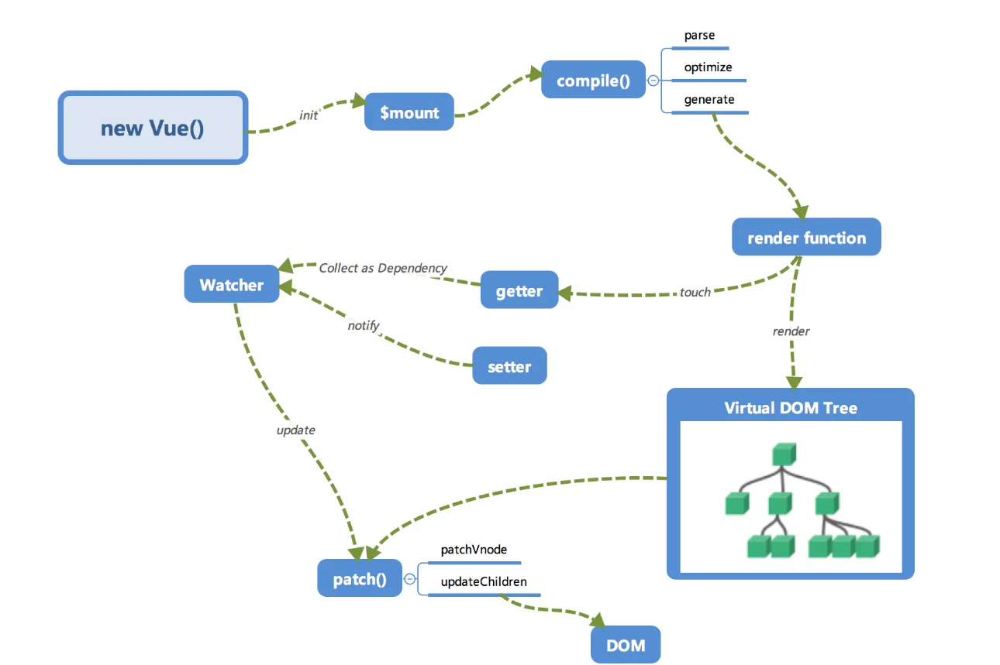
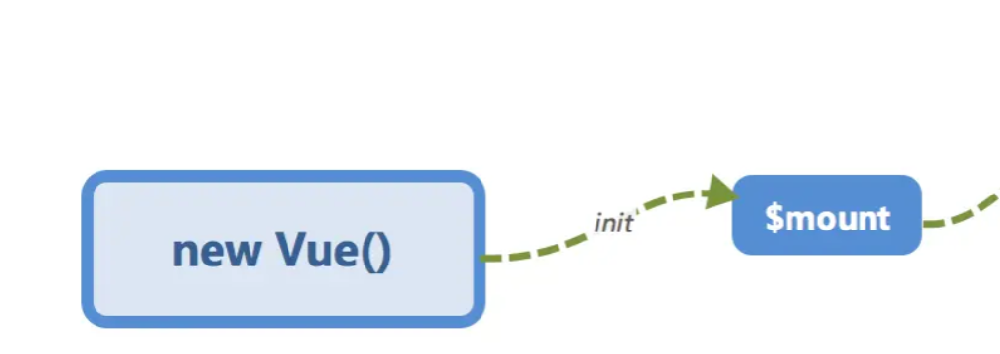
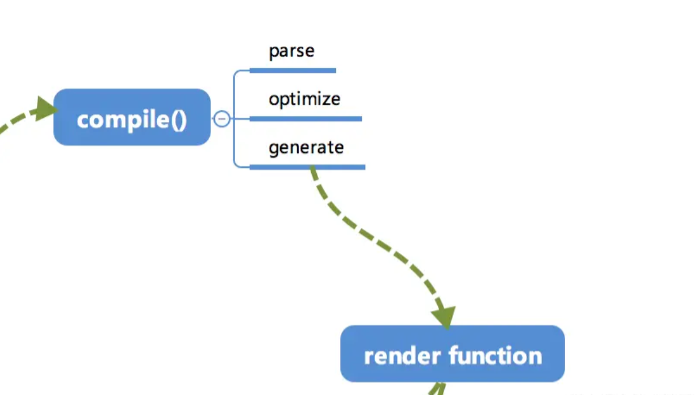
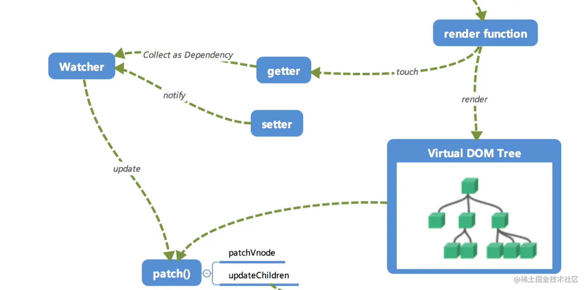
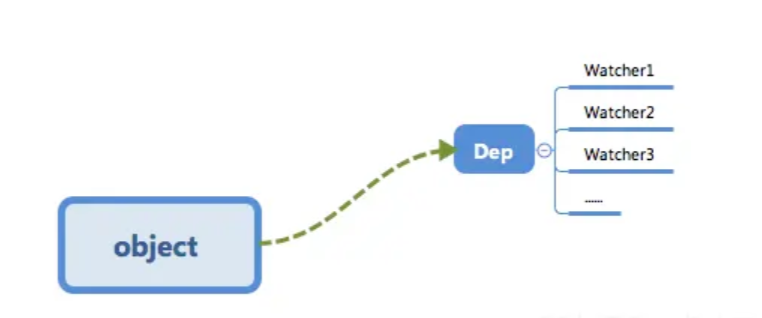
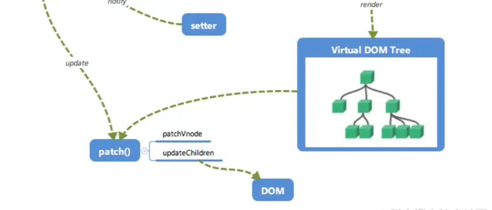

## 1.1 全局概览

内部流程图



## 1.2 初始化与挂载



在 `new Vue()` 之后。Vue 会调用 `init` 函数进行初始化，也就是这里的 `init` 过程，它会初始化生命周期、事件、props、methods、data、computed 与 watch 等。其中最重要的是通过 `Object.definedProperty` 设置 `setter` 与 `getter` 函数，用来实现 [**响应式**] 以及 [**依赖收集**]。

初始化之后调用 `$mount` 会挂载组件，如果是运行时编译，即不存在 render function 但是存在 template 的情况，需要进行 [**编译**] 步骤。

## 1.3 编译

compile 编译可以分成 `parse` 、 `optimize` 与 `generate` 三个阶段，最终需要得到 render function。



### parse

`parse` 会用正则等方式解析 template 模板中的指令、class、style等数据，形成 AST。

### optimize

`optimize` 的主要作用是标记 static 静态节点，这是 Vue 在编译过程中的一处优化，后面当 `update` 更新界面时，会有一个 `patch` 的过程，diff 算法会直接跳过静态节点，从而减少了比较的过程，优化了 `patch` 的性能。

### generate

`generate` 是将 AST 转化成 render function 字符串的过程，得到结果是 render 的字符串以及 staticRenderFns 字符串。

在经历过 `parse` 、`optimize` 与 `generate` 这三个阶段以后，组件中就会存在渲染 VNode 所需的 render function 了。

## 1.4 响应式



当 render function 被渲染的时候，因为会读取所需对象的值，所以会触发 `getter` 函数进行 [**依赖收集**]，[**依赖收集**] 的目的是将观察者 Watcher 对象存放到当前闭包中的订阅 Dep 的 subs 中。形成如下所示的这样的一个关系。



在修改对象的值的时候，会触发 `setter`，`setter` 通知之前 [**依赖收集**] 得到的 Dep 中的每一个 Watcher，告诉它们自己的值改变了，需要重新渲染视图。这时候这些 Watcher 就会开始调用 `update` 来更新视图，当然这中间还有一个 `patch` 的过程以及使用队列来异步更新的策略。

## 1.5 Virtual DOM

我们知道，render function 会被转化成 VNode 节点。Virtual DOM 其实就是一颗以 JavaScript 对象（VNode 节点）作为基础的树，用对象属性来描述节点，实际上它只是一层对真实 DOM 的抽象。最终可以通过一系列操作使这棵树映射到真实环境上。由于 Virtual DOM 是以 JavaScript 对象为基础而不依赖真实平台环境，所以使它具有跨平台的能力，比如说浏览器平台、Weex、Node 等。

比如说下面这样一个例子：

```js
{
  tag: 'div',             /*说明这是一个div标签*/
  children: [             /*存放该标签的子节点*/
    {
      tag: 'a',           /*说明这是一个a标签*/
      text: 'click me'    /*标签的内容*/
    }
  ]
}
```

渲染后可以得到

```html
<div>
  <a>click me</a>
</div>
```

这只是一个简单的例子，实际上的节点有更多的属性来标志节点，比如 isStatic（代表是否为静态节点）、isComment（代表是否是注释节点）等。

## 1.6 更新试图



当数据变化后，执行 render function 就可以得到一个新的 VNode 节点，我们如果想要得到新的视图，最简单粗暴的方式就是直接解析这个新的 VNode 节点，然后 `innerHTML` 直接全部渲染到真实 DOM 中。但是其实我们只对其中的小块内容进行了修改，这样做似乎有些 [**浪费**]。

那么我们为什么不能只修改那些 [改变了的地方] 呢？这个时候就要介绍我们的 [`patch`] 了。我们会将新的 VNode 与 旧的 VNode 一起传入 `patch` 进行比较，经过 diff 算法得出它们的 [**差异**]。最后我们只需要将这些 [差异] 的对应 DOM 进行修改即可。
