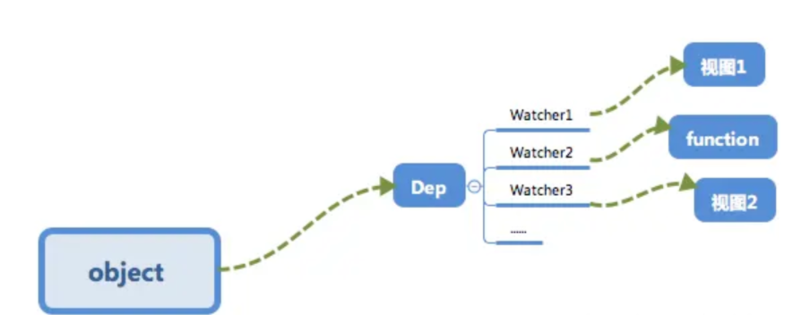

## 1. 为什么要依赖收集？

### 先举个栗子🌰

我们现在有这么一个 Vue 对象。

```js
new Vue({
  template:
    `<div>
      <span>{{text1}}</span>
      <span>{{text2}}</span>
    </div>
    `,
  data: {
    text1: 'text1',
    text2: 'text2',
    text3: 'text3',
  },
})
```

然后我们做了这么一个操作。

```js
this.text3 = 'modify text3';
```

我们修改了 `data` 中 `text3` 的数据，但是因为视图不需要用到 `text3`，所以我们并不需要触发之前的 `cb` 函数来更新视图，调用 `cb` 显然是不正确的。

### 再来个栗子🌰

假设我们现在有一个全局的对象，我们可能会在**多个** Vue 对象中用到它进行展示。

```js
let globalObj = {
  text1: 'text1'
};

let o1 = new Vue({
  template:
    `<div>
      <span>{{text1}}</span> 
    <div>`,
  data: globalObj
});

let o2 = new Vue({
  template:
    `<div>
      <span>{{text1}}</span> 
    <div>`,
  data: globalObj
});
```

这个时候，我们执行了如下操作。

```js
globalObj.text1 = 'hello,text1';
```

我们应该通知 `o1` 以及 `o2` 两个 vm 实例进行视图的更新，「依赖收集」会让 `text1` 这个数据知道“哦~有两个地方依赖我的数据，我变化的时候需要通知它们~”。

最终会形成数据与视图的一种对应关系，如下图。



## 2. 订阅者 Dep

## 3. 观察者 Watcher

## 4. 依赖收集

## 5. 小结
