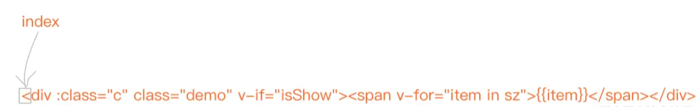
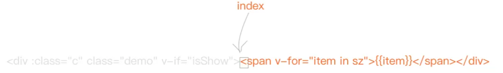
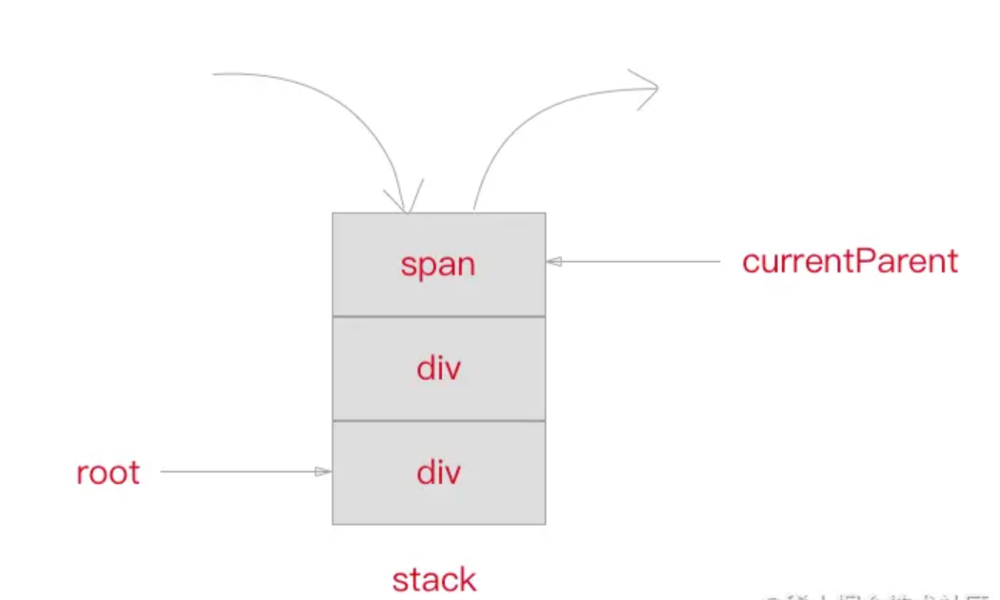
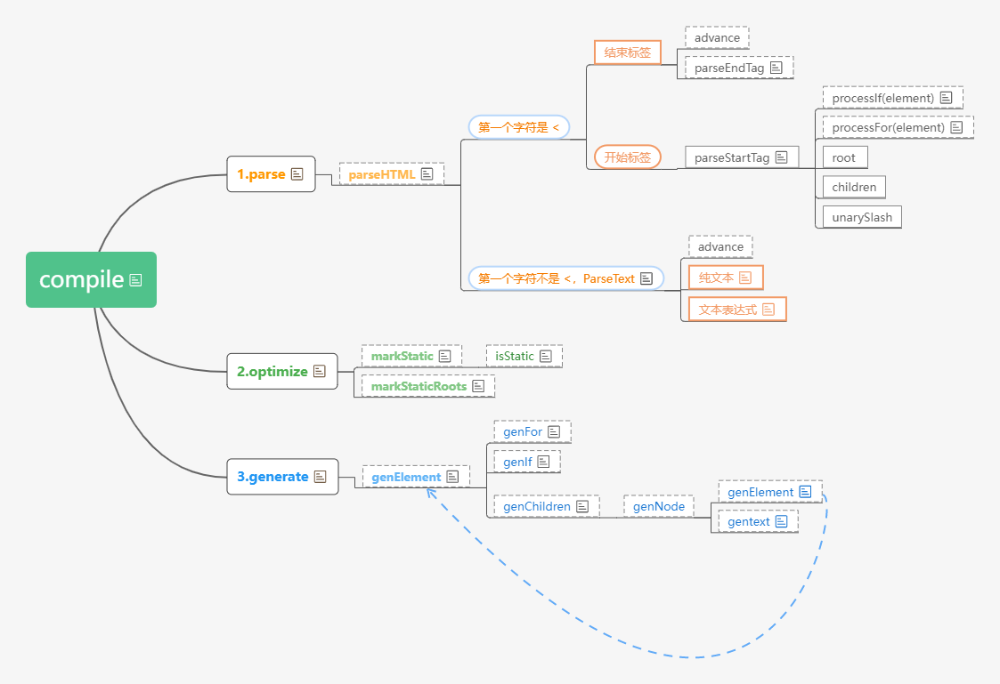

## 1. compile

`compile` 编译可以分成 `parse`、 `optimize` 与 `generate` 三个阶段，最终需要得到 render function。


以下面的 template 示例，来看解析的过程。

```vue
<div :class="c" class="demo" v-if="isShow">
  <span v-for="item in sz">{{ item }}</span>
</div>
```

```js
var html = '<div :class="c" class="demo" v-if="isShow"><span v-for="item in sz">{{item}}</span></div>';
```

## 2. parse

首先是 `parse`，`parse` 会用正则等方式将 template 模板中的字符串进行解析，得到指令、class、style等数据，形成 **AST**（在计算机科学中，**抽象语法树**（abstract syntax tree 或者缩写为 AST），或者语法树（syntax tree），是源码的抽象语法结构的树状表现形式，这里特指编程语言的代码。）。

这个过程比较复杂，会涉及到比较多的正则进行字符串解析，我们来看一下得到的 AST 的样子。

```js
{
  /* 标签属性的map，记录了标签上属性 */
  'attrsMap': {
    ':class': 'c',
    'class': 'demo',
    'v-if': 'isShow'
  },
  /* 解析得到的:class */
  'classBinding': 'c',
  /* 标签属性v-if */
  'if': 'isShow',
  /* v-if的条件 */
  'ifConditions': [
    {
      'exp': 'isShow'
    }
  ],
  /* 标签属性class */
  'staticClass': 'demo',
  /* 标签的tag */
  'tag': 'div',
  /* 子标签数组 */
  'children': [
    {
      'attrsMap': {
        'v-for': "item in sz"
      },
      /* for循环的参数 */
      'alias': "item",
      /* for循环的对象 */
      'for': 'sz',
      /* for循环是否已经被处理的标记位 */
      'forProcessed': true,
      'tag': 'span',
      'children': [
        {
          /* 表达式，_s 是一个转字符串的函数 */
          'expression': '_s(item)',
          'text': '{{item}}'
        }
      ]
    }
  ]
}
```

最终得到的 AST 通过一些**特定**的属性，能够比较清晰地描述出**标签的属性**以及**依赖关系**。

接下来我们用代码来讲解一下，如何使用正则来把 template 编译成我们需要的 AST 的。

### 2.1 正则

首先我们定义下一接下来我们会用的正则。

```js
// 名字
const ncname = '[a-zA-Z_][\\w\\-\\.]*'; //  AZ,az,_ 中任意一个
// 单属性标识符
const singleAttrIdentifier = /([^\s"'<>/=]+)/
// 单属性赋值
const singleAttrAssign = /(?:=)/
// 单属性值
const singleAttrValues = [
  /"([^"]*)"+/.source,
  /'([^']*)'+/.source,
  /([^\s"'=<>`]+)/.source
]
// 属性
const attribute = new RegExp(
  '^\\s*' + singleAttrIdentifier.source +
  '(?:\\s*(' + singleAttrAssign.source + ')' +
  '\\s*(?:' + singleAttrValues.join('|') + '))?'
)
// 名字捕获
const qnameCapture = '((?:' + ncname + '\\:)?' + ncname + ')'
// 开始标签打开
const startTagOpen = new RegExp('^<' + qnameCapture)
// 开始标签闭合
const startTagClose = /^\s*(\/?)>/
// 结束标签
const endTag = new RegExp('^<\\/' + qnameCapture + '[^>]*>')
// 默认标签正则
const defaultTagRE = /\{\{((?:.|\n)+?)\}\}/g
// 循环别名正则表达式 in of
const forAliasRE = /(.*?)\s+(?:in|of)\s+(.*)/
```

### 2.2 advance

因为我们解析 template 采用**循环进行字符串匹配**的方式，所以每匹配解析完一段我们需要将**去掉已经匹配解析的字符串**，头部的指针指向下来需要匹配的部分。

```js
function advance(n) {
  index += n;
  html = html.substring(n);
}
```

举个例子，当我们把第一个 div 的头部标签全部匹配完毕之后，我们需要将这部分除去，也就是又右移动 43 个字符。



调用 `advance` 函数

```js
advance(43);
```

得到结果



### 2.3 parseHTML

首先我们需要定义个 `parseHTML` 函数，在里面我们循环解析 template 字符串。

```js
function parseHTML () {
  // 开启一个 while 循环，循环结束的条件是 html 为空，即 html 被 parse 完毕
  while (html) {
    let textEnd = html.indexOf('<');
    // html 字符串的第一个字符就是左尖括号
    if(textEnd === 0) {
      // match() 方法检索返回一个字符串匹配正则表达式的结果。
      // End tag:  结束标签
      /*
        var ncname = '[a-zA-Z_][\\w\\-\\.]*';
        var qnameCapture = '((?:' + ncname + '\\:)?' + ncname + ')';
        var endTag = new RegExp('^<\\/' + qnameCapture + '[^>]*>');
        '<div :class="c" class="demo" v-if="isShow"><span v-for="item in sz">{{item}}</span></div>'.match(endTag)

        null
      */
      if(html.match(endTag)) {
        // ... process end tag
        continue;
      }
      // Start tag: 开始标签
      /*
        var ncname = '[a-zA-Z_][\\w\\-\\.]*';
        var qnameCapture = '((?:' + ncname + '\\:)?' + ncname + ')';
        var startTagOpen = new RegExp('^<' + qnameCapture);
        '<div :class="c" class="demo" v-if="isShow"><span v-for="item in sz">{{item}}</span></div>'.match(startTagOpen)

        ['<div', 'div', index: 0, input: '<div :class="c" class="demo" v-if="isShow"><span v-for="item in sz">{{item}}</span></div>', groups: undefined]
      */
      if(html.match(startTagOpen)) {
        // ... process start tag
        continue;
      }
    } else {
      // ... process text
      continue;
    }
  }
}
```

`parseHTML` 会用 `while` 来循环解析 template，用正则在匹配到标签头、标签尾以及文本的时候分别进行不同的处理。直到整个 template 被解析完毕。

### 2.4 parseStartTag

我们来写一个 `parseStartTag` 函数，用来**解析起始标签**（`'<div :class="c" class="demo" v-if="isShow">'`部分的内容）。

```js
function parseStartTag () {
  // 首先用 startTagOpen 正则得到标签的头部，可以得到 tagName（标签名称），同时我们需要一个数组 attrs 用来存放标签内的属性。
  // 如果匹配成功，那么 start 将是一个包含两个元素的数组：第一个元素是标签的开始部分(包含< 和 标签名称)；第二个元素是捕获组捕获到的标签名称。
  // start = ['<div', 'div', index: 0, input: '<div :class="c" class="demo" v-if="isShow">', groups: undefined ]
  const start = html.match(startTagOpen);
  if(start) {
    const match = {
      // 它的值为 start[1] 即标签的名称。
      tagName: start[1], // div
      // 用来存储将来被匹配到的属性。
      attrs: [],
      // 初始值为 index，是当前字符流读入位置在整个 html 字符串中的相对位置。
      start: index // 0
    }
    advance(start[0].length); // advance(4) -> ':class="c" class="demo" v-if="isShow">'

    let end, attr
    // 接下来使用 startTagClose 与 attribute 两个正则分别用来解析标签结束以及标签内的属性。这段代码用 while 循环一直到匹配到 startTagClose 为止，解析内部所有的属性。
    // 没有匹配到开始标签的结束部分 且 有匹配到了属性；将每一个属性的对应的 name、value push 到 match 变量的 attrs 属性中去。
    // [':class="c"', ':class', '=', 'c', undefined, undefined, index: 0, input: ':class="c" class="demo" v-if="isShow">', groups: undefined]
    while(!(end = html.match(startTagClose)) && (attr = html.match(attribute))) {
      advance(attr[0].length) // advance(10)
      match.attrs.push({
        name: attr[1], // ':class'
        value: attr[3] // 'c'
      });
    }
    // 匹配到结束标签，结束。'>'.match(/^\s*(\/?)>/) -> ['>', '', index: 0, input: '>', groups: undefined]
    if(end) {
      match.unarySlash = end[1]; // unarySlash 一元斜线
      advance(end[0].length);
      match.end = index; // 添加了一个end属性 值为index
      return match; // 将match 对象作为 parseStartTag 函数的返回值返回
    }
  }
}
```

我们模拟假设有如下html（template）字符串：

```js
<div id="box" v-if="watings"></div>
```

则parseStartTag函数的返回值如下

```js
match = {
  tagName: 'div',
  attrs: [
    [
      'id="box"',
      'id',
      '=',
      'box',
      undefined,
      undefined
    ],
    [
      ' v-if="watings"',
      'v-if',
      '=',
      'watings',
      undefined,
      undefined
    ]
  ],
  start: index,
  unarySlash: undefined,
  end: index
}
```

### 2.5 stack

此外，我们需要维护一个 **`stack`** 栈来保存已经解析好的标签头，这样我们可以根据在解析尾部标签的时候得到所属的层级关系以及父标签。同时我们定义一个 `currentParent` 变量用来存放**当前标签的父标签节点的引用**， `root` 变量用来指向**根标签节点**。

```js
const stack = [];
let currentParent, root;
```



知道这个以后，我们优化一下 `parseHTML` ，在 `startTagOpen` 的 `if` 逻辑中加上新的处理。

```js
if(html.match(startTagOpen)) {
  // 将 startTagMatch 得到的结果首先封装成 element ，这个就是最终形成的 AST 的节点，标签节点的 type 为 1。
  const startTagMatch = parseStartTag();
  const element = {
    type: 1,
    tag: startTagMatch.tagName,
    lowerCasedTag: startTagMatch.tagName.toLowerCase(),
    attrsList: startTagMatch.attrs,
    attrsMap: makeAttrsMap(startTagMatch.attrs),
    parent: currentParent,
    children: [],
  }
  // 没有根节点，让 root 指向根节点的引用。
  if(!root) {
    root = element
  }
  // 将当前节点的 element 放入父节点 currentParent 的 children 数组中。
  if(currentParent) {
    currentParent.children.push(element);
  }
  // 最后将当前节点 element 压入 stack 栈中，并将 currentParent 指向当前节点，因为接下去下一个解析如果还是头标签或者是文本的话，会成为当前节点的子节点，如果是尾标签的话，那么将会从栈中取出当前节点，这种情况我们接下来要讲。
  stack.push(element);
  currentParent = element;
  continue;
}

// 其中的 makeAttrsMap 是将 attrs 转换成 map 格式的一个方法。
function makeAttrsMap(attrs) {
  const map = {}
  for (let i = 0; i < attrs.length; i++) {
    map[attts[i].name] = attrs[i].value;
  }
  return map;
}
```

### 2.6 parseEndTag

同样，我们在 `parseHTML` 中加入对尾标签的解析函数，为了匹配如 “`</div>`”。

```js
// '</div>'.match(endTag) -> [ '</div>', 'div', index: 0, input: '</div>', groups: undefined ]
const endTagMatch = html.match(endTag)
if (endTagMatch) {
  advance(endTagMatch[0].length); // advance(6)
  parseEndTag(endTagMatch[1]); // parseEndTag('div')
  continue;
}
```

用 `parseEndTag` 来解析尾标签，它会从 stack 栈中取出**最近**的跟自己**标签名一致**的那个元素，将 `currentParent` 指向那个元素，并将该元素都从 stack 中出栈。

```html
<div>
  <span></span>
  <span></span>
  <br />
  <span>
</div>
```

```js
function parseEndTag(tagName) {
  let pos;
  for (pos = stack.length - 1; pos >= 0; pos--) {
    if(stack[pos].lowerCasedTag === tagName.toLowerCase()) {
      break;
    }
  }
  if(pos >= 0) {
    stack.length = pos;
    currentParent = stack[pos]
  }
}
```

### 2.7 parseText

最后是解析文本，这个比较简单，只需要将文本取出，然后有两种情况，一种是**普通**的文本，直接构建一个节点 push 进当前 `currentParent` 的 children 中即可。还有一种情况是文本是如 "{{ item }}" 这样的 Vue.js 的**表达式**，这时候我们需要用 `parseText` 来将表达式转化成代码。

```js
text = html.substring(0, textEnd)
advance(textEnd)
let expression;
// 含表达式文本
if(expression = parseText(text)) {
  currentParent.children.push({
    type: 2,
    text,
    expression
  });
} else { // 纯文本
  currentParent.children.push({
    type: 3,
    text
  })
}
```

用到一个 `parseText` 函数。

```js
function parseText (text) {
  // /\{\{((?:.|\n)+?)\}\}/g.test('hello world') -> false
  // /\{\{((?:.|\n)+?)\}\}/g.test('{{item}}') -> true
  if(!defaultTagRE.test(text)) return; // 如果没有匹配到文本中有表达式，则直接返回。
  const tokens = [];
  let lastIndex = defaultTagRE.lastIndex = 0
  let match, index
  // /\{\{((?:.|\n)+?)\}\}/g.exec('{{item}}') ->  (2) ['{{item}}', 'item', index: 0, input: '{{item}}', groups: undefined]
  // /\{\{((?:.|\n)+?)\}\}/g.exec('标签{{item}}') -> (2) ['{{item}}', 'item', index: 2, input: '标签{{item}}', groups: undefined]
  while (match = defaultTagRE.exec(text)) {
    index = match.index
    if(index > lastIndex) {
      tokens.push(JSON.stringify(text.slice(lastIndex, index)))
    }
    const exp = match[1].trim()
    tokens.push(`_s(${exp})`)
    lastIndex = index + match[0].length
  }
  if(lastIndex < text.length) {
    tokens.push(JSON.stringify(text.slice(lastIndex)));
  }
  return tokens.join('+')
}
```

我们使用一个 `tokens` 数组来存放解析结果，通过 `defaultTagRE` 来循环匹配该文本，如果是普通文本直接 `push` 到 `tokens` 数组中去，如果是表达式(`{item}`)，则转化成“`_s(${exp})`”的形式。

举个例子，如果我们有这样一个文本。

```js
<div>hello,{{name}}.</div>
```

最终得到 `tokens`。

```js
tokens = ['hello,', _s(name), '.'];
```

最终通过 `join` 返回表达式。

```js
'hello,' + _s(name) + '.'; 
```

### 2.8 processlf 与 processFor

最后介绍一下如何处理“`v-if`”以及“`v-for`”这样的 Vue.js 的表达式。

我们只需要在解析头标签的内容中加入这两个表达式的解析函数即可，在这时“`v-for`”之类指令已经在属性解析时存入了 `attrsMap` 中了。

```js
if (html.match(startTagOpen)) {
  const startTagMatch = parseStartTag();
  const element = {
    type: 1,
    tag: startTagMatch.tagName,
    attrsList: startTagMatch.attrs,
    attrsMap: makeAttrsMap(startTagMatch.attrs),
    parent: currentParent,
    children: []
  }

  processIf(element);
  processFor(element);

  if(!root){
    root = element
  }

  if(currentParent){
    currentParent.children.push(element);
  }

  stack.push(element);
  currentParent = element;
  continue;
}
```

首先我们需要定义一个 `getAndRemoveAttr` 函数，用来从 `el` 的 `attrsMap` 属性或是 `attrsList` 属性中取出 `name` 对应值。

```js
function getAndRemoveAttr (el, name) {
  let val
  if((val = el.attrsMap[name]) != null) {
    const list = el.attrsList
    for (let i = 0; i < list.length; i++) {
      if(list[i].name === name) {
        list.splice(i, 1)
        break
      }
    }
  }
  return val
}
```

比如说解析示例的 div 标签属性。

```js
getAndRemoveAttr(el, 'v-for');
```

可有得到“`item in sz`”。

有了这个函数这样我们就可以开始实现 `processFor` 与 `processIf` 了。

“v-for”会将指令解析成 `for` 属性以及 `alias` 属性，而“v-if”会将条件都存入 `ifConditions` 数组中。

```js
function processFor(el) {
  let exp;
  if ((exp = getAndRemoveAttr(el, 'v-for'))) { // exp -> 'item in sz'
    // 'item in sz'.match(/(.*?)\s+(?:in|of)\s+(.*)/) -> ['item in sz', 'item', 'sz', index: 0, input: 'item in sz', groups: undefined]
    const inMatch = exp.match(forAliasRE);
    el.for = inMatch[2].trim() // 'sz'.trim()
    el.alias = inMatch[1].trim(); // 'item'.trim()
  }
}

function processIf (el) {
  const exp = getAndRemoveAttr(el, 'v-if');
  // exp -> isShow
  if(exp) {
    el.if = exp;
    if (!el.ifConditions) {
      el.ifConditions = [];
    }
    el.ifConditions.push({
      exp: exp,
      block: el
    })
  }
}
```

到这里，我们已经把 `parse` 的过程介绍完了，接下来看一下 `optimize`。

## 3. optimize

`optimize` 主要作用就跟它的名字一样，用作 「优化」。

这个涉及到后面要讲 `patch` 的过程，因为 `patch` 的过程实际上是将 VNode 节点进行一层一层的对比，然后将「差异」更新到视图上。那么一些静态节点是不会根据数据变化而变化的，这些节点我们没有对比的需求，是不是可以跳过这些静态节点的对比，从而节省一些性能呢？

那么我们就需要为**静态的节点**做上一些「标记」，在 `patch` 的时候我们就可以直接**跳过**这些被标记的节点的对比，从而达到「优化」的目的。

经过 `optimize` 这层的处理，每个节点会加上 `static` 属性，用来标记是否是静态的。

得到如下结果。

```js
{
  'attrsMap' : {
    ':class': 'c',
    'class': 'demo',
    'v-if': 'isShow',
  },
  'classBinding': 'c',
  'if': 'isShow',
  'ifConditions': [
    {
      'exp': 'isShow',
    }
  ],
  'staticClass': 'demo',
  'tag': 'div',
  /* 静态标记 */
  'static': false,
  'children': [
    {
      'attrsMap' : {
        'v-fors': 'item in sz',
      },
      /* 静态标记 */
      'static': false,
      'alias': 'item',
      'for': 'sz',
      'forProcessed': true,
      'classBinding': 'c',
      'if': 'isShow',
      'tag': 'span',
      'children': [
        {
          'expression': '_s(item)',
          'text': '{{item}}',
          'static': false,
        }
      ],
    }
  ],
}
```

我们用代码实现一下 `optimize` 函数。

### 3.1 isStatic

首先实现一个 `isStatic` 函数，传入一个 node 判断该 node 是否是静态节点。判断的标准是当 type 为 2 （表达式节点）则是非静态节点，当 type 为 3 （文本节点）的时候则是静态节点，当然，如果存在 `if` 或者 `for` 这样的条件的时候（表达式节点），也是非静态节点。

```js
function isStatic(node) {
  // 非静态节点
  if(node.type === 2) {
    return false;
  }
  // 静态节点
  if(node.type === 3) {
    return true;
  }
  // 存在 if、for 表达式也是非静态节点，返回 false
  return (!node.if && !node.for);
}
```

文档、元素、属性以及 HTML 或 XML 文档的其他方面拥有不同的节点类型。存在 12 种不同的节点类型:

NodeType |节点类型 | 描述
---|:--:|---
1 | Element | 元素
2 | Attr | 属性
3 | Text | 元素或属性中的文本内容
4 | CDATASection | 文档中的 CDATA 部分（不会由解析器解析的文本）
5 | EntityReference | 实体引用
6 | Entity | 实体
7 | ProcessingInstruction | 处理指令
8 | Comment | 注释
9 | Document | 整个文档（DOM 树的根节点）
10 | DocumentType | 向为文档定义的实体提供接口
11 | DocumentFragment | 代表轻量级的 Document 对象，能够容纳文档的某个部分
12 | Notation | 代表 DTD 中声明的符号。

### 3.2 markStatic

`markStatic` 为所有的节点标记上 `static`，**遍历所有节点**通过 `isStatic` 来判断当前节点是否是静态节点，此外，会便利当前节点下的**所有子节点**，如果子节点是非静态节点，那么当前节点也是非静态节点。

```js
function markStatic (node) {
  node.static = isStatic(node);
  if(node.type === 1) {
    for (let i = 0; l = node.children.length; i < l; i++) {
      const child = node.children[i];
      markStatic(child); // 递归检测每个子节点，如果有非静态节点，那么当前节点也是非静态节点。
      if(!child.static) {
        node.static = false;
      }
    }
  }
}
```

### 3.3 markStaticRoots

接下来是 `markStaticRoots` 函数，用来标记 `staticRoot`（**静态根**）。这个函数实现比较简单，简单来讲就是如果当前节点是静态节点，同时满足节点并不是只有一个文本节点左右子节点时，标记 `staticRoot` 为 true，否则为 false。

```js
function markStaticRoots (node) {
  if (node.type === 1) {
    if (node.static && node.children.length && !(node.children.length === 1 && node.children[0].type === 3)) {
      node.staticRoot = true;
    } else {
      node.staticRoot = false;
    }
  }
}
```

### 3.4 optimize

有了以上的函数，就可以实现 `optimize` 了。

```js
function optimize (rootAst) {
  markStatic(rootAst);
  markStaticRoots(rootAst);
}
```

## 4. generate

`generate` 会将 AST 转化成 render function 字符串，最终得到 render 的字符串以及 staticRenderFns 字符串。

```vue
<div :class="c" class="demo" v-if="isShow">
  <span v-for="item in sz">{{ item }}</span>
</div>
```

真实的 Vue.js 编译得到的结果。

```js
// _c -> createElement
// _l -> renderList   用于呈现v-for列表。
// _v -> createTextVNode  创建文本节点。
// _s -> toString: Convert a value to a string that is actually rendered.
// _e -> createEmptyVNode 创建空的 VNode 
with(this) {
  return (isShow) ?
    _c(
      'div', 
      { 
        staticClass: 'demo', 
        class: c 
      }, 
      _l( 
        (sz), 
        function(item) { 
          return _c('span', [_v(_s(item))]) 
        } 
      )
    )
    : _e()
}
```

这些 `_c`，`_l` 到底是什么？其实他们是 Vue.js 对一些函数的**简写**，比如说 `_c` 对应的是 `createElement` 这个函数。没关系，我们把它用 VNode 的形式写出来就会明白了。

首先是第一层 div 节点。

```js
render () {
  return isShow ? (nw VNode('div', {
    'staticClass': 'demo',
    'class': c,
  }, [/* 这里还有子节点 */ ])) : createEmptyVNode();
}
```

然后我们在 `children` 中加上第二层 span 及其子文本节点节点。

```js
/* 渲染v-for列表 */
function renderList (val, render) {
  let ret = new Array(val.length);
  for (i = 0, l = val.length; i < l; i++) {
    ret[i] = render(val[i], i);
  }
}

render () {
  return isShow ? (new VNode('div', {
      'staticClass': 'demo',
      'class': c
    }, 
    /* begin */
    renderList(sz, (item) => {
      return new VNode('span', {}, [
        createTextVNode(item);
      ]);
    })
    /* end */
  )) : createEmptyVNode();
}
```

### 4.1 genIf

首先实现一个处理 `if` 条件的 `genIf` 函数。

```js
function genIf (el) {
  el.ifProcessed = true;
  if (!el.ifConditions.length) {
    return '_e()';
  }
  return `(${el.ifConditions[0].exp}) ? ${genElement(el.ifConditions[0].block)} : _e()`
}
```

### 4.2 genFor

然后是处理 `for` 循环的函数。

```js
function genFor (el) {
  el.forProcessed = true;
  
  const exp = el.for;
  const alias = el.alias;
  const interator1 = el.interator1 ? ',${el.interator1}' : '';
  const interator2 = el.interator2 ? ',${el.interator2}' : '';

  return `_l((${exp}),` +
    `function(${alias}${iterator1}${iterator2}){` +
    `return ${genElement(el)}` +
  '})';
}
```

### 4.3 genText

处理文本节点的函数。

```js
function genText (el) {
  return `_v(${el.expression})`;
}
```

### 4.4 genElement

接下来实现 `genElement`，这是一个处理节点的函数，因为它依赖 `genChildren` 以及 `genNode`，所以者三个函数放一起讲。

genElement 会根据当前节点是否有 `if` 或者 `for` 标记然后判断是否要用 `genIf` 或者 `genFor` 处理，否则通过 `genChildren` 处理子节点，同时得到 `staticClass`、`class` 等属性。

`genChildren` 比较简单，遍历所有的子节点，通过 `genNode` 处理后用 "," 隔开拼接成字符串。

`genNode` 则是根据 `type` 来判断该节点是用文本节点 `genText` 还是标签节点 `genElement` 来处理。

```js
function genNode (el) {
  if (el.type === 1) { // 标签节点
    return genElement(el);
  } else { // 文本节点
    return genText(el);
  }
}

function genChildren (el) {
  const children = el.children;
  // 遍历所有的子节点，通过 genNode 处理后用 "," 隔开拼接成字符串。
  if (children && children.length > 0) {
    return `${children.map(genNode).join(',')}`;
  }
}

function genElement (el) {
  if (el.if && !el.ifProcessed) {
    return genIf(el);
  } else if (el.for && !el.forProcessed) { 
    return genFor(el);
  } else {
    const children = genChildren(el);
    let code;
    code = `_c('${el.tag},'{
      staticClass: ${el.attrsMap && el.attrsMap[':class']},
      class: ${el.attrsMap && el.attrsMap['class']},
    }${
      children ? `,${children}` : ''
    })`
    return code;
  }
}
```

### 4.5 generate

最后我们使用上面的函数来实现 `generate`，其实很简单，我们只需要将整个 AST 传入后判断是否为空，为空返回一个 div 标签，否则通过 `generate` 来处理。

```js
function generate(rootAst) {
  const code = rootAst ? genElement(rootAst) : '_c("div")'
  return {
    render: `with(this) { return ${code} }`,
  }
}
```

经历过这些过程以后，我们已经把 template 顺利转成了 rendere function 了，接下来我们将介绍 `patch` 的过程，来看一下具体 VNode 节点如何进行差异的比对。

附上流程图



附上在线的流程网址（有函数的提示说明）

[compiler](https://www.processon.com/view/link/62c44771e0b34d074943dd32#map)

附上完整代码：

```js
/*
  _c -> createElement
  _l -> renderList   用于呈现v-for列表。
  _v -> createTextVNode  创建文本节点。
  _s -> toString: Convert a value to a string that is actually rendered.
  _e -> createEmptyVNode 创建空的 VNode 
*/

const ncname = '[a-zA-Z_][\\w\\-\\.]*'
const singleAttrIdentifier = /([^\s"'<>/=]+)/
const singleAttrAssign = /(?:=)/
const singleAttrValues = [
  /"([^"]*)"+/.source,
  /'([^']*)'+/.source,
  /([^\s"'=<>`]+)/.source,
]
const attribute = new RegExp(
  '^\\s*' +
    singleAttrIdentifier.source +
    '(?:\\s*(' +
    singleAttrAssign.source +
    ')' +
    '\\s*(?:' +
    singleAttrValues.join('|') +
    '))?'
)

const qnameCapture = '((?:' + ncname + '\\:)?' + ncname + ')'
const startTagOpen = new RegExp('^<' + qnameCapture)
const startTagClose = /^\s*(\/?)>/

const endTag = new RegExp('^<\\/' + qnameCapture + '[^>]*>')

const defaultTagRE = /\{\{((?:.|\n)+?)\}\}/g

const forAliasRE = /(.*?)\s+(?:in|of)\s+(.*)/

// 保存已经解析好的标签头
const stack = []
// currentParent 变量用来存放当前标签的父标签节点的引用
// root 变量用来指向根标签节点
let currentParent, root

let index = 0
// 1.2.1 去掉已经匹配解析的字符串
// 解析 template 采用循环进行字符串匹配的方式，所以每匹配解析完一段我们需要将已经匹配掉的去掉，头部的指针指向下来需要匹配的部分。
// 举个例子，当我们把第一个 div 的头部标签全部匹配完毕之后，我们需要将这部分除去，也就是又右移动 43 个字符。
function advance(n) {
  index += n
  html = html.substring(n)
}

function makeAttrsMap(attrs) {
  const map = {}
  for (let i = 0, l = attrs.length; i < l; i++) {
    map[attrs[i].name] = attrs[i].value
  }
  return map
}
// 1.2.3 解析起始标签
function parseStartTag() {
  /*
    ['<div', 'div', index: 0, input: '<div :class="c" class="demo" v-if="isShow"><span v-for="item in sz">{{item}}</span></div>', groups: undefined]
  */
  const start = html.match(startTagOpen)
  if (start) {
    const match = {
      tagName: start[1], // start[1] -> 'div'
      attrs: [],
      start: index, // 0
    }
    // advance(4)
    // '<div :class="c" class="demo" v-if="isShow"><span v-for="item in sz">{{item}}</span></div>'.substring(4)
    // ' :class="c" class="demo" v-if="isShow"><span v-for="item in sz">{{item}}</span></div>'
    advance(start[0].length) // start[0] -> '<div'

    let end, attr
    /* 
      var singleAttrIdentifier = /([^\s"'<>/=]+)/
      var singleAttrAssign = /(?:=)/
      var singleAttrValues = [
        /"([^"]*)"+/.source,
        /'([^']*)'+/.source,
        /([^\s"'=<>`]+)/.source,
      ]
      var attribute = new RegExp(
        '^\\s*' +
          singleAttrIdentifier.source +
          '(?:\\s*(' +
          singleAttrAssign.source +
          ')' +
          '\\s*(?:' +
          singleAttrValues.join('|') +
          '))?'
      )
    */
    // ' :class="c" class="demo" v-if="isShow"><span v-for="item in sz">{{item}}</span></div>'.match(attribute)
    // [' :class="c"', ':class', '=', 'c', undefined, undefined, index: 0, input: ' :class="c" class="demo" v-if="isShow"><span v-for="item in sz">{{item}}</span></div>', groups: undefined]
    while (
      !(end = html.match(startTagClose)) && // '>'.match(/^\s*(\/?)>/) -> ['>', '', index: 0, input: '>', groups: undefined]
      (attr = html.match(attribute)) // '>'.match(attribute) -> null
    ) {
      // attr[0] -> ' :class="c"'
      // ' :class="c"'.length -> 11
      // ' :class="c" class="demo" v-if="isShow"><span v-for="item in sz">{{item}}</span></div>'.substring(11)
      // ' class="demo" v-if="isShow"><span v-for="item in sz">{{item}}</span></div>'
      advance(attr[0].length)
      match.attrs.push({
        name: attr[1], // attr[1] -> :class
        value: attr[3], // attr[3] -> c
      })
      /* 
        attrs: [
          { name: ':class', value: 'c' },
          { name: 'class', value: 'demo' },
          { name: 'v-if', value: 'isShow' },
        ]
      */
    }
    // end -> ['>', '', index: 0, input: '>', groups: undefined]
    if (end) {
      match.unarySlash = end[1] // end[1] -> ''
      advance(end[0].length) // end[0].length -> 1 advance(1)
      match.end = index
      /* 
        {
          tagName: 'div',
          attrs: [
            { name: ':class', value: 'c' },
            { name: 'class', value: 'demo' },
            { name: 'v-if', value: 'isShow' },
          ],
          start: index,
          unarySlash: '',
          end: index,
        }
      */
      return match
    }
  }
}
// 1.2.2 对尾标签的解析函数
function parseEndTag(tagName) {
  // 用 parseEndTag 来解析尾标签，它会从 stack 栈中取出最近的跟自己标签名一致的那个元素，将 currentParent 指向那个元素，并将该元素都从 stack 中出栈。
  let pos
  for (pos = stack.length - 1; pos >= 0; pos--) {
    if (stack[pos].lowerCasedTag === tagName.toLowerCase()) {
      break
    }
  }

  if (pos >= 0) {
    // 匹配到了开始同名标签
    if (pos > 0) {
      currentParent = stack[pos - 1] // 当前节点父标签的引用为 stack 栈上一个
    } else {
      // 没有匹配到开始同名标签
      currentParent = null
    }
    stack.length = pos // stack: 保存已经解析好的标签头;匹配到后,之前保留的出栈.
  }
}
// 解析文本
// 1. 普通的文本
// 2. 表达式文本
function parseText(text) {
  // 如果是纯文本直接返回
  // /\{\{((?:.|\n)+?)\}\}/g.test('hello') -> false
  // /\{\{((?:.|\n)+?)\}\}/g.test('{{val}}') -> true
  if (!defaultTagRE.test(text)) return
  // 如果是表达式文本
  // 我们使用一个 tokens 数组来存放解析结果，通过 defaultTagRE 来循环匹配该文本，如果是普通文本直接 push 到 tokens 数组中去，如果是表达式({item})，则转化成“_s(${exp})”的形式。
  const tokens = []
  let lastIndex = (defaultTagRE.lastIndex = 0)
  let match, index
  // 1. 普通的文本 /\{\{((?:.|\n)+?)\}\}/g.exec('hello') -> null
  // 2. 表达式文本 /\{\{((?:.|\n)+?)\}\}/g.exec('{{val}}') -> ['{{val}}', 'val', index: 0, input: '{{val}}', groups: undefined]
  // 表达式文本 - match = ['{{val}}', 'val', index: 0, input: '{{val}}', groups: undefined]
  while ((match = defaultTagRE.exec(text))) {
    index = match.index

    if (index > lastIndex) {
      tokens.push(JSON.stringify(text.slice(lastIndex, index)))
    }

    const exp = match[1].trim() // 'val'.trim()
    tokens.push(`_s(${exp})`) // '_s(${val})' -> '_s(val)'
    lastIndex = index + match[0].length
  }
  // 普通的文本 - 0 < 'hello'.length -> true
  if (lastIndex < text.length) {
    tokens.push(JSON.stringify(text.slice(lastIndex))) // 'hello'.slice(0) -> 'hello'
  }
  // <div>hello,{{name}}.</div>
  // tokens = ['hello,', _s(name), '.'];
  // join -> 'hello' + _s(name) + '.';
  return tokens.join('+')
}

function getAndRemoveAttr(el, name) {
  let val
  if ((val = el.attrsMap[name]) != null) {
    const list = el.attrsList
    for (let i = 0, l = list.length; i < l; i++) {
      if (list[i].name === name) {
        list.splice(i, 1)
        break
      }
    }
  }
  return val
}

function processFor(el) {
  let exp
  if ((exp = getAndRemoveAttr(el, 'v-for'))) {
    const inMatch = exp.match(forAliasRE)
    el.for = inMatch[2].trim()
    el.alias = inMatch[1].trim()
  }
  // 'for': 'sz', // for循环的对象
  // 'alias': "item", // for循环的参数
}

// 解析 v-if 属性
function processIf(el) {
  // getAndRemoveAttr: 用来从 el 的 attrsMap 属性或是 attrsList 属性中取出 name 对应值。
  const exp = getAndRemoveAttr(el, 'v-if') // exp -> isShow
  if (exp) {
    el.if = exp
    if (!el.ifConditions) {
      el.ifConditions = []
    }
    el.ifConditions.push({
      exp: exp,
      block: el,
    })
  }
  // 'if': 'isShow', // 标签属性v-if
  // 'ifConditions': [{ 'exp': 'isShow' }], // v-if的条件
}
// 1.2 定义一个 parseHTML 函数，在里面循环解析 template 字符串
function parseHTML() {
  // 开启一个 while 循环，循环结束的条件是 html 为空，即 html 被 parse 完毕
  while (html) {
    let textEnd = html.indexOf('<')
    // html 字符串的第一个字符就是左尖括号；如果不是，先截去 html 字符串 < 前面的字符
    if (textEnd === 0) {
      // 结束标签
      // 1. 不是结束标签
      /*
        var ncname = '[a-zA-Z_][\\w\\-\\.]*';
        var qnameCapture = '((?:' + ncname + '\\:)?' + ncname + ')';
        var endTag = new RegExp('^<\\/' + qnameCapture + '[^>]*>');
        '<div :class="c" class="demo" v-if="isShow"><span v-for="item in sz">{{item}}</span></div>'.match(endTag)

        null
      */
      // 2. 是结束标签
      /*
        var ncname = '[a-zA-Z_][\\w\\-\\.]*';
        var qnameCapture = '((?:' + ncname + '\\:)?' + ncname + ')';
        var endTag = new RegExp('^<\\/' + qnameCapture + '[^>]*>');
        '</span>'.match(endTag)

        ['</span>', 'span', index: 0, input: '</span>', groups: undefined]
      */
      const endTagMatch = html.match(endTag) // match() 方法检索返回一个字符串匹配正则表达式的结果。
      if (endTagMatch) {
        // 1.2.1 去掉已经匹配解析的字符串
        advance(endTagMatch[0].length) // advance('</span>'.length) -> advance(7)
        // 1.2.2 对尾标签的解析函数
        parseEndTag(endTagMatch[1]) // parseEndTag('span')
        continue
      }
      // 开始标签
      /*
        var ncname = '[a-zA-Z_][\\w\\-\\.]*';
        var qnameCapture = '((?:' + ncname + '\\:)?' + ncname + ')';
        var startTagOpen = new RegExp('^<' + qnameCapture);
        '<div :class="c" class="demo" v-if="isShow"><span v-for="item in sz">{{item}}</span></div>'.match(startTagOpen)

        ['<div', 'div', index: 0, input: '<div :class="c" class="demo" v-if="isShow"><span v-for="item in sz">{{item}}</span></div>', groups: undefined]
      */
      if (html.match(startTagOpen)) {
        // 1.2.3 解析起始标签
        // 将 startTagMatch 得到的结果首先封装成 element ，这个就是最终形成的 AST 的节点，标签节点的 type 为 1。
        /*
          {
            tagName: 'div',
            attrs: [
              { name: ':class', value: 'c' },
              { name: 'class', value: 'demo' },
            ],
            start: index,
            unarySlash: '',
            end: index,
          }
        */
        const startTagMatch = parseStartTag()
        const element = {
          type: 1,
          tag: startTagMatch.tagName, // 'div'
          lowerCasedTag: startTagMatch.tagName.toLowerCase(), // 'div'
          attrsList: startTagMatch.attrs, // [ { name: ':class', value: 'c' }, { name: 'class', value: 'demo' } ],
          attrsMap: makeAttrsMap(startTagMatch.attrs), // { ':class': 'c', 'class': 'demo', 'v-if': 'isShow' }
          parent: currentParent,
          children: [],
        }
        // 解析 v-if
        processIf(element)
        // 解析 v-for
        processFor(element)
        // 没有根节点，让 root 指向根节点的引用。
        if (!root) {
          root = element
        }
        // 将当前节点的 element 放入父节点 currentParent 的 children 数组中。
        if (currentParent) {
          currentParent.children.push(element)
        }
        // !'' -> true
        if (!startTagMatch.unarySlash) {
          // 最后将当前节点 element 压入 stack 栈中，并将 currentParent 指向当前节点，因为接下去下一个解析如果还是头标签或者是文本的话，会成为当前节点的子节点，如果是尾标签的话，那么将会从栈中取出当前节点，这种情况我们接下来要讲。
          stack.push(element)
          currentParent = element
        }
        continue
      }
    } else {
      // 1. 纯文本
      // let html = 'hello<div>world</div>'
      // let textEnd = html.indexOf('<'); // 5
      // html.substring(0, 5); // 'hello'

      // 2. 表达式
      // let html = '{{val}}<div>world</div>'
      // let textEnd = html.indexOf('<') // 7
      // html.substring(0, 7); // '{{val}}'
      text = html.substring(0, textEnd)
      // 1. 纯文本 advance(5) -> '<div>world</div>'
      // 2. 表达式 advance(7) -> '<div>world</div>'
      advance(textEnd)
      let expression
      if ((expression = parseText(text))) {
        // 表达式文本
        // parseText('{{val}}')
        currentParent.children.push({
          type: 2,
          text,
          expression,
        })
      } else {
        // 纯文本
        // parseText('hello')
        currentParent.children.push({
          type: 3,
          text, // 'hello
        })
      }
      continue
    }
  }
  return root
}
// 1.1 定义 parse 函数，返回 parseHTML 函数处理后的结果。
function parse() {
  return parseHTML()
}

function optimize(rootAst) {
  function isStatic(node) {
    if (node.type === 2) {
      return false
    }
    if (node.type === 3) {
      return true
    }
    return !node.if && !node.for
  }
  function markStatic(node) {
    node.static = isStatic(node)
    if (node.type === 1) {
      for (let i = 0, l = node.children.length; i < l; i++) {
        const child = node.children[i]
        markStatic(child)
        if (!child.static) {
          node.static = false
        }
      }
    }
  }

  function markStaticRoots(node) {
    if (node.type === 1) {
      if (
        node.static &&
        node.children.length &&
        !(node.children.length === 1 && node.children[0].type === 3)
      ) {
        node.staticRoot = true
        return
      } else {
        node.staticRoot = false
      }
    }
  }

  markStatic(rootAst)
  markStaticRoots(rootAst)
}

function generate(rootAst) {
  function genIf(el) {
    el.ifProcessed = true
    if (!el.ifConditions.length) {
      return '_e()'
    }
    return `(${el.ifConditions[0].exp})?${genElement(
      el.ifConditions[0].block
    )}: _e()`
  }

  function genFor(el) {
    el.forProcessed = true

    const exp = el.for
    const alias = el.alias
    const iterator1 = el.iterator1 ? `,${el.iterator1}` : ''
    const iterator2 = el.iterator2 ? `,${el.iterator2}` : ''

    return (
      `_l((${exp}),` +
      `function(${alias}${iterator1}${iterator2}){` +
      `return ${genElement(el)}` +
      '})'
    )
  }

  function genText(el) {
    return `_v(${el.expression})`
  }

  function genNode(el) {
    if (el.type === 1) {
      return genElement(el)
    } else {
      return genText(el)
    }
  }

  function genChildren(el) {
    const children = el.children

    if (children && children.length > 0) {
      return `${children.map(genNode).join(',')}`
    }
  }

  function genElement(el) {
    if (el.if && !el.ifProcessed) {
      return genIf(el)
    } else if (el.for && !el.forProcessed) {
      return genFor(el)
    } else {
      const children = genChildren(el)
      let code
      code = `_c('${el.tag},'{
                staticClass: ${el.attrsMap && el.attrsMap[':class']},
                class: ${el.attrsMap && el.attrsMap['class']},
            }${children ? `,${children}` : ''})`
      return code
    }
  }

  const code = rootAst ? genElement(rootAst) : '_c("div")'
  return {
    render: `with(this){return ${code}}`,
  }
}

//
var html =
  '<div :class="c" class="demo" v-if="isShow"><span v-for="item in sz">{{item}}</span></div>'

// 1.  parse 解析 - template 解析为 ast
const ast = parse()
console.log('parse', ast)
// 2. optimize 优化 - 打上静态标记
optimize(ast)
console.log('optimize', ast)
// 3. generate 生成 - ast 转化为 render function
const code = generate(ast)
console.log('generate', code)

/*
// parse -> ast
{
  type: 1,
  tag: 'div',
  lowerCasedTag: 'div',
  attrsList: [ { name: ':class', value: 'c' }, { name: 'class', value: 'demo' } ],
  attrsMap: { ':class': 'c', class: 'demo', 'v-if': 'isShow' },
  parent: undefined,
  children: [
    {
      type: 1,
      tag: 'span',
      lowerCasedTag: 'span',
      attrsList: [],
      attrsMap: { 'v-for': 'item in sz' },
      parent: [Circular *1],
      children: [{
        expression: "_s(item)"
        static: false
        text: "{{item}}"
        type: 2
      }],
      for: 'sz',
      alias: 'item'
    }
  ],
  if: 'isShow',
  ifConditions: [ { exp: 'isShow', block: [Circular *1] } ]
}
*/

/*
// optimize
{
  type: 1,
  tag: 'div',
  lowerCasedTag: 'div',
  attrsList: [ { name: ':class', value: 'c' }, { name: 'class', value: 'demo' } ],
  attrsMap: { ':class': 'c', class: 'demo', 'v-if': 'isShow' },
  parent: undefined,
  children: [
    {
      type: 1,
      tag: 'span',
      lowerCasedTag: 'span',
      attrsList: [],
      attrsMap: [Object],
      parent: [Circular *1],
      children: [Array],
      for: 'sz',
      alias: 'item',
      static: false
    }
  ],
  if: 'isShow',
  ifConditions: [ { exp: 'isShow', block: [Circular *1] } ],
  static: false,
  staticRoot: false
}
*/

/*
// generate
{
  render: "with(this){return (isShow)?_c('div,'{\n" +
    '                staticClass: c,\n' +
    '                class: demo,\n' +
    "            },_l((sz),function(item){return _c('span,'{\n" +
    '                staticClass: undefined,\n' +
    '                class: undefined,\n' +
    '            },_v(_s(item)))})): _e()}'
}
*/
```
