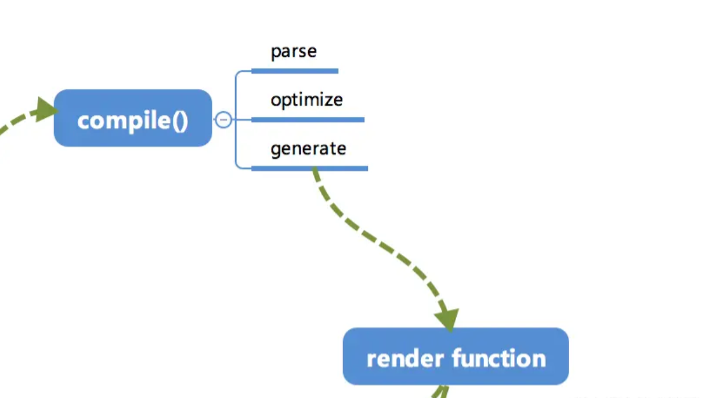

## 1. compile

`compile` 编译可以分成 `parse`、 `optimize` 与 `generate` 三个阶段，最终需要得到 render function。



以下面的 template 示例，来看解析的过程。

```vue
<div :class="c" class="demo" v-if="isShow">
  <span v-for="item in items">{{ item }}</span>
</div>
```

```js
var html = '<div :class="c" class="demo" v-if="isShow"><span v-for="item in items">{{item}}</span></div>';
```

## 2. parse

首先是 `parse`，`parse` 会用正则等方式将 template 模板中的字符串进行解析，得到指令、class、style等数据，形成 **AST**（在计算机科学中，**抽象语法树**（abstract syntax tree 或者缩写为 AST），或者语法树（syntax tree），是源码的抽象语法结构的树状表现形式，这里特指编程语言的代码。）。

这个过程比较复杂，会涉及到比较多的正则进行字符串解析，我们来看一下得到的 AST 的样子。

```js
{
  /* 标签属性的map，记录了标签上属性 */
  'attrsMap': {
    ':class': 'c',
    'class': 'demo',
    'v-if': 'isShow'
  },
  /* 解析得到的:class */
  'classBinding': 'c',
  /* 标签属性v-if */
  'if': 'isShow',
  /* v-if的条件 */
  'ifConditions': [
    {
      'exp': 'isShow'
    }
  ],
  /* 标签属性class */
  'staticClass': 'demo',
  /* 标签的tag */
  'tag': 'div',
  /* 子标签数组 */
  'children': [
    {
      'attrsMap': {
        'v-for': "item in items"
      },
      /* for循环的参数 */
      'alias': "item",
      /* for循环的对象 */
      'for': 'items',
      /* for循环是否已经被处理的标记位 */
      'forProcessed': true,
      'tag': 'span',
      'children': [
        {
          /* 表达式，_s 是一个转字符串的函数 */
          'expression': '_s(item)',
          'text': '{{item}}'
        }
      ]
    }
  ]
}
```

最终得到的 AST 通过一些**特定**的属性，能够比较清晰地描述出**标签的属性**以及**依赖关系**。

接下来我们用代码来讲解一下，如何使用正则来把 template 编译成我们需要的 AST 的。

### 2.1 正则

首先我们定义下一接下来我们会用的正则。

```js
// 名字
const ncname = '[a-zA-Z_][\\w\\-\\.]*';
// 单属性标识符
const singleAttrIdentifier = /([^\s"'<>/=]+)/
// 单属性赋值
const singleAttrAssign = /(?:=)/
// 单属性值
const singleAttrValues = [
  /"([^"]*)"+/.source,
  /'([^']*)'+/.source,
  /([^\s"'=<>`]+)/.source
]
// 属性
const attribute = new RegExp(
  '^\\s*' + singleAttrIdentifier.source +
  '(?:\\s*(' + singleAttrAssign.source + ')' +
  '\\s*(?:' + singleAttrValues.join('|') + '))?'
)
// 名字捕获
const qnameCapture = '((?:' + ncname + '\\:)?' + ncname + ')'
// 开始标签打开
const startTagOpen = new RegExp('^<' + qnameCapture)
// 开始标签闭合
const startTagClose = /^\s*(\/?)>/
// 结束标签
const endTag = new RegExp('^<\\/' + qnameCapture + '[^>]*>')
// 默认标签正则
const defaultTagRE = /\{\{((?:.|\n)+?)\}\}/g
// 循环别名正则表达式 in of
const forAliasRE = /(.*?)\s+(?:in|of)\s+(.*)/
```

### 2.2 advance

因为我们解析 template 采用**循环**进行字符串匹配的方式，所以没匹配解析完一段我们需要将已经匹配掉的去掉，头部的指针指向下来需要匹配的部分。

```js
function advance() {
  index += n;
  html = html.substring(n);
}
```

### 2.3 parseHTML

### 2.4 parseStartTag

### 2.5 stack

### 2.6 parseEndTag

### 2.7 parseText

### 2.8 processlf 与 processFor

## 3. optimize

### 3.1 isStatic

### 3.2 markStatic

### 3.3 markStaticRoots

### 3.4 optimize

## 4. generate

### 4.1 genIf

### 4.2 genFor

### 4.3 genText

### 4.4 genElement

### 4.5 generate
