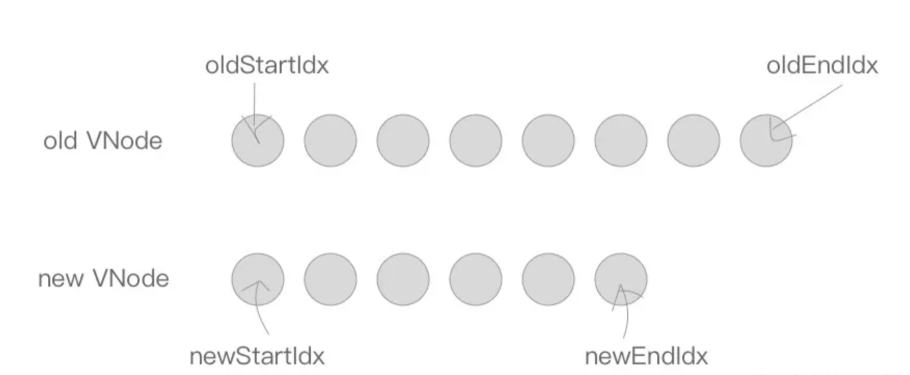

## 1. 数据更新视图

在对 `model` 进行操作对时候，会触发对应 `Dep` 中的 `Watcher` 对象。`Watcher` 对象会调用对应的 `update` 来修改视图。最终是将新产生的 `VNode` 节点与老 `VNode` 进行一个 `patch` 的过程，比对得出「差异」，最终将这些「差异」更新到视图上。

## 2. 跨平台

因为使用了 Virtual DOM 的原因，Vue.js 具有了跨平台的能力，Virtual DOM 终归只是一些 **JavaScript 对象**罢了，那么最终是如何调用不同平台的 API 的呢？

这就需要依赖一层**适配层**了，将不同平台的 API 封装在内，以同样的接口对外提供。

```js
const nodeOps = {
  setTextContent(text) {
    if (platform === "weex") {
      node.parentNode.setAttr("value", text);
    } else if (platform === "web") {
      node.textContent = text;
    }
  },
  parentNode() {
    //......
  },
  removeChild() {
    //......
  },
  nextSibling() {
    //......
  },
  insertBefore() {
    //......
  },
};
```

举个例子，现在我们有上述一个 nodeOps 对象做适配，根据 platform 区分不同平台来执行当前平台对应的 API，而对外则是提供了一致的接口，供 Virtual DOM 来调用。

## 3. 一些 API

接下来我们来介绍其他的一些 API，这些 API 在下面 `patch` 的过程中会被用到，他们最终都会调用 `nodeOps` 中的相应函数来操作平台。

- `insert`：用来在 `parent` 这个父节点下插入一个子节点，如果指定了 `ref` 则插入到 `ref` 这个子节点前面。
- `creatElm`：用来新建一个节点， `tag` 存在创建一个标签节点，否则创建一个文本节点。
- `addVnodes`：用来批量调用 `createElm` 新建节点。
- `removeNode`：用来移除一个节点。
- `removeVnodes`：会批量调用 `removeNode` 移除节点。

```js
// insert
function insert(parent, elm, ref) {
  if (parent) {
    if (ref) {
      // 指定了 ref
      if (ref.parentNode === parent) {
        nodeOps.insertBefore(parent, elm, ref); // 在父节点下，ref 子节点前插入一个子节点。
      }
    } else {
      // 在父节点下插入一个子节点
      nodeOps.appendChild(parent, elm);
    }
  }
}
```

```js
// createElm
function createElm(vnode, parentElm, refElm) {
  if (vnode.tag) {
    // vnode 中有 tag 属性时，创建一个标签节点。
    insert(parentElm, nodeOps.createElement(value.tag), refElm); // 将创建好的标签节点插入到父节点下，指定 ref 则插到这个子节点前。
  } else {
    insert(parentElm, nodeOps.createElement(value.text), refElm); // 创建文本节点，插入到父节点下，指定 ref 则插到这个子节点前。
  }
}
```

```js
// addVnodes：批量调用 createElm 新建节点。
function addVnodes(parentElm, refElm, vnodes, startIdx, endIdx) {
  for (; startIdx <= endIdx; ++startIdx) {
    createElm(vnodes[startIdx], parentElm, refElm);
  }
}
```

```js
// removeNode：用来移除一个节点。
function removeNode(el) {
  const parent = nodeOps.parentNode(el);
  if (parent) {
    nodeOps.removeChild(parent, el);
  }
}
```

```js
// removeVnodes：会批量调用 removeNode 移除节点。
function removeVnodes(parentElm, vnodes, startIdx, endIdx) {
  for (; startIdx <= endIdx; ++startIdx) {
    const ch = vnodes[startIdx];
    if (ch) {
      removeNode(ch.elm);
    }
  }
}
```

## 4. patch

首先说一下 `patch` 的核心 diff 算法，我们用 diff 算法可以比对出两颗树的「差异」，我们来看一下，假设我们现在有如下两颗树，它们分别是新老 VNode 节点，这时候到了 `patch` 的过程，我们需要将他们进行比对。

[diffVNode](./img/newAndOldVNode.png)

diff 算法是通过**同层的树节点**进行比较而非对树进行逐层搜索遍历的方式，所以时间复杂度只有 **O(n)**，是一种相当高效的算法，如下图。

[compareType](./img/compareType.png)

这张图中的相同颜色的方块中的节点会进行比对，比对得到「**差异**」后将这些「**差异**」更新到视图上。因为只进行同层级的比对，所以十分高效。

`patch` 的过程相当复杂，我们先简单的代码看一下。

```js
function patch(oldVnode, vnode, parentElm) {
  if (!oldVnode) {
    // 没有旧节点，添加新节点。
    addVnodes(parentElm, null, vnode, 0, vnode.length - 1);
  } else if (!vnode) {
    // 没有新节点，移除旧节点。
    removeVnodes(parentElm, oldVnode, 0, vnode.length - 1);
  } else {
    if (sameVnode(oldVnode, vnode)) {
      // 新旧节点相同，执行 patchVnode
      patchVnode(oldVnode, vnode);
    } else {
      // 新旧节点不同，移除旧节点，添加新节点。
      removeVnodes(parentElm, oldVnode, 0, oldVnode.length - 1);
      addVnodes(parentElm, null, vnode, vnode.length - 1);
    }
  }
}
```

因为 `patch` 的主要功能是对比两个 VNode 节点，将「差异」更新到视图上，所以入参有新老两个 VNode 以及父节点的 element。我们来逐步捋下逻辑。

首先在 `oldVnode`（老 VNode 节点）不存在的时候，相当于新的 VNode 替代原本没有的节点，所以直接用 `addVnodes` 将这些节点批量添加到 `parentElm` 上。

```js
if (!oldVnode) {
  addVnodes(parentElm, null, vnode, 0, vnode.length - 1);
}
```

然后同理，在 `vnode` （新 VNode 节点）不存在的时候，相当于要把老的节点删除，所以直接使用 `removeVnodes` 进行批量的节点删除即可。

```js
else if (!vnode) {
  removeVnodes(parentElm, null, vnode);
}
```

最后一种情况，当 `oldVNode` 与 `vnode` 都存在的时候，需要判断它们是否属于 `sameVnode`（相同的节点）。如果是则进行 patchVnode（比对 VNode ）操作，否则删除老节点，增加新节点。

```js
if (sameVnode(oldVNode, vnode)) {
  patchVnode(oldVNode, vnode);
} else {
  removeVnodes(parentElm, oldVNode, 0, oldVnode.length - 1);
  addVnodes(parentElm, null, vnode, 0, vnode.length - 1);
}
```

## 5. sameVnode

```js
function sameVnode() {
  return (
    a.key === b.key &&
    a.tag === b.tag &&
    a.isComment === b.isComment &&
    !!a.data === !!b.data &&
    sameInputType(a, b)
  );
}

function sameInputType(a, b) {
  if (a.tag !== "input") return true;
  let i;
  const typeA = (i = a.data) && (i = i.attrs) && i.type;
  const typeB = (i = b.data) && (i = i.attrs) && i.type;
  return typeA === typeB;
}
```

`sameVnode` 其实很简单，只有当 `key`、`tag`、`isComment`（是否为注释节点）、`data`同时定义（或不定义），同时满足当标签类型为 input 的时候 type 相同即可。

## 6. patchVnode

`patchVnode` 这个函数，是在符合 `sameVnode` 的条件下触发的，所以会进行「**比对**」。

```js
function patchVnode(oldVNode, vnode) {
  // 首先在新老 VNode 节点相同的情况下，就不需要做任何改变了，直接 return 掉。
  if (oldVNode === vnode) {
    return;
  }
  // 当新老 VNode 节点都是 isStatic（静态的），并且 key 相同时，只要将 componentInstance 与 elm 从老 VNode 节点“拿过来”即可。这里的 isStatic 也就是前面提到过的「编译」的时候会将静态节点标记出来，这样就可以跳过比对的过程。
  if (vnode.isStatic && oldVNode.isStatic && vnode.key === oldVNode.key) {
    vnode.elm = oldVnode.elm;
    vnode.componentInstance = oldVnode.componentInstance;
    return;
  }
  const elm = (vnode.elm = oldVnode.elm);
  const oldCh = oldVNode.children;
  const ch = vnode.children;
  // 当新 VNode 节点是文本节点的时候，直接用 setTextContent 来设置 text，这里的 nodeOps 是一个适配层，根据不同平台提供不同的操作平台 DOM 的方法，实现跨平台。
  if (vnode.text) {
    nodeOps.setTextContent(elm, vnode.text);
  } else {
    // 当新 VNode 节点是非文本节点当时候，需要分 4 种情况。
    if (oldCh && ch && oldCh !== ch) {
      // 1. oldCh 与 ch 都存在且不相同时，使用 updateChildren 函数来更新子节点，这个后面重点讲。
      updateChildren(elm, oldCh, ch);
    } else if (ch) {
      // 2. 如果只有 ch 存在的时候，如果老节点是文本节点则先将节点的文本清除，然后将 ch 批量插入插入到节点elm下。
      if (oldVNode.text) nodeOps.setTextContent(elm, "");
      addVnodes(elm, null, ch, 0, ch.length - 1);
    } else if (oldCh) {
      // 3. 同理当只有 oldch 存在时，说明需要将老节点通过 removeVnodes 全部清除。
      removeVnodes(elm, oldCh, 0, oldCh.length - 1);
    } else if (oldVnode.text) {
      // 4. 最后一种情况是当只有老节点是文本节点的时候，清除其节点文本内容。
      nodeOps.setTextContent(elm, "");
    }
  }
}
```

## 7. updateChildren

```js
function updateChildren(parentElm, oldCh, newCh) {
  let oldStartIdx = 0; // 老开始游标
  let oldEndIdx = oldCh.length - 1; // 老结束游标
  let oldStartVnode = oldCh[0]; // 老开始节点
  let oldEndVnode = oldCh[oldEndIdx]; // 老结束节点
  let newStartIdx = 0; // 新开始游标
  let newEndIdx = newCh.length - 1; // 新结束游标
  let newStartVnode = newCh[0]; // 新开始节点
  let newEndVnode = newCh[newEndIdx]; // 新结束节点
  let oldKeyToIdx, idxInOld, elmToMove, refElm;

  // oldStartIdx、newStartIdx、oldEndIdx 以及 newEndIdx 会逐渐向中间靠拢。
  while (oldStartIdx <= oldEndIdx && newStartIdx <= newEndIdx) {
    if (!oldStartVnode) {
      oldStartVnode = oldCh[++oldStartIdx];
    } else if (!oldEndVnode) {
      oldEndVnode = oldCh[--oldEndIdx];
    } else if (sameVnode(oldStartVnode, newStartVnode)) {
      patchVnode(oldStartVnode, newStartVnode);
      oldStartVnode = oldCh[++oldStartIdx];
      newStartVnode = newCh[++newStartIdx];
    } else if (sameVnode(oldEndVnode, newEndVnode)) {
      patchVnode(oldEndVnode, newEndVnode);
      oldEndVnode = oldCh[--oldEndIdx];
      newEndVnode = newCh[--newEndIdx];
    } else if (sameVnode(oldStartVnode, newEndVnode)) {
      patchVnode(oldStartVnode, newEndVnode);
      nodeOps.insertBefore(
        parentElm,
        oldStartVnode.elm,
        nodeOps.nextSibling(oldEndVnode.elm)
      );
      oldStartVnode = oldCh[++oldStartIdx];
      newEndVnode = newCh[--newEndIdx];
    } else if (sameVnode(oldEndVnode, newStartVnode)) {
      patchVnode(oldEndVnode, newStartVnode);
      nodeOps.insertBefore(parentElm, oldEndVnode.elm, oldStartVnode.elm);
      oldEndVnode = oldCh[--oldEndIdx];
      newStartVnode = newCh[++newStartIdx];
    } else {
      let elmToMove = oldCh[idxInOld];
      if (!oldKeyToIdx)
        oldKeyToIdx = createKeyToOldIdx(oldCh, oldStartIdx, oldEndIdx);
      idxInOld = newStartVnode.key ? oldKeyToIdx[newStartVnode.key] : null;
      if (!idxInOld) {
        createElm(newStartVnode, parentElm);
        newStartVnode = newCh[++newStartIdx];
      } else {
        elmToMove = oldCh[idxInOld];
        if (sameVnode(elmToMove, newStartVnode)) {
          patchVnode(elmToMove, newStartVnode);
          oldCh[idxInOld] = undefined;
          nodeOps.insertBefore(parentElm, newStartVnode.elm, oldStartVnode.elm);
          newStartVnode = newCh[++newStartIdx];
        } else {
          createElm(newStartVnode, parentElm);
          newStartVnode = newCh[++newStartIdx];
        }
      }
    }
  }

  if (oldStartIdx > oldEndIdx) {
    refElm = newCh[newEndIdx + 1] ? newCh[newEndIdx + 1].elm : null;
    addVnodes(parentElm, refElm, newCh, newStartIdx, newEndIdx);
  } else if (newStartIdx > newEndIdx) {
    removeVnodes(parentElm, oldCh, oldStartIdx, oldEndIdx);
  }
}
```


