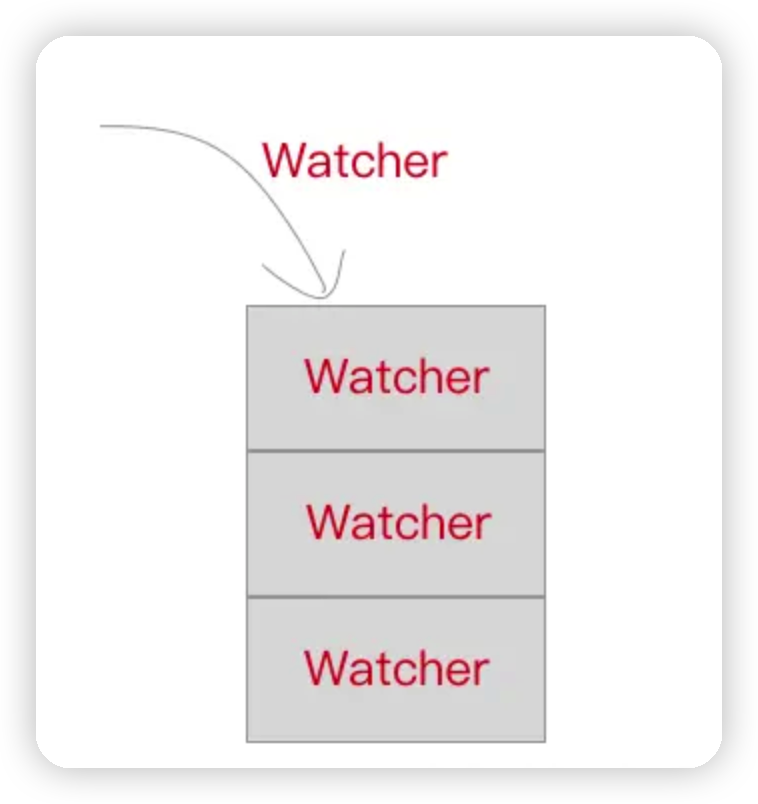

## 1. 为什么要异步更新

通过前面几个章节我们介绍，相信大家已经明白了 Vue.js 是如何在我们修改 `data` 中的数据后修改视图了。简单回顾一下，这里面其实就是一个“`setter -> Dep -> Watcher -> patch -> 视图`”的过程。

假设我们有如下这么一种情况。

```xml
<template>
  <div>
    <div>{{number}}</div>
    <div @click="handleClick">click</div>
  </div>
</template>
```

```js
export default {
  data () {
    return {
      number: 0
    };
  },
  methods: {
    handleClick () {
      for(let i = 0; i < 1000; i++) {
        this.number++;
      }
    }
  }
}
```

当我们按下 click 按钮的时候，`number` 会被循环增加 1000 次。

那么按照之前的理解，每次 `number` 被 +1 的时候，都会触发 `number` 的 `setter` 方法，从而根据上面的流程一直跑下来最后修改真实的 DOM。那么在这个过程中，DOM 会被更新 1000 次！太可怕了。

Vue.js 肯定不会如此低效的方法来处理。Vue.js 在默认情况下，每次出发某个数据的 `setter` 方法后，对应的 `Watcher` 对象其实会被 `push` 进一个队列 `queue` 中，在下一个 `tick` 的时候将这个队列 `queue` 全部拿出来 `run`（`Watcher` 对象的一个方法，用来出发 `patch` 操作）一遍。



那么什么是下一个 tick 呢？

## 2. nextTick

Vue.js 实现了一个 `nextTick` 函数，传入一个 `cb` ，这个 `cb` 会被存储到一个队列中，在下一个 tick 时触发队列中的所有 `cb` 事件。

因为目前浏览器平台并没有实现 `nextTick` 方法，所以 Vue.js 源码中分别用 `Promise`、`setTimeout`、`setImmediate` 等方式在 microtask（或是task）中创建一个事件，目的是在当前调用栈执行完毕以后（不一定立即）才会去执行这个事件。

我们用 setTimeout 来模拟这个方法，当然，真实的源码会更加复杂，有兴趣了解源码中 `nextTick` 的具体实现的同学可以参考 [next-tick](https://github.com/vuejs/vue/blob/dev/src/core/util/next-tick.js#L90)。

首先定义一个 `callbacks` 数组用来存储 `nextTick`，在下一个 `tick` 处理这些回调函数之前，所有的 `cb` 都会被存在这个 `callbacks` 数组中。`pending` 是一个标记位，代表一个等待的状态。

`setTimeout` 会在 task 中创建一个事件 `flushCallbacks` ，`flushCallbacks` 则会在执行时将 `callbacks` 中的所有 `cb` 依次执行。

```js
let callbacks = [];
let pending = false;

function nextTick (cb) {
    callbacks.push(cb);

    if (!pending) {
        pending = true;
        setTimeout(flushCallbacks, 0);
    }
}

function flushCallbacks () {
    pending = false;
    const copies = callbacks.slice(0);
    callbacks.length = 0;
    for (let i = 0; i < copies.length; i++) {
        copies[i]();
    }
}
```

## 3. 再写 Watcher

## 4. queueWatcher

## 5. flushSchedulerQueue

## 6. 举个例子
