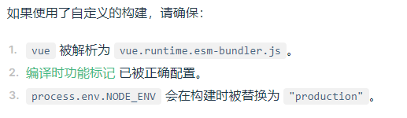

## 7.1.1 开发环境 vs. 生产环境

在开发过程中，Vue 提供了许多功能来提升开发体验：

- 对常见错误和隐患的警告
- 对 prop / 事件的校验
- 响应性调试钩子
- 开发工具集成

然而，这些功能在生产环境中并不能发挥作用。一些警告检查也会产生少量的性能开销。当部署到生产环境中时，我们应该**移除**所有未使用的、仅用于开发环境的代码分支，来获得更小的包体积和更好的性能。

## 7.1.2 不使用构建工具

如果你没有使用任何构建工具，而是从 CDN 或其他源来加载 Vue，请确保在部署时使用的是生产环境版本（以 `.prod.js` 结尾的发行文件）。生产环境版本会被最小化，并移除了所有仅用于开发环境的代码分支。

- 如果需要使用全局变量版本（通过 Vue 全局变量访问）：请使用 `vue.global.prod.js`。
- 如果需要 ESM 版本（通过原生 ESM 导入访问）：请使用 `vue.esm-browser.prod.js`。

## 7.1.3 使用构建工具

通过 `create-vue` 搭建的项目或者 `Vue CLI` 都会为生产环境发布作**预配置**。



其他参考：

- [Vite 生产环境指南](https://vitejs.dev/guide/build.html)
- [Vite 部署指南](https://vitejs.dev/guide/static-deploy.html)
- [Vue CLI 部署指南](https://cli.vuejs.org/guide/deployment.html)

## 7.1.4 追踪运行时错误

应用级错误处理，可以用来向追踪服务报告错误：

```js
import { createApp } from 'vue'
const app = createApp(...)
app.config.errorHandler = (err, instance, info) => {
  // 向追踪服务报告错误
}
```
