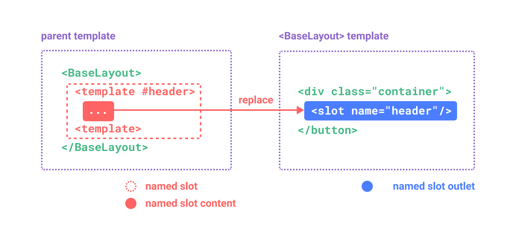

## 3.5.1 插槽内容与插口

`<slot>` 元素是一个**插槽的插口**，标示了父元素提供的**插槽内容**将在哪里被渲染。


通过使用插槽，让 `<FancyButton>` 仅负责渲染外层的 `<button>` (以及相应的样式)，而**内部的内容由父组件提供**。

除了文本以外，插槽内容还可以是**任意合法的模板内容**。例如我们可以传入多个元素，甚至是**组件**：

```vue
<FancyButton>
  <span style="color:red">Click me!</span>
  <AwesomeIcon name="plus" />
</FancyButton>
```

通过使用插槽，`<FancyButton>` 组件更加灵活和具有可复用性。现在组件可以用在不同的地方渲染各异的内容，但同时还保证都具有相同的样式。

## 3.5.2 渲染作用域

插槽内容可以访问到**父组件**的数据作用域，因为插槽内容本身是在父组件模板中定义的。举个例子：

```vue
<span>{{ message }}</span>
<FancyButton>{{ message }}</FancyButton>
```

这里的两个 `{{ message }}` 插值表达式渲染的内容都是一样的。

**插槽内容无法访问子组件的数据**，请牢记一条规则：

> 任何父组件模板中的东西都只被编译到父组件的作用域中；而任何子组件模板中的东西都只被编译到子组件的作用域中。

## 3.5.3 默认内容

在外部没有提供任何内容的情况下，为插槽指定默认内容用于渲染是很有用的。

```vue
<button type="submit">
  <slot>
    Submit <!-- 默认内容 -->
  </slot>
</button>
```

当我们在父组件中使用 `<SubmitButton>` 但不提供任何插槽内容：`<SubmitButton />`。那么将渲染默认的“Submit”单词：

```html
<button type="submit">Submit</button>
```

但如果我们提供了别的内容：`<SubmitButton>Save</SubmitButton>`。那么将渲染提供的内容：

```html
<button type="submit">Save</button>
```

## 3.5.4 具名插槽

`<slot>` 元素可以有一个特殊的 attribute `name`，用来**给各个插槽分配唯一的 ID**，以确定每一处要渲染的内容：

```vue
<div class="container">
  <header>
    <slot name="header"></slot>
  </header>
  <main>
    <slot></slot>
  </main>
  <footer>
    <slot name="footer"></slot>
  </footer>
</div>
```

没有提供 `name` 的 `<slot>` 插口会隐式地命名为“default”。

在父组件中使用 `<BaseLayout>` 时，我们需要一种方式将多个插槽内容传入到各自目标插槽的插口。此时就需要用到**具名插槽**了：

```vue
<BaseLayout>
  <template v-slot:header>
    <!-- header 插槽的内容放这里 -->
  </template>
</BaseLayout>
```

`v-slot` 有对应的简写 `#`，因此 `<template v-slot:header>` 可以简写为 `<template #header>`。其意思就是“将这部分模板片段传入子组件的 header 插槽中”。



下面我们给出完整的、向 `<BaseLayout>` 传递插槽内容的代码，指令均使用的是缩写形式：

```vue
<BaseLayout>
  <template #header>
    <h1>Here might be a page title</h1>
  </template>

  <template #default>
    <p>A paragraph for the main content.</p>
    <p>And another one.</p>
  </template>

  <template #footer>
    <p>Here's some contact info</p>
  </template>
</BaseLayout>
```

当一个组件同时接收默认插槽和具名插槽时，所有位于顶级的非 `<template>` 节点都被隐式地视为**默认插槽的内容**。所以上面也可以写成:

```vue
<BaseLayout>
  <template #header>
    <h1>Here might be a page title</h1>
  </template>

  <!-- 隐式的默认插槽 -->
  <p>A paragraph for the main content.</p>
  <p>And another one.</p>

  <template #footer>
    <p>Here's some contact info</p>
  </template>
</BaseLayout>
```

现在 `<template>` 元素中的所有内容都将被传递到相应的插槽。最终渲染出的 HTML 如下：

```html
<div class="container">
  <header>
    <h1>Here might be a page title</h1>
  </header>
  <main>
    <p>A paragraph for the main content.</p>
    <p>And another one.</p>
  </main>
  <footer>
    <p>Here's some contact info</p>
  </footer>
</div>
```

## 3.5.5 动态插槽

**动态指令参数**在 `v-slot` 上也是有效的，即可以定义下面这样的动态插槽名：

```vue
<base-layout>
  <template v-slot:[dynamicSlotName]>
    ...
  </template>

  <!-- 缩写为 -->
  <template #[dynamicSlotName]>
    ...
  </template>
</base-layout>
```

## 3.5.6 作用域插槽

在上面的渲染作用域中我们讨论到，插槽的内容无法访问到子组件的状态。

然而在某些场景下插槽的内容可能想要同时使用父组件域内和子组件域内的数据。要做到这一点，我们需要一种方法来让子组件在渲染时将一部分数据提供给插槽。

我们也确实有办法这么做！可以像对组件传递 `prop` 那样，向一个插槽的插口上传递 attribute：

```vue
<!-- <MyComponent> 的模板 -->
<div>
  <slot :text="greetingMessage" :count="1"></slot>
</div>
```

通过子组件标签上的 `v-slot` 指令，直接接收到了一个插槽 `prop` 对象：

```vue
<MyComponent v-slot="slotProps">
  {{ slotProps.text }} {{ slotProps.count }}
</MyComponent>
```


们也可以在 `v-slot` 中使用解构：

```vue
<MyComponent v-slot="{ text, count }">
  {{ text }} {{ count }}
</MyComponent>
```

### 具名作用域插槽

具名作用域插槽的工作方式也是类似的，插槽 props 可以作为 `v-slot` 指令的值被访问到：`v-slot:name="slotProps"`。当使用缩写时是这样：

```vue
<MyComponent>
  <template #header="headerProps">
    {{ headerProps }}
  </template>

  <template #default="defaultProps">
    {{ defaultProps }}
  </template>

  <template #footer="footerProps">
    {{ footerProps }}
  </template>
</MyComponent>
```

向具名插槽中传入 `props`：

```vue
<slot name="header" message="hello"></slot>
```

**注意**插槽上的 `name` 是由 Vue 保留的，不会作为 `props` 传递给插槽。因此最终 `headerProps` 的结果是 `{ message: 'hello' }`。

### 一个漂亮的列表示例

想要了解作用域插槽怎么样使用更加优雅吗？不妨看看这个 `<FancyList>` 组件的例子，它会渲染一个列表，其中会封装一些加载远端数据的逻辑、以及使用此数据来做列表渲染，或者是像分页、无限滚动这样更进阶的功能。然而我们希望它能够灵活处理每一项的外观，并将对每一项样式的控制权留给使用它的父组件。我们期望的用法可能是这样的：

```vue
<FancyList :api-url="url" :per-page="10">
  <template #item="{ body, username, likes }">
    <div class="item">
      <p>{{ body }}</p>
      <p>by {{ username }} | {{ likes }} likes</p>
    </div>
  </template>
</FancyList>
```

在 `<FancyList>` 之中，我们可以多次渲染 `<slot>` 并每次都提供不同的数据 (注意我们这里使用了 `v-bind` 来传递插槽的 props)：

```vue
<ul>
  <li v-for="item in items">
    <slot name="item" v-bind="item"></slot>
  </li>
</ul>
```

### 无渲染组件

一些组件可能只包括了逻辑而不需要自己渲染内容，视图输出通过作用域插槽全权交给了消费者组件。我们将这种类型的组件称为**无渲染组件**。

这里有一个无渲染组件的例子，一个封装了追踪当前鼠标位置逻辑的组件：

```vue
<MouseTracker v-slot="{ x, y }">
  Mouse is at: {{ x }}, {{ y }}
</MouseTracker>
```

```vue
<script setup>
import { ref, onMounted, onUnmounted } from 'vue'
  
const x = ref(0)
const y = ref(0)

const update = e => {
  x.value = e.pageX
  y.value = e.pageY
}

onMounted(() => window.addEventListener('mousemove', update))
onUnmounted(() => window.removeEventListener('mousemove', update))
</script>

<template>
  <slot :x="x" :y="y"/>
</template>
```

虽然这个模式很有趣，但大部分能用无渲染组件实现的功能都可以通过组合式 API 以另一种更高效的方式实现，并且还不会带来额外组件嵌套的开销。之后我们会在**组合式函数**一章中介绍如何更高效地实现追踪鼠标位置的功能。

尽管如此，作用域插槽在需要**同时**封装逻辑、组合视图界面时还是很有用，就像上面的 `<FancyList>` 组件那样。
